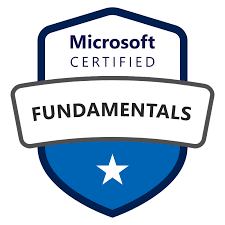

# Microsoft Azure Fundamentals


## Habilidades medidas

- A versão em inglês deste exame foi atualizada em 28 de outubro de 2022. Examine o guia de estudo vinculado na caixa “Dica” anterior para obter detalhes sobre as habilidades avaliadas e as alterações mais recentes.
- Descrever os conceitos da nuvem (25 a 30%)
- Descrever a arquitetura e os serviços do Azure (35 a 40%)
- Descrever o gerenciamento e a governança do Azure (30 a 35%)


## Introdução

### Compare Clouds

https://comparecloud.in/

### Introdução aos conceitos básicos do Microsoft Azure

O Microsoft Azure é uma plataforma de computação em nuvem com um conjunto de serviços em constante expansão para ajudar você a criar soluções para atingir suas metas de negócios.

Os serviços do Azure dão suporte a tudo, do simples ao complexo. O Azure tem serviços Web simples para hospedar sua presença comercial na nuvem.

O Azure também dá suporte à execução de computadores totalmente virtualizados que gerenciam suas soluções de software personalizadas.

O Azure fornece uma infinidade de serviços baseados em nuvem, como armazenamento remoto, hospedagem de banco de dados e gerenciamento de conta centralizado.

O Azure também oferece novos recursos, como IA (inteligência artificial) e serviços focados em IoT (Internet das Coisas).

### O que são Conceitos Básicos do Azure?

Os Conceitos Básicos do Azure são uma série de três roteiros de aprendizagem que ajudam você a se familiarizar com o Azure e seus diversos serviços e recursos.

Se você está interessado em serviços de computação, rede ou armazenamento, aprendendo sobre as melhores práticas de segurança na nuvem ou explorando a opções de governança e gerenciamento, considere os Conceitos Básicos do Azure como seu guia organizado para o Azure.

Os Conceitos Básicos do Azure incluem exercícios interativos que oferecem experiência prática com o Azure. Muitos exercícios fornecem um ambiente temporário do portal do Azure chamado área restrita, que permite que você pratique a criação de recursos de nuvem gratuitamente em seu próprio ritmo.

Independentemente de suas metas, os Conceitos Básicos do Azure têm algo para você. Você deve fazer este curso se:

Desejar obter a certificação oficial da Microsoft (AZ-900)

A série de roteiros de aprendizagem dos Conceitos Básicos do Azure pode ajudar você a se preparar para o Exame AZ-900: Conceitos Básicos do Microsoft Azure. Esse exame inclui três áreas de domínio de conhecimento:

### Introdução à computação em nuvem

Neste módulo, você conhecerá os conceitos gerais de nuvem. 
Você começará com uma introdução à nuvem em geral. 
Em seguida, você se aprofundará em conceitos como responsabilidade compartilhada, diferentes modelos de nuvem e explorará o método de preço exclusivo da nuvem.

Se você já estiver familiarizado com a computação em nuvem, este módulo poderá ser uma ampla revisão para você.

### Objetivos de aprendizagem

Depois de concluir este módulo, você poderá:

- Definir computação em nuvem.
- Descrever o modelo de responsabilidade compartilhada.
- Definir modelos de nuvem, incluindo público, privado e híbrido.
- Identificar os casos de uso apropriados para cada modelo de nuvem.
- Descrever o modelo baseado no consumo.
- Comparar os modelos de preços de nuvem.

### O que é computação em nuvem

A computação em nuvem é a entrega de serviços de computação pela Internet. Os serviços de computação incluem infraestrutura de TI comum, como máquinas virtuais, armazenamento, bancos de dados e rede. Os serviços de nuvem também expandem as ofertas tradicionais de TI para incluir itens como IoT (Internet das Coisas), ML (machine learning) e IA (inteligência artificial).

Como a computação em nuvem usa a Internet para fornecer esses serviços, ela não precisa ficar restrita pela infraestrutura física da mesma forma que um datacenter tradicional. Isso significa que, se você precisar aumentar rapidamente sua infraestrutura de TI, não precisará esperar para construir um novo datacenter; você pode usar a nuvem para expandir rapidamente seu volume de TI.

### Descrever o modelo de responsabilidade compartilhada


Você pode ter ouvido falar do modelo de responsabilidade compartilhada, mas talvez não entenda o que isso significa nem como afeta a computação em nuvem.

Comece com um datacenter corporativo tradicional. A empresa é responsável por manter o espaço físico, garantir a segurança e manter ou substituir os servidores se algo acontecer. O departamento de TI é responsável por manter toda a infraestrutura e o software necessários para manter o datacenter em funcionamento. É provável que eles também sejam responsáveis por manter todos os sistemas corrigidos e na versão correta.

Com o modelo de responsabilidade compartilhada, essas responsabilidades são compartilhadas entre o provedor de nuvem e o consumidor. Segurança física, energia, resfriamento e conectividade de rede são responsabilidade do provedor de nuvem. O consumidor não fica na mesma localização do datacenter, portanto, não faria sentido que o consumidor tivesse algumas dessas responsabilidades.

Ao mesmo tempo, o consumidor é responsável pelos dados e pelas informações armazenados na nuvem. (Você não gostaria que o provedor de nuvem pudesse ler suas informações). O consumidor também é responsável pela segurança de acesso, o que significa que você só dá acesso àqueles que precisam.

Então, para algumas coisas, a responsabilidade depende da situação. Se você estiver usando um banco de dados SQL na nuvem, o provedor de nuvem será responsável pela manutenção do banco de dados real. No entanto, você ainda será responsável pelos dados que são ingeridos no banco de dados. Se você implantasse uma máquina virtual e instalasse um banco de dados SQL nela, seria responsável pelos patches e atualizações do banco de dados, além da manutenção dos dados e das informações armazenados no banco de dados.

Com um datacenter local, você é responsável por tudo. Com a computação em nuvem, essas responsabilidades mudam. O modelo de responsabilidade compartilhada está fortemente vinculado aos tipos de serviço de nuvem (abordados posteriormente neste roteiro de aprendizagem): IaaS (infraestrutura como serviço), PaaS (plataforma como serviço) e SaaS (software como serviço). A IaaS coloca a maior responsabilidade sobre o consumidor, com o provedor de nuvem sendo responsável pelas questões básicas de segurança física, energia e conectividade. Na outra ponta do espectro, o SaaS coloca a maior parte da responsabilidade no provedor de nuvem. A PaaS, sendo um meio termo entre IaaS e SaaS, situa-se no meio desses dois cenários e distribui uniformemente a responsabilidade entre o provedor de nuvem e o consumidor.

### Você sempre será responsável por:

- Informações e dados armazenados na nuvem
- Dispositivos que têm permissão para se conectar à nuvem (telefones celulares, computadores e assim por diante)
- Contas e identidades das pessoas, serviços e dispositivos em sua organização

### O provedor de nuvem é sempre responsável por:

- Datacenter físico
- Rede física
- Hosts físicos

### Seu modelo de serviço determinará a responsabilidade por coisas como:

- Sistemas operacionais
- Controles de rede
- Aplicativos
- Identidade e infraestrutura

### Definir modelos de nuvem

O que são modelos de nuvem? Os modelos de nuvem definem o tipo de implantação de recursos de nuvem. Os três principais modelos de nuvem são: privado, público e híbrido.

### Nuvem privada

Vamos começar com uma nuvem privada. Uma nuvem privada é, de certa forma, a evolução natural de um datacenter corporativo. Ela é uma nuvem (que fornece serviços de TI pela Internet) usada por uma única entidade. A nuvem privada fornece um controle muito maior para a empresa e o departamento de TI. No entanto, ela também tem mais custos e menos benefícios em relação a uma implantação de nuvem pública. Por fim, uma nuvem privada pode ser hospedada em seu datacenter local. Ela também pode ser hospedada em um datacenter dedicado externo, até mesmo por terceiros que tenham dedicado esse datacenter à sua empresa.

### Nuvem pública

Uma nuvem pública é criada, controlada e mantida por um provedor de nuvem de terceiros. Com uma nuvem pública, qualquer pessoa que queira comprar serviços de nuvem pode acessar e usar os recursos. A disponibilidade pública geral é uma diferença fundamental entre nuvens públicas e privadas.

### Nuvem híbrida

Uma nuvem híbrida é um ambiente de computação que usa nuvens públicas e privadas em um ambiente interconectado. Um ambiente de nuvem híbrida pode ser usado para permitir que uma nuvem privada escale para atender a uma demanda maior temporária implantando recursos de nuvem pública. A nuvem híbrida pode ser usada para fornecer uma camada adicional de segurança. Por exemplo, os usuários podem escolher com flexibilidade quais serviços manter na nuvem pública e quais implantar na infraestrutura de nuvem privada.

### Várias nuvens

O quarto (e cada vez mais provável) cenário, é um cenário de várias nuvens. Em um cenário de várias nuvens, você usa vários provedores de nuvem pública. Talvez você use recursos diferentes de diferentes provedores de nuvem. Ou você pode ter iniciado seu percurso de nuvem com um provedor e esteja em processo de migração para um provedor diferente. Independentemente disso, em um ambiente de várias nuvens, você lida com dois (ou mais) provedores de nuvem pública e gerencia recursos e segurança em ambos os ambientes.

### Azure Arc

O Azure Arc é um conjunto de tecnologias que ajuda a gerenciar seu ambiente de nuvem. O Azure Arc pode ajudar a gerenciar o seu ambiente de nuvem, seja uma nuvem pública exclusivamente no Azure, uma nuvem privada em seu datacenter, uma configuração híbrida ou até mesmo um ambiente de várias nuvens em execução em vários provedores de nuvem ao mesmo tempo.

### Solução VMware no Azure

E se você já estiver estabelecido com o VMware em um ambiente de nuvem privada, mas quiser migrar para uma nuvem pública ou híbrida? A Solução VMware no Azure permite executar suas cargas de trabalho do VMware no Azure com integração e escalabilidade total.

### Modelo baseado em consumo

Ao comparar modelos de infraestrutura de TI, há dois tipos de despesas a serem consideradas. 

 - CapEx (despesas de capital)
 
 - OpEx (despesas operacionais).


A CapEx normalmente é uma despesa inicial única para comprar ou proteger recursos tangíveis. 
Um prédio novo, a repavimentação do estacionamento, a construção de um datacenter ou a compra de um veículo da empresa são exemplos de CapEx.

Ao contrário, a OpEx é o gasto de capital em serviços ou produtos ao longo do tempo. 
O aluguel de um centro de convenções, o leasing de um veículo da empresa ou a assinatura de serviços de nuvem são exemplos de OpEx.

A computação em nuvem se enquadra na OpEx porque opera em um modelo baseado em consumo. 
Na computação em nuvem, você não paga pela infraestrutura física, pela eletricidade, pela segurança nem por nada que esteja associado à manutenção de um datacenter. 
Você paga pelos recursos de TI que usa. Se você não usar nenhum recurso de TI durante o mês, não pagará nada.

### Um modelo baseado em consumo oferece vários benefícios, como:

- Sem custos prévios.
- Não há necessidade de comprar nem gerenciar uma infraestrutura cara que os usuários talvez não usem na capacidade máxima.
- A capacidade de pagar para obter mais recursos quando necessário.
- A capacidade de parar de pagar por recursos que não são mais necessários.

Com um datacenter tradicional, você tenta estimar as necessidades futuras de recursos. Se você superestimar, gastará mais do que o necessário no datacenter, podendo desperdiçar capital. Se você subestimar, o datacenter atingirá a capacidade rapidamente e os aplicativos e serviços poderão sofrer redução de desempenho. A correção de um datacenter subprovisionado pode ser muito demorada. Pode ser necessário solicitar, receber e instalar mais hardware. Você também precisará adicionar energia, resfriamento e rede para o hardware extra.

Em um modelo baseado em nuvem, você não precisa se preocupar em acertar perfeitamente as necessidades de recursos. Se você achar que precisa de mais máquinas virtuais, bastará adicioná-las. Se a demanda cair e você não precisar de tantas máquinas virtuais, bastará remover algumas, conforme o necessário. De qualquer forma, você só paga pelas máquinas virtuais que usa, não pela "capacidade extra" que o provedor de nuvem tem em mãos.

### Comparar os modelos de preços de nuvem

Computação em nuvem é a entrega de serviços de computação pela Internet, usando o modelo de preço pago conforme o uso. 

Normalmente, você paga apenas pelos serviços de nuvem que usa, o que ajuda a:

- Planeje e gerencie os custos operacionais.
- Executar a infraestrutura com mais eficiência.
- Escale as operações de acordo com as necessidades de negócios.

Em outras palavras, a computação em nuvem é uma forma de alugar capacidade computacional e armazenamento do datacenter de terceiros. Você pode tratar os recursos de nuvem como faria com os recursos em seu próprio datacenter. Mas, ao contrário do acontece no seu próprio datacenter, ao terminar de usar os recursos de nuvem, basta devolvê-los. Você é cobrado apenas pelo que usa.

Em vez de manter CPUs e armazenamento no seu datacenter, você aluga esses recursos pelo tempo necessário. O provedor em nuvem é responsável por manter a infraestrutura subjacente para você. A nuvem permite que você supere rapidamente os desafios empresariais mais difíceis e ofereça soluções de ponta para seus usuários.

### 1.2 - Descrever os benefícios do uso de serviços de nuvem

Neste módulo, você conhecerá alguns dos benefícios oferecidos pela computação em nuvem. Você aprenderá como a computação em nuvem pode ajudar a atender à demanda variável e ainda oferecer uma ótima experiência ao cliente. Você também aprenderá sobre segurança, governança e capacidade de gerenciamento geral na nuvem.

Ao criar ou implantar um aplicativo de nuvem, duas das maiores considerações são o tempo de atividade (ou disponibilidade) e a capacidade de lidar com a demanda (ou a escala).

### Alta disponibilidade

Quando você está implantando um aplicativo, um serviço ou qualquer recurso de TI, é importante que os recursos estejam disponíveis quando necessário. A alta disponibilidade se concentra em garantir a disponibilidade máxima, independentemente de interrupções ou eventos que possam ocorrer.

Ao arquitetar sua solução, você precisará considerar as garantias de disponibilidade do serviço. O Azure é um ambiente de nuvem altamente disponível com garantias de tempo de atividade, dependendo do serviço. Essas garantias fazem parte dos SLAs (Contratos de Nível de Serviço).

### Escalabilidade

Outro grande benefício da computação em nuvem é a escalabilidade dos recursos de nuvem. A escalabilidade refere-se à capacidade de ajustar recursos para atender à demanda. Se você experimentar um pico repentino de tráfego e seus sistemas ficarem sobrecarregados, a capacidade de escalar significa que você poderá adicionar mais recursos para lidar melhor com o aumento da demanda.

O outro benefício da escalabilidade é que você não está pagando além do necessário pelos serviços. Como a nuvem é um modelo baseado em consumo, você paga apenas pelo que usa. Se a demanda cair, você poderá reduzir seus recursos e, assim, reduzir seus custos.

A escala geralmente vem em duas variedades: vertical e horizontal. 

- A escala vertical se concentra em aumentar ou diminuir a capacidade dos recursos. 

- A escala horizontal é adição ou subtração do número de recursos.

### Dimensionamento vertical

Com a escala vertical, se você estivesse desenvolvendo um aplicativo e precisasse de mais capacidade de processamento, poderia escalar verticalmente para adicionar mais CPUs ou RAM à máquina virtual. 
Por outro lado, se você percebesse que superestimou as necessidades, poderia reduzir verticalmente, diminuindo as especificações de CPU ou RAM.

### Dimensionamento horizontal

Com a escala horizontal, se você experimentasse um salto repentino acentuado na demanda, seus recursos implantados poderiam ser expandidos (automaticamente ou manualmente). 
Por exemplo, você pode adicionar máquinas virtuais ou contêineres por meio da expansão. Da mesma forma, se houver uma queda significativa na demanda, os recursos implantados poderão ser reduzidos horizontalmente (de maneira automática ou manual).

### Descrever os benefícios da confiabilidade e da previsibilidade na nuvem

Confiabilidade e previsibilidade são dois benefícios cruciais na nuvem que ajudam você a desenvolver soluções com confiança.

### Confiabilidade

Resiliência é a capacidade que um sistema tem de se recuperar de falhas e continuar funcionando. Ela também é um dos pilares do Microsoft Azure Well-Architected Framework.

Devido ao design descentralizado, a nuvem naturalmente dá suporte a uma infraestrutura confiável e resiliente. Com um design descentralizado, a nuvem permite que você tenha recursos implantados em várias regiões do mundo. Com essa escala global, mesmo que ocorra um evento catastrófico em uma região, as outras regiões ainda estarão em funcionamento. Você pode criar aplicativos para aproveitar automaticamente essa confiabilidade maior. Em alguns casos, o próprio ambiente de nuvem mudará automaticamente para uma região diferente, sem que você precise realizar nenhuma ação. Você entenderá melhor como o Azure aproveita a escala global para oferecer confiabilidade.

### Previsibilidade

A previsibilidade na nuvem permite que você avance com confiança. A previsibilidade pode se concentrar na previsibilidade de desempenho ou na previsibilidade de custo. Tanto a previsibilidade de desempenho quanto a de custo são bastante influenciadas pelo Microsoft Azure Well-Architected Framework. Ao implantar uma solução criada com base nessa estrutura, você tem uma solução com custo e desempenho previsíveis.

### Desempenho

A previsibilidade de desempenho se concentra em prever os recursos necessários para oferecer uma experiência positiva aos clientes. O dimensionamento automático, o balanceamento de carga e a alta disponibilidade são apenas alguns dos conceitos de nuvem que dão suporte à previsibilidade de desempenho. Se de repente você precisar de mais recursos, o dimensionamento automático poderá implantar recursos adicionais para atender à demanda e depois reduzir a implantação quando a demanda cair. Ou se o tráfego estiver bem concentrado em uma área, o balanceamento de carga ajudará a redirecionar parte da sobrecarga para áreas menos sobrecarregadas.

### Custo

A previsibilidade de custos se concentra em prever o custo dos gastos com a nuvem. Com a nuvem, você pode acompanhar o uso de recursos em tempo real, monitorar os recursos para garantir a maior eficiência de uso possível e aplicar a análise de dados para encontrar padrões e tendências que ajudam a planejar melhor as implantações de recursos. Operando na nuvem e usando a análise e as informações da nuvem, você pode prever custos futuros e ajustar os recursos conforme o necessário. Você pode até mesmo usar ferramentas como TCO (custo total de propriedade) ou a Calculadora de Preços para obter uma estimativa de possíveis gastos com a nuvem.

### Elsticidade 

Os provedores de nuvem facilitam o dimensionamento de seus aplicativo e oferecem a capacidade de dimensionar automaticamente com base no padrão de uso para sua aplicação. Você pode dimensionar automaticamente com base em coisas como uso de CPU e memória uso, e você também pode escalar com base em outros métricas específicas para o tipo de aplicativo. O conceito de dimensionamento automático
é chamada de elasticidade.

### Dica: 

Não confunda tolerância a falhas com dimensionamento.

A escala permite que você reaja a necessidades de carga ou recursos, mas é sempre assumiu que todas as VMs que você está usando são
saudável. 

A tolerância a falhas acontece sem qualquer interação de você, e é projetado para movê-lo automaticamente de um estado insalubre
sistema para um sistema saudável se as coisas correrem errado.

### On-premisse -> Infraestrutura Local

- Datacenter Local

### IAAS -> Infrastructure as a service (infraestrutura como serviço)

 - Migração lift-and-shift: você conta com recursos de nuvem semelhantes aos do datacenter local e apenas migra os elementos em execução local para execução na infraestrutura IaaS.

- Teste e desenvolvimento: você estabeleceu configurações para ambientes de desenvolvimento e teste que precisa replicar rapidamente. Você pode ativar ou desativar os diferentes ambientes rapidamente com uma estrutura de IaaS, mantendo o controle completo.

### PAAS -> Plataform as a service (plataforma como serviço) 


- Azure CDN
- Azure Cosmos DB
- Azure SQL Database
- Azure Database for MySQL
- Azure Storage
- Azure Synapse Analytics

### SAAS -> Software as a service (software como serviço)

- Microsoft 365
- Xbox Live
- OneDrive
- Power Automate (previously Microsoft Flow)

### Computação em Nuvem

Quando comecei este capítulo, disse que a nuvem geralmente representa infraestrutura e aplicativos disponíveis na Internet.
Quando a maioria das pessoas pensa na nuvem, elas pensam disso neste contexto, mas os recursos de nuvem não são sempre conectado à Internet pública.
Uma maneira melhor de pensar sobre a computação em nuvem é pensar nisso como muitos recursos de computação todos conectados por uma rede, mas mesmo essa definição não descreve totalmente a nuvem. Nuvem computação também significa sistemas escaláveis, ágil, e  assim por diante.
Se você combinar esses conceitos junto com a computação distribuída recursos acessíveis em uma rede, você tem a fundamentos da computação em nuvem.
Como você pode ver, é um pouco difícil definir claramente computação em nuvem, mas uma discussão sobre diferentes modelos de nuvem devem ajudá-lo a melhor entender o que é computação em nuvem.

### Nuvem Pública

- Microsoft Azure, AWS, Oracle Cloud, IBM Cloud e etc.

### Nuvem Privada

- Azure Stack, Open Stack e etc.

### Nuvem Hibrida

- Integra a disponibilidade de recursos on-premisses e de nuvem.

### Modelo baseado em consumo

Ao comparar modelos de infraestrutura de TI, há dois tipos de despesas a serem consideradas. 

 - CapEx (despesas de capital)
 
 - OpEx (despesas operacionais).


A CapEx normalmente é uma despesa inicial única para comprar ou proteger recursos tangíveis. 
Um prédio novo, a repavimentação do estacionamento, a construção de um datacenter ou a compra de um veículo da empresa são exemplos de CapEx.

Ao contrário, a OpEx é o gasto de capital em serviços ou produtos ao longo do tempo. 
O aluguel de um centro de convenções, o leasing de um veículo da empresa ou a assinatura de serviços de nuvem são exemplos de OpEx.

### Descrever os benefícios da segurança e da governança na nuvem


Se você estiver implantando infraestrutura como serviço ou software como serviço, os recursos de nuvem vão dar suporte à governança e à conformidade. Itens como modelos de conjunto ajudam a garantir que todos os seus recursos implantados atendam aos padrões corporativos e aos requisitos regulatórios governamentais. Além disso, você pode atualizar todos os seus recursos implantados com novos padrões à medida que os padrões são alterados. A auditoria baseada em nuvem ajuda a sinalizar qualquer recurso que esteja fora de conformidade com seus padrões corporativos e fornece estratégias de mitigação. Dependendo do seu modelo operacional, patches de software e atualizações também podem ser aplicados automaticamente, o que ajuda na governança e na segurança.

Em relação à segurança, você pode encontrar uma solução de nuvem que atenda às suas necessidades de segurança. Se você quiser o controle máximo da segurança, a infraestrutura como serviço fornecerá recursos físicos, mas permitirá que você gerencie os sistemas operacionais e o software instalado, incluindo aplicação de patches e manutenção. Se você quiser que a aplicação de patches e a manutenção sejam tratadas automaticamente, as implantações de plataforma como serviço ou software como serviço podem ser as melhores estratégias de nuvem para você.

E como a nuvem se destina a uma entrega de recursos de TI via Internet, os provedores de nuvem normalmente são adequados para lidar com situações como ataques de DDoS (negação de serviço distribuído), tornando sua rede mais robusta e segura.

Ao estabelecer uma presença de governança o mais cedo possível, você poderá manter sua presença de nuvem atualizada, protegida e bem gerenciada.

## Descrever o modelo de responsabilidade compartilhada

Em organizações que executam apenas hardware e software locais, a organização é 100% responsável por implementar segurança e conformidade. Com os serviços baseados em nuvem, essa responsabilidade é compartilhada entre o cliente e o provedor de nuvem.

O modelo de responsabilidade compartilhada identifica quais tarefas de segurança são tratadas pelo provedor de nuvem e quais tarefas de segurança são tratadas por você, o cliente. As responsabilidades variam dependendo de onde a carga de trabalho está hospedada:

SaaS (software como serviço)
PaaS (plataforma como serviço)
IaaS (infraestrutura como serviço)
Datacenter local

O modelo de responsabilidade compartilhada torna as responsabilidades claras. Quando as organizações movem dados para a nuvem, algumas responsabilidades são transferidas para o provedor de nuvem e outras para a organização do cliente.

O diagrama a seguir ilustra as áreas de responsabilidade entre o cliente e o provedor de nuvem, de acordo com o local em que os dados são mantidos.


## Ambiente do Azure


“Descrever conceitos de nuvem”, você aprendeu sobre a nuvem e como você pode se beneficiar de usar serviços em nuvem. Microsoft Azure foi mencionado, mas não em muitos detalhes.
Neste capítulo, vamos nos aprofundar nos muitos serviços e soluções que o Azure oferece. Você ganhará um compreensão dos principais conceitos do Azure arquitetura, que se aplicam a todos os serviços do Azure.
Cobrimos os datacenters do Azure e as formas que A Microsoft implementa tolerância a falhas e recuperação de desastres espalhando o Azure infraestrutura em todo o mundo. Você também aprenderá sobre as zonas de disponibilidade, que são da Microsoft solução para garantir que seus serviços não sejam afetado quando um determinado datacenter do Azure passa por um problema.
Você também descobrirá como gerenciar e rastrear seus recursos do Azure e como você pode trabalhar com recursos como um grupo usando o recurso do Azure grupos. Você aprenderá como usar grupos de recursos para planejar e gerenciar os recursos do Azure, e você
saiba como os grupos de recursos podem ajudá-lo categorize suas despesas operacionais no Azure.
Para realmente entender os grupos de recursos e como o Azure funciona sob o capô, é importante entender o recurso do Azure
Manager (ARM), o sistema subjacente que O Azure usa para gerenciar seus recursos. Você vai aprender sobre os benefícios que o ARM oferece e você verá como o ARM abre algumas possibilidades poderosas para implantação rápida e fácil de soluções mundiais para o Azure.

### Ferramentas de Gerenciamento Disponiveis no Azure

- Portal do Azure (Web)
- Azure PowerShell (Windows,Linux,Apple)
- Aplicativo Móvel do Azure 
- Interface de Linha de Comando - CLI  (Alterna entre Bash e PowerShell)
- API REST do Azure
- Azure Cloud Shell

Todos esses itens formam o Azure Resource Manager ou ARM, são arqiuvos JavScript Object Notation (JSON) que podem ser usados para criar e implantar a infraestrutura do Azure sem precisar gravar comandos de programação.

### Assitente do Azure

O Assistente do Azure analisa os recursos implantados do Azure e faz recomendações com base nas melhores praticas para otimizar as implantações do Azure.

- Confiabilidade
- Segurança
- Desempenho
- Custos
- Excelencia Operacoinal

### Azure Monitor

Maximiza a disponibilidade e o desempenho de aplicativos e serviços coletando, analisando e agindo sobre Telemetria dos ambientes em nuvens locais.

### Integridade do Serviço do Azure

Avaliar o impacto de problema e serviços do Azure com atualizações personalizadas de orientação e suporte, notificações.


### Microsoft Defender Para Nuvem

A central de Segurança do Azure é um serviço de monitoramento que fornece  proteção contra ameaças nos datacenters do Azure e nos datacenters locais.

- Fornece recomendação de segurança
- Detectar e bloquear malwares
- Analisar e identificar possiveis ataques.
- Controle de acesso just-in-time para portas

- Conformidade com as Politicas
- Alertas de Segurança
- Classificação de Segurança
- Limpeza de Segurança de Recursos


### Dica:  Não confundiar Microsoft defender para nuvem do Azure com Microsoft Advisor, no caso o Microsoft Advisor apenas oferece algumas sugestões de boas práticas sem nenhum tipo de interação.


### Azure Sentinel

O Azure Sentinel é uma soluçõa de gerenciamento de informações de segurança (SIEM) e de resposta automatizadas de segurança (SOAR) que fornece uma análise de segurança e inteligencia contra ameaças em uma empresa.

### Conectores e Integrações

- Office365
- Azure Active Directory
- Proteção Avançada Contra Ameaças do Azure
- Microsoft Cloud App Security

### Azure Key Vault

O Azure Key Vault armazena segredos do aplicativo em um local de nuvem centralizado para controlar com segurança as permissões e o registroem log de acesso.

Dica: Serviço associado a região e não global.

- Gerenciamento de Segredos
- Gerenciamento de Chaves
- Gerenciamento de Certificados
- Armazena segredo apoiados por módulos de segurança e hardware (HSMs)

### Host dedicado do Azure

O Host Dedicado do Azure fornece servidores fiscios que hospedam uma ou mais maquinas virtuais do Azure dedicadas a carga de trabalho de uma unica organização.

### Beneficios

- Isolamento de hardware nivel do servidor
- Controle sobre o tempo do evento e manutenção
- Alinhando com os beneficois hibridos de uso do azure


## Segurança de Rede no Azure


- Utiliza uma abordagem em camadas para proteger sistema de computadores.
- Fornece vários níveis de proteção
- Ataques contra uma camada são isolados das camadas subsequentes


### Grupos de Segurança de Rede (NSGs)

Os Grupos de Segurança de Rede (NSGs) filtram o trafego de rede para os recursos do Azure (e a partir dele também) nas Redes Virtuais do Azure.

- Definir regras de entrada e de saida para filtrar por fonte e endereço IP de destino, porta e protocolo.
- Adicoinar várias regras, conforme necessário, dentro dos limites da assinatura.
- O Azure aplica regras de segurança de linha de base, padrão aos novos NSGs
- Substituir as regras padrão por regras novas e de prioridade mais alta

### Firewall do Azure

Um Firewall como Serviço (FaaS) com estado e gerenciado que concede/nega acesso ao sevidor com base no endereço IP de origem, para proteger recursos de rede.

- Aplica regras de filtragem de tráfego de entrada e saida
- Alta disponibilidade integrada
- Escalabilidade de nuvem irrestrita
- Usa o registro em log do Azure monitor

O Gateway de Aplicativo do Azure também fornece um firewall, chamado de firewall de Aplicativo WEB (WAF).

O WAF fornece proteção interna, centralizada para seu aplicativos Web.

### Dica: 

O Serviço de NSGs é semelhante ao firewall que vêm no Windows, já o serviço de Firewall do Azure é um serviço cobrado a parte (Fortinet, Barracuda)

### Proteção contra DDoS (Negação de Serviço distribuida) do Azure

O s ataques de DDoS sobrecarergam e esgostam ercurso de rede, tornando os aplicativos lentos ou não responsivos.

- Limpa o trafego de rede indesejado antes que ele afete a disponibilidade do serviço.
- A camada de serviço básica é automaticamente  ativa no Azure.
- A camada de serviço padrão adicina recurso de mitigação ajustado para proteger.


### DDos Básico -> Monitora o tráfego, coleta logs é passivo -> Valor Free (Grátis)

### DDoS  Standard -> Comtempla o DDoS Básico e também é reativo -> Possui Custo

### Proteção Completa Analisada

- Utilizar em conjunto o NSGs com Firewall do Azure para conquistar a proteção completa.
- A camada de perimetro protege os limites de rede com a Proteção contra DDos do Azure e o Firewall do Azure.
- A camada de rede permite que o tráfego passe entre recursos de rede apenas com as regras de entrada e saida do Grupo de Segurança de Rede (NSG).

### Dica: 

 - Você pode ter recursos diferentes de várias regiões dentro de um mesmo grupo de recurso.
 - Quando é colocado uma TAG em um Resource Group é somente dele , não é herdada.
 - Já as permissões de um grupo de recursos, todos os recursos nesse grupo de recurso herdarão as permissões.
 
 
Uma vez que você tenha a compreensão fundamental do Azure, você se aprofundará em alguns dos principais produtos de carga de trabalho fornecidos pela Microsoft, como como máquinas virtuais do Azure, Serviço de Aplicativo do Azure, serviços que facilitam o trabalho contêineres e redes, e armazenamento e serviços de banco de dados. Você também aprenderá sobre o Azure Marketplace e como ele habilita o criação e implantação de soluções complexas com o mínimo de trabalho de sua parte, e por causa o conhecimento "sob o capô" que você terá de anteriormente no capítulo, o Azure Marketplace não vai parecer magia negra.

Se você acha que é muito para cobrir, você está certo!

É importante que você tenha uma compreensão de todos esses tópicos para passar no AZ-900 exame. Com o conhecimento fundamental da
cloud do Capítulo 1, “Descreva a nuvem conceitos", você descobrirá que entender o Azure-conceitos específicos serão mais fáceis do que você pensa.

 - Tenant 

  Seria o locatario ou o Azure Active Directory

  Ex.: empresa.onmicrosoft.com
  
 - Subscription
  
   Seria a Assinatura

 - Management Group 

   Seria o grupo de assinaturas.

 ## Infraestrutura física do Azure
 
 Regiões, Zonas de Disponibilidade, Recursos, Assinaturas

### Regiões

Uma região é uma área geográfica do planeta que contém pelo menos um data center, mas possivelmente vários, nas proximidades e conectado a uma rede de baixa latência. O Azure atribui e controla os recursos de modo inteligente dentro de cada região para garantir que as cargas de trabalho sejam balanceadas corretamente.

Quando você implanta um recurso no Azure, geralmente precisa escolher a região em que deseja que ele seja implantado.

 ### Observação

Alguns serviços ou recursos de VM (máquina virtual) estão disponíveis somente em determinadas regiões, como tamanhos específicos de VMs ou tipos de armazenamento. Também há alguns serviços globais do Azure que não exigem que você selecione uma região específica, como o Azure Active Directory, o Gerenciador de Tráfego do Azure e o DNS do Azure.

### Zonas de Disponibilidade

Zonas de disponibilidade são datacenters separados fisicamente dentro de uma região do Azure.
Cada zona de disponibilidade é composta de um ou mais datacenters equipados com energia, resfriamento e rede independentes. Uma zona de disponibilidade é configurada para ser um limite de isolamento. Se uma zona ficar inativa, as outras continuarão funcionando. Zonas de disponibilidade são conectadas por meio de redes de fibra óptica privadas de alta velocidade.

### Dica:

O fato de cada geografia conter pelo menos menos duas regiões separadas por uma grande a distância física é importante. É assim que
O Azure mantém a recuperação de desastres e é provavelmente este conceito será incluído no exame. Abordaremos mais sobre isso mais adiante aidna neste capítulo.

### Resource Groups

Grupos de recursos

Agora você deve estar percebendo que mudar para o cloud pode não ser tão simples quanto parecia a princípio.
Criar um único recurso no Azure é bastante simples, mas quando você está lidando com empresas aplicativos de nível, você geralmente está lidando com um complexo conjunto de serviços. Não só isso, mas você pode estar lidando com vários aplicativos que usam vários serviços e podem estar espalhados por várias regiões do Azure. As coisas podem certamente ficar caótico rapidamente.

Felizmente, o Azure oferece um recurso que ajuda você a lidar com esse tipo de problema: o grupo de recursos. Um grupo de recursos é uma lógica contêiner para serviços do Azure. Ao criar tudo
Serviços do Azure associados a um determinado aplicativo em um único grupo de recursos, você pode em seguida, implemente e gerencie todos esses serviços como uma única entidade.

Organizando recursos do Azure em um recurso grupo tem muitas vantagens. Você pode definir facilmente implementações usando um recurso conhecido como Modelo ARM. As implantações de modelo ARM são normalmente para um único grupo de recursos. Você pode
implantar em vários grupos de recursos, mas fazê-lo requer que você estabeleça uma complicada cadeia de Modelos ARM.

### Mais informações Mais sobre modelos ARM

Você aprenderá mais sobre modelos ARM mais adiante neste capítulo, quando discuta o Azure Resource Manager.
Outra vantagem dos grupos de recursos é que você pode nomear um grupo de recursos facilmente nome reconhecível para que você possa ver todos os Azure recursos usados em uma determinada aplicação em um olhar. Isso pode não parecer tão importante até você realmente começa a implantar os recursos do Azure e perceber que você tem muito mais recursos do que você pensou primeiro. Por exemplo, quando você cria uma máquina virtual do Azure, o Azure cria não apenas uma máquina virtual, mas também cria um disco
recurso, interface de rede, recurso de IP público, e grupo de segurança de rede. Se você está olhando todos os seus recursos do Azure, pode ser difícil diferencie quais recursos combinam com qual aplicativo.

### Identidade

Todos os usuários e dispositivos têm uma identidade que pode ser usada para acessar os recursos. A identidade é a maneira como usuários e dispositivos são identificados na rede corporativa e na nuvem. Ter certeza sobre quem ou o que está acessando os dados da organização e outros recursos é uma parte fundamental da proteção do ambiente.

Neste módulo, você aprenderá sobre os principais conceitos de autenticação e autorização e por que a identidade é importante para proteger recursos corporativos. Você também aprenderá sobre alguns serviços relacionados à identidade.

Depois de concluir este módulo, você poderá:

Entender a diferença entre autenticação e autorização.
Descreva o conceito de identidade como perímetro de segurança.
Descreva os serviços relacionados à identidade.


## Definir autenticação e autorização

### Autenticação

A autenticação é o processo de provar que uma pessoa é quem ela diz ser. Quando alguém adquire um item com um cartão de crédito, pode ser necessário mostrar uma forma adicional de identificação. Isso prova que ela é a pessoa cujo nome aparece no cartão. Neste exemplo, o usuário pode apresentar uma carteira de habilitação que serve como uma forma de autenticação e comprova a ID.

Quando você quiser acessar um computador ou dispositivo, encontrará um tipo de autenticação semelhante. Você pode receber uma solicitação para inserir um nome de usuário e uma senha. O nome de usuário declara quem você é, mas, por si só, não é suficiente para permitir acesso. Quando combinado com a senha, que somente esse usuário deve saber, ele permite o acesso aos seus sistemas. O nome de usuário e a senha são, juntos, uma forma de autenticação. Às vezes, a autenticação é abreviada para AuthN.

### Autorização

Ao autenticar um usuário, você precisará decidir onde ele pode ir e o que ele tem permissão para ver e tocar. Esse processo é chamado de autorização.

Suponha que você queira passar a noite em um hotel. A primeira coisa que você fará é ir para a recepção para iniciar o "processo de autenticação". Depois que o recepcionista verificar quem você é, você recebe um cartão de chave e poderá ir para seu quarto. Pense no cartão de chave como o processo de autorização. O cartão de chaves só permitirá que você abra as portas e elevadores que você tem permissão para acessar, como para seu quarto de hotel.

Em termos de segurança cibernética, a autorização determina o nível de acesso ou as permissões que uma pessoa autenticada tem aos seus dados e recursos. Às vezes, a autorização é abreviada para AuthZ.

## Defina a Identidade como o perímetro de segurança primário

A colaboração digital mudou. Agora os funcionários e parceiros precisam colaborar e acessar recursos organizacionais em qualquer lugar, em qualquer dispositivo e sem afetar a produtividade. Também ocorreu um aumento no número de pessoas que trabalham em casa.

A segurança corporativa precisa se adaptar a essa nova realidade. O perímetro de segurança não pode mais ser visto como a rede local. Agora ele se estende para:

Aplicativos de SaaS para cargas de trabalho comercialmente críticas que podem ser hospedados fora da rede corporativa.

Os dispositivos pessoais que os funcionários estão usando para acessar recursos corporativos (BYOD ou traga seu próprio dispositivo), enquanto trabalham em casa.
Os dispositivos não gerenciados usados pelos parceiros ou clientes ao interagir com dados corporativos ou colaborar com os funcionários Internet das Coisas, conhecida como os dispositivos IoT, instalada em toda a rede corporativa e nos locais do cliente.

O modelo de segurança baseado em perímetro tradicional não é mais suficiente. A identidade se tornou o novo perímetro de segurança, que permite que as organizações protejam os ativos.

Mas o que queremos dizer com identidade? Uma identidade é o conjunto de coisas que definem ou caracterizam alguém ou algo. Por exemplo, a identidade de uma pessoa inclui as informações usadas para se autenticar, como o nome de usuário e senha e o nível de autorização dela.

Uma identidade pode ser associada a um usuário, um aplicativo, um dispositivo ou outra coisa.

### Identidade é o novo perímetro de segurança

Quatro pilares de uma infraestrutura de identidade

A identidade é um conceito que abrange um ambiente inteiro, portanto, as organizações precisam pensar em larga escala. Há uma coleção de processos, tecnologias e políticas para gerenciar identidades digitais e controlar como são usadas para acessar os recursos. Eles podem ser organizados em quatro pilares fundamentais que as organizações devem considerar ao criar uma infraestrutura de identidade.

### Administração.

A administração trata da criação e do gerenciamento/governança de identidades para usuários, dispositivos e serviços. Como administrador, você gerencia como e em que circunstâncias as características das identidades podem ser alteradas (criadas, atualizadas, excluídas).

### Autenticação. 

O pilar de autenticação conta a história do que um sistema de TI precisa saber sobre uma identidade para confirmar que ela está correta. Envolve o ato de contestar as credenciais legítimas de uma parte.

### Autorização. 

O pilar de autorização trata do processamento dos dados de identidade de entrada para determinar o nível de acesso que uma pessoa ou um serviço autenticado tem no aplicativo ou serviço que deseja acessar.

### Auditoria. 

O pilar de auditoria trata do acompanhamento de quem faz o que, quando, onde e como. A auditoria inclui ter relatórios detalhados, alertas e governança de identidades.
Abordar cada um desses quatro pilares é fundamental para uma solução de controle de acesso e identidade abrangente e robusta.

## Descrever a função do provedor de identidade

Autenticação moderna é um termo abrangente para os métodos de autenticação e autorização entre um cliente, como laptop ou telefone, e um servidor, como um site ou aplicativo. A função de provedor de identidade é o principal recurso da autenticação moderna. Um provedor de identidade cria, mantém e gerencia as informações de identidade e, ao mesmo tempo, fornece serviços de autenticação, autorização e auditoria.

Com a autenticação moderna, todos os serviços, incluindo todos os serviços de autenticação, são fornecidos por um provedor de identidade central. As informações usadas para autenticar o usuário com o servidor são armazenadas e gerenciadas de forma centralizada pelo provedor de identidade.

Com um provedor de identidade central, as organizações podem estabelecer políticas de autenticação e autorização, monitorar o comportamento do usuário, identificar atividades suspeitas e reduzir ataques mal-intencionados.

Assista a este vídeo para obter mais informações sobre a autenticação moderna e como funciona com um provedor de identidade central.

Como você pode ver no vídeo, graças à autenticação moderna, o cliente se comunica com o provedor de identidade, fornecendo uma identidade que pode ser autenticada. Depois que a identidade (que pode ser um usuário ou um aplicativo) é verificada, o provedor de identidade emite um token de segurança que o cliente envia ao servidor.

O servidor valida o token de segurança por meio da relação de confiança com o provedor de identidade. Usando o token de segurança e as informações contidas nele, o usuário ou o aplicativo acessa os recursos necessários no servidor. Nesse cenário, o token e as informações contidas nele são armazenados e gerenciados pelo provedor de identidade. O provedor de identidade centralizado está fornecendo o serviço de autenticação.

O Microsoft Azure Active Directory é um exemplo de um provedor de identidade baseado em nuvem. 

Outros exemplos incluem Twitter, Google, Amazon, LinkedIn e GitHub.

### Logon único

Outro recurso essencial de um provedor de identidade e "autenticação moderna" é o suporte para SSO (logon único). Com o SSO, o usuário faz logon uma vez e essa credencial é usada para acessar vários aplicativos ou recursos. Quando você configura o SSO para trabalhar entre vários provedores de identidade, isso é chamado de federação.

## Descrever o conceito de serviços de diretório e Active Directory

No contexto de uma rede de computadores, um diretório é uma estrutura hierárquica que armazena informações sobre os objetos na rede. Um serviço de diretório armazena dados de diretório e os disponibiliza para os usuários de rede, administradores, serviços e aplicativos.

AD (Active Directory) é um conjunto de serviços de diretório desenvolvido pela Microsoft como parte do Windows 2000 para redes locais baseadas em domínio. O serviço mais conhecido desse tipo é o AD DS (Active Directory Domain Services). Ele armazena informações sobre os membros do domínio, incluindo dispositivos e usuários, verifica as credenciais e define os direitos de acesso. Um servidor que executa o AD DS é chamado de DC (controlador de domínio).

O AD DS é um componente essencial nas organizações com infraestrutura de TI local. O AD DS permite às organizações gerenciar vários sistemas e componentes de infraestrutura local usando uma única identidade por usuário. No entanto, o AD DS não oferece suporte nativo a dispositivos móveis, aplicativos de SaaS ou aplicativos de linha de negócios que exigem métodos de autenticação moderna.

O aumento dos serviços de nuvem, aplicativos de SaaS e dispositivos pessoais usados no trabalho resultou na necessidade de autenticação moderna e na evolução das soluções de identidade baseadas no Active Directory.

O Azure Active Directory é a próxima evolução das soluções de gerenciamento de identidade e acesso. Ele fornece às organizações uma solução de IDaaS (identidade como serviço) para todos os aplicativos na nuvem e no local. Neste curso, vamos nos concentrar no Azure AD, o provedor de identidade baseado em nuvem da Microsoft.

Para saber mais sobre as diferenças entre os conceitos do Active Directory e Azure Active Directory, veja a seção Saiba mais da unidade Resumo e recursos que se vincula à documentação.

## Descrever o conceito de federação

A federação permite o acesso de serviços através dos limites da organização ou do domínio, estabelecendo relações de confiança com o provedor de identidade do respectivo domínio. Com a federação, não é necessário que um usuário mantenha nome de usuário e senha diferentes ao acessar recursos em outros domínios.

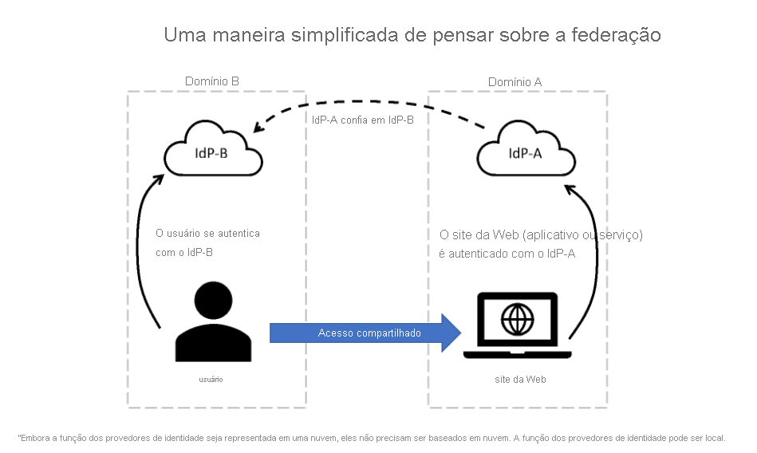

Uma maneira simplificada de pensar sobre esse cenário de federação é a seguinte:

O site, no domínio A, usa os serviços de autenticação do IdP-A (provedor de identidade A).
O usuário, no domínio B, faz a autenticação com o IdP-B (provedor de identidade B).
O IdP-A tem uma relação de confiança configurada com o IdP-B.
Quando o usuário, que deseja acessar o site, fornece as credenciais para o site, o site confia no usuário e permite o acesso. Esse acesso é permitido devido à confiança já estabelecida entre os dois provedores de identidade.
Com a federação, a confiança nem sempre é bidirecional. Embora o IdP-A possa confiar no IdP-B e permitir que o usuário no domínio B acesse o site no domínio A, o oposto não é verdadeiro, a menos que a relação de confiança esteja configurada.

Um exemplo comum de federação na prática é quando um usuário faz logon em um site de terceiros com uma conta de mídia social, como o Twitter. Nesse cenário, o Twitter é um provedor de identidade e o site de terceiros pode estar usando um provedor de identidade diferente, como o Azure AD. Existe uma relação de confiança entre o Azure AD e o Twitter.

## Descrever a defesa em profundidade

A defesa em profundidade usa uma abordagem em camadas de segurança, em vez de depender de um único perímetro. Uma estratégia de defesa em profundidade usa uma série de mecanismos para reduzir o avanço de um ataque. Cada camada fornece proteção para que, se uma camada for violada, uma camada subsequente impedirá que um invasor receba acesso não autorizado aos dados.

Camadas de exemplo de segurança podem incluir:

- Segurança física, como limitar o acesso a um datacenter para apenas o pessoal autorizado.

- Controles de segurança de identidade e acesso, como autenticação multifator ou acesso baseado em condição para controlar o acesso à infraestrutura e controle de alterações.

- A segurança de perímetro de sua rede corporativa inclui a proteção contra DDoS (ataque de negação de serviço distribuído) para filtrar ataques em grande escala antes que eles possam causar uma negação de serviço para os usuários.

- Segurança de rede, como segmentação de rede e controles de acesso à rede, para limitar a comunicação entre os recursos.

- A segurança da camada Computação, como a proteção do acesso a máquinas virtuais, local ou na nuvem, fechando determinadas portas.

A segurança da camada Aplicativo garante que os aplicativos estejam seguros e livres de vulnerabilidades de segurança.

A segurança da camada Dados, incluindo controles para gerenciar o acesso aos dados de negócios e clientes e à criptografia para proteger os dados.

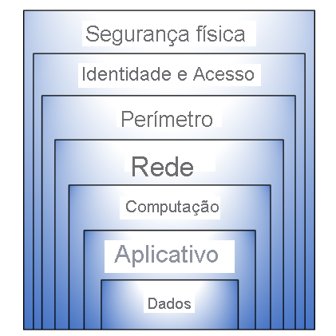

### Confidencialidade, Integridade, Disponibilidade (CIA)

Como descrito acima, uma estratégia de defesa em profundidade usa uma série de mecanismos para reduzir o avanço de um ataque. Todos os diferentes mecanismos (tecnologias, processos e treinamento) são elementos de uma estratégia de segurança cibernética, cujos objetivos incluem garantir a confidencialidade, integridade e disponibilidade; muitas vezes referidas como CIA (confidentiality, integrity e availability).

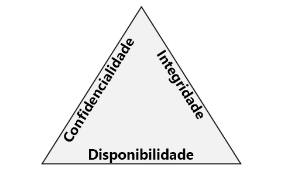

- A Confidencialidade se refere à necessidade de manter os dados confidenciais, como informações do cliente, senhas ou dados financeiros. Você pode criptografar os dados para mantê-los confidenciais, mas também precisa manter as chaves de criptografia confidenciais. Confidencialidade é a parte mais visível da segurança. Podemos ver claramente a necessidade de dados confidenciais, chaves, senhas e outros segredos que devem ser mantidos confidenciais.

- A Integridade se refere à manutenção de dados ou mensagens corretas. Ao enviar uma mensagem de email, você deve ter certeza de que a mensagem recebida é igual à mensagem enviada. Ao armazenar dados em um banco de dados, você deve ter certeza de que os dados recuperados são os mesmos que os dados armazenados. A criptografia de dados mantém a confidencialidade, mas você deve ser capaz de descriptografar os dados de forma que eles se mantenham tal como eram antes de serem criptografados. Integridade trata-se da confiança de que os dados não foram adulterados ou alterados.

- Disponibilidade refere-se a tornar os dados disponíveis para aqueles que precisam deles, quando eles precisam. É importante para a organização manter os dados do cliente seguros, mas ao mesmo tempo eles também devem estar disponíveis para os funcionários que lidam com os clientes. Embora possa ser mais seguro armazenar os dados em um formato criptografado, os funcionários precisam acessar dados descriptografados.

Embora os objetivos de uma estratégia de segurança cibernética sejam preservar a confidencialidade, integridade e disponibilidade de sistemas, redes, aplicativos e dados; o objetivo dos cibercriminosos é interromper esses objetivos. O portfólio da Microsoft inclui as soluções e tecnologias para permitir que as organizações cumpram os objetivos da tríade da CIA.

## Explorar o modelo de Confiança Zero

A confiança zero pressupõe que tudo está em uma rede aberta e não confiável, até mesmo os recursos por trás dos firewalls de rede corporativa. O modelo de confiança zero opera no princípio de “não confiar em ninguém e verificar tudo”.

A capacidade dos invasores de ignorar os controles de acesso convencionais é eliminar qualquer ilusão de que as estratégias de segurança tradicionais sejam suficientes. Por não confiar mais na integridade da rede corporativa, a segurança é reforçada.

Na prática, isso significa que não presumimos mais que uma senha seja suficiente para validar um usuário, mas sim adicionar a autenticação multifator para fornecer verificações adicionais. Em vez de conceder acesso a todos os dispositivos na rede corporativa, os usuários têm permissão para acessar apenas os aplicativos ou dados específicos de que precisam.

## Princípios de orientação de confiança zero

O modelo de confiança zero tem três princípios que orientam e sustentam como a segurança deve ser implementada. São eles: verificação explícita, acesso com privilégio mínimo e pressuposição de violação.

Verificação explícita. Sempre autentique e autorize com base nos pontos de dados disponíveis, incluindo a identidade do usuário, o local, o dispositivo, o serviço ou a carga de trabalho, a classificação de dados e as anomalias.
Acesso com privilégio mínimo. Limite o acesso do usuário com acesso just-in-time e just-enough (JIT/JEA), políticas adaptáveis baseadas em risco e proteção de dados para proteger os dados e a produtividade.
Pressuposição de violação. Segmento de acesso por rede, usuário, dispositivos e aplicativo. Use a criptografia para proteger dados e use a análise para obter visibilidade, detectar ameaças e melhorar sua segurança.

### Seis pilares fundamentais

No modelo de confiança zero, todos os elementos funcionam em conjunto para fornecer segurança de ponta a ponta. Esses seis elementos são os pilares fundamentais do modelo de confiança zero:

- As identidades podem ser usuários, serviços ou dispositivos. Quando uma identidade tenta acessar um recurso, ela deve ser verificada com autenticação forte e seguir os princípios de acesso com privilégios mínimos.

- Os dispositivos criam uma grande superfície de ataque como fluxos de dados de dispositivos para cargas de trabalho locais e para a nuvem. 

- O monitoramento de dispositivos para integridade e conformidade é um aspecto importante da segurança.

- Os aplicativos são a maneira como os dados são consumidos. Isso inclui a descoberta de todos os aplicativos que estão sendo usados, o que às vezes é chamado de TI sombra, pois nem todos os aplicativos são gerenciados centralmente. Esse pilar também inclui o gerenciamento de permissões e o acesso.

- Os dados devem ser classificados, rotulados e criptografados com base em seus atributos. Os esforços de segurança são basicamente sobre a proteção de dados, garantindo que eles permaneçam seguros quando saem de dispositivos, aplicativos, infraestrutura e redes que a organização controla.

- A infraestrutura, seja local ou baseada na nuvem, representa um vetor de ameaça. Para melhorar a segurança, você avalia a versão, a configuração e o acesso JIT e usa a telemetria para detectar ataques e anomalias. Isso permite que você bloqueie ou sinalize automaticamente comportamentos arriscados e tome ações de proteção.

- As redes devem ser segmentadas, incluindo a micro segmentação na rede mais profunda. Além disso, a proteção contra ameaças em tempo real, criptografia de ponta a ponta, monitoramento e análise devem ser empregadas.


Uma estratégia de segurança que emprega os três princípios do modelo Confiança Zero nos seis pilares fundamentais ajuda as empresas a fornecer e reforçar a segurança em toda a organização.

## Descrever criptografia e hash


Uma maneira de mitigar ameaças comuns de segurança cibernética é criptografar dados confidenciais ou valiosos. Criptografia é o processo de tornar dados ilegíveis e inutilizáveis para visualizadores não autorizados. Para usar ou ler os dados criptografados, eles precisam ser descriptografados, o que exige o uso de uma chave secreta.

### Há dois tipos de criptografia de nível superior: simétrica e assimétrica.

 A criptografia simétrica usa a mesma chave para criptografar e descriptografar os dados. 

 A criptografia assimétrica usa um par de chaves públicas e de chaves privadas. Qualquer chave pode criptografar dados, mas uma única chave não pode ser usada para descriptografar dados criptografados. Para descriptografar, você precisa de uma chave emparelhada. A criptografia assimétrica é usada para acessar sites na Internet usando o protocolo HTTPS e soluções de assinatura eletrônica de dados. A criptografia pode proteger dados inativos ou em trânsito.

The concept of symmetric and asymmetric encryption

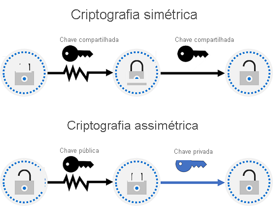

### Criptografia para dados em repouso

Dados inativos são dados armazenados em um dispositivo físico, como um servidor. Ele pode ser armazenado em um banco de dados ou em uma conta de armazenamento, mas, independentemente de onde ele estiver armazenado, a criptografia de dados inativos garante que os dados não possam ser lidos sem as chaves e os segredos necessários para descriptografá-los.

Se um invasor obtiver um disco rígido com os dados criptografados e não tiver acesso às chaves de criptografia, ele terá grande dificuldade para ler os dados.

### Criptografia TLS para dados em trânsito

Dados em trânsito são os dados que se movem de um local para outro, como pela Internet ou por meio de uma rede privada. A transferência segura pode ser feita por várias camadas diferentes. Isso pode ser feito criptografando os dados na camada de aplicativo antes de enviá-los por uma rede. HTTPS é um exemplo de criptografia em trânsito.

A criptografia dos dados em trânsito protege-os de observadores externos e fornece um mecanismo para transmitir os dados, limitando o risco de exposição.

### Criptografia para dados em uso

Um caso de uso comum para a criptografia de dados em uso envolve a proteção de dados em armazenamento não persistente, como memória RAM ou caches de CPU. Isso pode ser alcançado por meio de tecnologias que criam um enclave (pense nisso como um cofre seguro) que protege os dados e mantém os dados criptografados enquanto a CPU processa os dados.

### Hash

O hash usa um algoritmo para converter texto em um valor exclusivo de comprimento fixo chamado hash. Toda vez que o mesmo texto tem hash usando o mesmo algoritmo, o mesmo valor de hash é produzido. Esse hash pode ser usado como um identificador exclusivo de seus dados associados.

O hash é diferente da criptografia, pois não usa chaves, e o valor de hash não é subsequentemente descriptografado de volta para o original.

O hash é usado para armazenar senhas. Quando um usuário insere sua senha, o mesmo algoritmo que criou o hash armazenado cria um hash da senha digitada. Isso é comparado com a versão de hash armazenada da senha. Se as senhas corresponderem, o usuário terá digitado sua senha corretamente. Isso é mais seguro do que armazenar senhas de texto sem formatação, mas os algoritmos de hash também são conhecidos por hackers. Como as funções de hash são determinísticas (a mesma entrada produz a mesma saída), os hackers podem usar ataques de dicionário de força bruta por meio do hash de senhas. Para cada hash correspondente, eles sabem a senha real. Para atenuar esse risco, as senhas geralmente têm “sal”. Isso se refere à adição de um valor aleatório de comprimento fixo à entrada de funções de hash para criar hashes exclusivos para a mesma entrada.

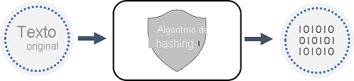

### Descrever conceitos de conformidade

Os dados se tornaram mais importantes do que nunca. Organizações, instituições e sociedades inteiras geram e dependem de dados para funcionar diariamente. A grande escala de dados gerados e o aumento da dependência deles significam que a privacidade e a proteção desses dados se tornaram fundamentais. À medida que organizações e instituições movem seus dados para nuvens do provedor de serviços, com datacenters em todo o mundo, considerações adicionais entram em jogo.

Agências governamentais e grupos do setor emitiram regulamentos para ajudar a proteger e controlar o uso de dados. De informações pessoais e financeiras à proteção e privacidade de dados, as organizações podem ser responsáveis por atender dezenas de regulamentações para estarem em conformidade. Listados abaixo estão alguns conceitos e termos importantes relacionados à conformidade de dados.

- Residência de dados – Quando se trata de conformidade, os regulamentos de residência de dados regem os locais físicos onde os dados podem ser armazenados e como e quando podem ser transferidos, processados ou acessados internacionalmente. Esses regulamentos podem diferir significativamente dependendo da jurisdição.

- Soberania de dados – Outra consideração importante é a soberania de dados, o conceito de que os dados, particularmente dados pessoais, estão sujeitos às leis e regulamentos do país/região em que são coletados fisicamente, mantidos ou processados. Isso pode adicionar uma camada de complexidade quando se trata de conformidade, pois o mesmo dado pode ser coletado em um local, armazenado em outro e processado em outro; tornando-o sujeito a leis de diferentes países/regiões.

- Privacidade de dados – Fornecer aviso e ser transparente sobre a coleta, o processamento, o uso e o compartilhamento de dados pessoais são princípios fundamentais das leis e regulamentos de privacidade. Dados pessoais significa qualquer informação relacionada a uma pessoa física identificada ou identificável. As leis de privacidade anteriormente faziam referência a "PII" ou "informações de identificação pessoal", mas as leis expandiram a definição para quaisquer dados que estejam diretamente vinculados ou indiretamente vinculados a uma pessoa. As organizações estão sujeitas e devem operar de acordo com uma infinidade de leis, regulamentos, códigos de conduta, padrões específicos do setor e padrões de conformidade que regem a privacidade de dados.

Na maioria dos casos, as leis e os regulamentos não definem nem prescrevem tecnologias específicas que as organizações devem usar para proteger os dados. Eles deixam que a organização identifique tecnologias compatíveis, operações e outras medidas apropriadas de proteção de dados.

## Descrever a infraestrutura física do Azure


Ao longo de seu percurso com o Microsoft Azure, você ouvirá e usará termos como Regiões, Zonas de Disponibilidade, Recursos, Assinaturas etc. Este módulo se concentra nos principais componentes de arquitetura do Azure. Os principais componentes da arquitetura do Azure podem ser divididos em dois agrupamentos principais: a infraestrutura física e a infraestrutura de gerenciamento.

Infraestrutura física
A infraestrutura física do Azure começa com datacenters. Conceitualmente, os datacenters são iguais aos grandes datacenters corporativos. São instalações com recursos organizados em racks com energia, refrigeração e infraestrutura de rede dedicadas.

Como um provedor de nuvem global, o Azure tem datacenters em todo o mundo. No entanto, esses datacenters individuais não estão diretamente acessíveis. Os datacenters são agrupados em Regiões do Azure ou em Zonas de Disponibilidade do Azure projetadas para ajudá-lo a obter resiliência e confiabilidade para suas cargas de trabalho críticas para os negócios.

O site Infraestrutura global possibilita explorar interativamente a infraestrutura subjacente do Azure.

Regiões

Uma região é uma área geográfica do planeta que contém pelo menos um data center, mas possivelmente vários, nas proximidades e conectado a uma rede de baixa latência. O Azure atribui e controla os recursos de modo inteligente dentro de cada região para garantir que as cargas de trabalho sejam balanceadas corretamente.

Quando você implanta um recurso no Azure, geralmente precisa escolher a região em que deseja que ele seja implantado.

### Observação

Alguns serviços ou recursos de VM (máquina virtual) estão disponíveis somente em determinadas regiões, como tamanhos específicos de VMs ou tipos de armazenamento. Também há alguns serviços globais do Azure que não exigem que você selecione uma região específica, como o Azure Active Directory, o Gerenciador de Tráfego do Azure e o DNS do Azure.

### Zonas de Disponibilidade

Zonas de disponibilidade são datacenters separados fisicamente dentro de uma região do Azure. Cada zona de disponibilidade é composta de um ou mais datacenters equipados com energia, resfriamento e rede independentes. Uma zona de disponibilidade é configurada para ser um limite de isolamento. Se uma zona ficar inativa, as outras continuarão funcionando. Zonas de disponibilidade são conectadas por meio de redes de fibra óptica privadas de alta velocidade.

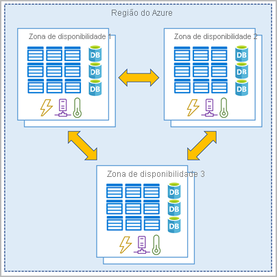


 Importante

Para garantir a resiliência, no mínimo três zonas de disponibilidade separadas estão presentes em todas as regiões habilitadas para zona de disponibilidade. No entanto, nem todas as Regiões do Azure atualmente dão suporte a zonas de disponibilidade.

Usar zonas de disponibilidade em seus aplicativos
É importante verificar se seus serviços e dados são redundantes para que você possa proteger suas informações em caso de falha. Ao hospedar sua infraestrutura, a configuração de sua redundância exigirá a criação de ambientes de hardware duplicados. O Azure pode ajudar a tornar seu aplicativo altamente disponível por meio das zonas de disponibilidade.

Você pode usar as zonas de disponibilidade para executar aplicativos críticos e incorporar alta disponibilidade à arquitetura do aplicativo, colocalizando seus recursos de computação, armazenamento, rede e dados em uma zona de disponibilidade e replicando em outras zonas de disponibilidade. Tenha em mente que pode haver um custo para duplicar seus serviços e transferir dados entre zonas de disponibilidade.

As zonas de disponibilidade são destinadas, principalmente, a VMs, discos gerenciados, balanceadores de carga e bancos de dados SQL. Os serviços do Azure que dão suporte às zonas de disponibilidade enquadram-se em três categorias:

Serviços em zonas: você fixa o recurso a uma zona específica (por exemplo, VMs, discos gerenciados, endereços IP).
Serviços com redundância de zona: a plataforma replica automaticamente entre zonas (por exemplo, armazenamento com redundância de zona, Banco de Dados SQL).
Serviços não regionais: os serviços estão sempre disponíveis em geografias do Azure e são resilientes a interrupções em toda a zona, bem como a interrupções em toda a região.
Mesmo com a resiliência adicional que as zonas de disponibilidade proporcionam, é possível que um evento possa ser tão grande que afete várias zonas de disponibilidade em uma só região. Para fornecer ainda mais resiliência, o Azure tem Pares de Regiões.

### Pares de regiões

A maioria das regiões do Azure é emparelhada a outra região na mesma geografia (como EUA, Europa ou Ásia) a pelo menos 300 milhas (cerca de 480 km) de distância. Essa abordagem permite a replicação de recursos em uma geografia, o que ajuda a reduzir a probabilidade de interrupções devido a eventos como desastres naturais, conflitos civis, quedas de energia ou interrupções de rede física afetarem toda uma região. Por exemplo, se uma região em um par de regiões fosse afetada por um desastre natural, os serviços fariam failover automaticamente para a outra região nesse par.

 Importante

Nem todos os serviços do Azure replicam dados automaticamente ou retornam automaticamente de uma região com falha para replicação cruzada para outra região habilitada. Nesses cenários, a recuperação e a replicação devem ser configuradas pelo cliente.

Exemplos de pares de regiões no Azure são Oeste dos EUA emparelhado com Leste dos EUA e Sudeste da Ásia emparelhado com Leste da Ásia. Como o par de regiões está diretamente conectado e suficientemente afastado para ser isolado contra desastres regionais, você pode usá-lo para fornecer redundância de dados e serviços confiáveis.


Vantagens adicionais dos pares de regiões:
Se ocorrer uma interrupção ampla do Azure, uma região de cada par será priorizada para que pelo menos uma seja restaurada quanto antes para os aplicativos hospedados nesse par de regiões.
As atualizações planejadas do Azure são distribuídas para regiões emparelhadas uma por vez, de modo a minimizar o tempo de inatividade e o risco de interrupção dos aplicativos.
Os dados continuam residindo na mesma geografia que seu par (com exceção do Sul do Brasil) para fins de jurisdição do imposto e aplicação da lei.
 Importante

A maioria das regiões é emparelhada em duas direções, o que significa que uma região é o backup da outra região (Oeste dos EUA e Leste dos EUA fazem backup entre si). No entanto, algumas regiões, como Índia Ocidental e Sul do Brasil, são emparelhadas em apenas uma direção. Em um emparelhamento de uma direção, a região primária não fornece backup para a região secundária. Assim, mesmo que a região secundária da Índia Ocidental seja o Sul da Índia, o Sul da Índia não depende da Índia Ocidental. A região secundária do Oeste da Índia é o Sul da Índia, mas a região secundária do Sul da Índia é a Índia Central. O Sul do Brasil é exclusivo porque ele está associado a uma região fora de sua região geográfica. A região secundária do Sul do Brasil é o Centro-Sul dos EUA. A região secundária do Centro-Sul dos EUA não é Sul do Brasil.

### Regiões soberanas

Além das regiões normais, o Azure também tem regiões soberanas. Regiões soberanas são instâncias do Azure isoladas da instância principal do Azure. Talvez seja necessário usar uma região soberana para fins legais ou de conformidade.

As regiões soberanas do Azure incluem:

US DoD Central, US Gov – Virgínia, US Gov Iowa, entre outros: essas regiões são instâncias lógicas e físicas do Azure isoladas da rede, destinadas a parceiros e órgãos do governo dos EUA. Esses datacenters são operados por cidadãos selecionados dos EUA e incluem certificações de conformidade adicionais.
Leste da China, Norte da China, entre outros: essas regiões estão disponíveis por meio de uma parceria exclusiva entre a Microsoft e a 21Vianet, segundo a qual a Microsoft não mantém diretamente os data centers.

## Descrever a infraestrutura de gerenciamento do Azure


A infraestrutura de gerenciamento inclui recursos do Azure e grupos de recursos, assinaturas e contas. Entender a organização hierárquica ajudará você a planejar seus projetos e produtos no Azure.

## Recursos e grupos de recursos do Azure
Um recurso é o bloco de construção básico do Azure. Qualquer coisa que você criar, provisionar, implantar etc. é um recurso. VMs (máquinas virtuais), redes virtuais, bancos de dados, serviços cognitivos etc. são todos considerados recursos no Azure.


Os grupos de recursos são simplesmente agrupamentos de recursos. Quando você cria um recurso, é necessário colocá-lo em um grupo de recursos. Embora um grupo de recursos possa conter muitos recursos, apenas um recurso pode estar em um grupo de recursos por vez. Alguns recursos podem ser movidos entre grupos de recursos, mas quando você move um recurso para um novo grupo, ele não é mais associado ao grupo anterior. Além disso, os grupos de recursos não podem ser aninhados, o que significa que você não pode colocar o grupo de recursos B dentro do grupo de recursos A.

Os grupos de recursos oferecem um modo conveniente de agrupar recursos. Quando você aplicar uma ação a um grupo de recursos, essa ação será aplicada a todos os recursos dentro do grupo de recursos. Se você excluir um grupo de recursos, todos os recursos serão excluídos. Se você conceder ou negar acesso a um grupo de recursos, vai conceder ou negar acesso a todos os recursos dentro do grupo de recursos.

Quando você está provisionando recursos, pense na estrutura do grupo de recursos que melhor atende às suas necessidades.

Por exemplo, se você estiver configurando um ambiente de desenvolvimento temporário, agrupar todos os recursos significa que você pode desprovisionar todos os recursos associados de uma só vez excluindo o grupo de recursos. Se você estiver provisionando recursos de computação que precisarão de três esquemas de acesso diferentes, talvez seja melhor agrupar recursos com base no esquema de acesso e depois atribuir acesso no nível do grupo de recursos.

Não há regras rígidas sobre como você usa grupos de recursos, portanto, considere como configurar seus grupos de recursos para maximizar a utilidade deles para você.

## Assinaturas do Azure

- Avaliação Gratuita

 Fornece acesso gratuito aos recursos do Azure por um tempo limitado. Apenas uma assinatura de avaliação gratuita está disponível
por conta, e você não pode criar uma nova avaliação gratuita se um anterior expirou.

- Pay-As-You-Go Você paga apenas pelos recursos que usar no Azure. Não há custo inicial e você pode cancelar a assinatura a qualquer momento.

- Desenvolvimento/teste pré-pago Uma assinatura especial para assinantes do Visual Studio que podem ser usados para desenvolvimento e testes. 

 Esta assinatura oferece taxas com desconto em VMs, mas você não pode usar isso para aplicações de produção.

Observe os tipos de assinatura do Azure, dependendo do tipo de conta do Azure que você possui, você pode ter opções adicionais de assinatura.

No Azure, as assinaturas são uma unidade de gerenciamento, cobrança e escala. Semelhante a como os grupos de recursos são um modo de organizar logicamente os recursos, as assinaturas permitem organizar logicamente seus grupos de recursos e facilitar a cobrança.


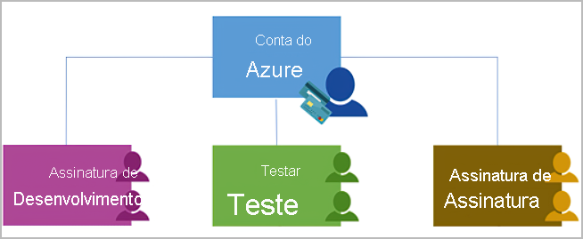

A utilização do Azure exige uma Assinatura do Azure. Uma assinatura fornece a você acesso autenticado e autorizado a serviços e produtos do Azure. Ela também permite que você provisione recursos. Uma assinatura do Azure se vincula a uma conta do Azure, que é uma identidade no Azure AD (Azure Active Directory) ou em um diretório no qual o Azure AD confia.

Uma conta pode ter várias assinaturas, mas só é necessário ter uma. Em uma conta com várias assinaturas, você pode usar as assinaturas para configurar diferentes modelos de cobrança e aplicar diferentes políticas de gerenciamento de acesso. Você pode usar as assinaturas do Azure para definir limites em relação a produtos, serviços e recursos do Azure. Você pode usar dois tipos de limites de assinatura:

Limite de cobrança: Esse tipo de assinatura determina como uma conta do Azure é cobrada pelo uso do Azure. Você pode criar várias assinaturas para atender a diferentes tipos de requisitos de cobrança. O Azure gera relatórios de cobrança e faturas separados para cada assinatura, para que você possa organizar e gerenciar os custos.
Limite de controle de acesso: O Azure aplica políticas de gerenciamento de acesso no nível da assinatura, e você pode criar assinaturas separadas para refletir diferentes estruturas organizacionais. Um exemplo disso é que, em um negócio, você tem diferentes departamentos aos quais aplica políticas de assinatura do Azure distintas. Esse modelo de cobrança permite gerenciar e controlar o acesso aos recursos que os usuários provisionam com assinaturas específicas.

## Criar assinaturas adicionais do Azure

Semelhante ao uso de grupos de recursos para separar recursos por função ou acesso, talvez você queira criar assinaturas adicionais para gerenciamento de recursos ou cobrança. Por exemplo, é possível criar assinaturas adicionais para separar:

Ambientes: você pode optar por criar assinaturas adicionais a fim de configurar ambientes separados para desenvolvimento e teste, segurança ou para isolar dados por motivos de conformidade. Esse design é particularmente útil porque o controle de acesso ao recurso ocorre no nível da assinatura.
Estruturas organizacionais: É possível criar assinaturas para refletir diferentes estruturas organizacionais. Você poderia, por exemplo, limitar uma equipe a recursos de baixo custo, enquanto permite uma gama completa para o departamento de TI. Esse design permite gerenciar e controlar o acesso aos recursos que os usuários provisionam em cada assinatura.
Cobrança: você pode criar assinaturas adicionais para fins de cobrança. Como os custos são agregados primeiro no nível da assinatura, talvez você queira criar assinaturas para gerenciar e controlar os custos com base em suas necessidades. Por exemplo, talvez você queira criar uma assinatura para as cargas de trabalho de produção e outra para as cargas de trabalho de desenvolvimento e teste.

## Grupos de gerenciamento do Azure

A última parte é o grupo de gerenciamento. Os recursos são reunidos em grupos de recursos e os grupos de recursos são reunidos em assinaturas. Se você está começando a usar o Azure, isso pode parecer hierarquia suficiente para manter as coisas organizadas. Porém, imagine que você está lidando com vários aplicativos e várias equipes de desenvolvimento em várias regiões geográficas.

Se você tiver muitas assinaturas, talvez precise de um modo de gerenciar o acesso, as políticas e a conformidade com eficiência para essas assinaturas. Os grupos de gerenciamento do Azure fornecem um nível de escopo acima das assinaturas. Você organiza as assinaturas em contêineres chamados grupos de gerenciamento e aplica as condições de governança a esses grupos. Todas as assinaturas em um grupo de gerenciamento herdam automaticamente as condições aplicadas ao grupo de gerenciamento, da mesma forma que os grupos de recursos herdam configurações de assinaturas e recursos herdados de grupos de recursos. Os grupos de gerenciamento fornecem gerenciamento corporativo em larga escala, independentemente do tipo de assinaturas que você possa ter. Grupos de gerenciamento podem ser aninhados.

### Gerenciador de Recursos do Azure (ARM)

Quase todos os sistemas que são movidos para a nuvem consistem em mais de um serviço do Azure. Para exemplo, você pode ter um Azure virtual máquina para uma parte do seu aplicativo; seus dados pode estar em um Banco de Dados SQL do Azure; você pode ter alguns dados confidenciais armazenados na chave do Azure Cofre; e você pode ter uma parte baseada na web de seu aplicativo hospedado no Serviço de Aplicativo do Azure.

Como você pode ver, o ARM tem muitos benefícios e você deve estar ciente disso para o seu exame:

- O ARM permite que você implante facilmente vários servidores do Azure recursos de uma só vez.

- Com o ARM torna possível reproduzir qualquer implantação com resultados consistentes em qualquer ponto no futuro.

- O ARM permite que você crie modelos declarativos para implantação em vez de exigir que você escreva e manter scripts de implantação complexos.

- O ARM torna possível configurar dependências para que seus recursos são implantados na ordem certa a cada tempo.

## Grupo de gerenciamento, assinaturas e hierarquia de grupo de recursos

É possível compilar uma estrutura flexível de grupos de gerenciamento e assinaturas para organizar seus recursos em uma hierarquia para políticas unificadas e gerenciamento de acesso. O diagrama a seguir mostra um exemplo de criação de uma hierarquia de governança usando grupos de gerenciamento.

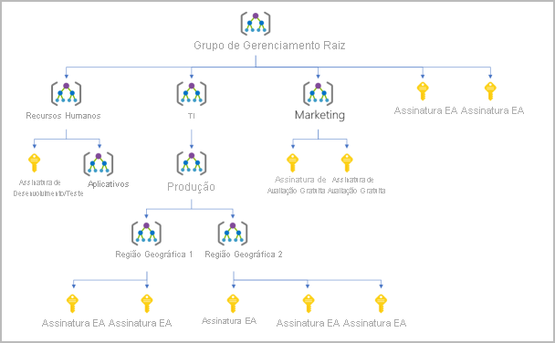


Alguns exemplos de como você pode usar grupos de gerenciamento podem ser:

Criar uma hierarquia que aplica uma política. Você pode limitar os locais de VM à região Oeste dos EUA em um grupo chamado Produção. Essa política herdará todas as assinaturas nesse grupo de gerenciamento e será aplicada a todas as VMs sob essas assinaturas. Essa política de segurança não pode ser alterada pelo proprietário da assinatura nem do recurso, o que permite uma governança aprimorada.
Fornecer acesso do usuário a várias assinaturas. Ao mover várias assinaturas em um grupo de gerenciamento, você poderá criar uma atribuição de RBAC do Azure (controle de acesso baseado em função do Azure) no grupo de gerenciamento. Atribuir o RBAC do Azure no nível do grupo de gerenciamento significa que todos os grupos de subgerenciamento, assinaturas, grupos de recursos e recursos abaixo desse grupo de gerenciamento também herdam essas permissões. Uma atribuição no grupo de gerenciamento pode permitir que os usuários tenham acesso a tudo que for necessário, em vez de criar scripts do Azure RBAC em assinaturas diferentes.
Fatos importantes sobre os grupos de gerenciamento:

10.000 grupos de gerenciamento podem ter suporte em um único diretório.
Uma árvore do grupo de gerenciamento pode dar suporte a até seis níveis de profundidade. Esse limite não inclui o nível raiz nem o nível da assinatura.
Cada grupo de gerenciamento e assinatura podem dar suporte a somente um pai.

## Descrever Máquinas Virtuais do Azure

Com as VMs (Máquinas Virtuais) do Azure, você pode criar e usar VMs na nuvem. As VMs fornecem IaaS (infraestrutura como serviço) na forma de um servidor virtualizado e podem ser usadas de várias maneiras. Como em um computador físico, você pode personalizar todos os programas de software em execução na VM. As VMs são uma opção ideal quando você precisa de:

Controle total sobre o SO (sistema operacional).
Capacidade para executar um software personalizado.
Usar configurações personalizadas de hospedagem.
Uma VM do Azure oferece a flexibilidade da virtualização sem a necessidade de comprar e manter o hardware físico que a executa. No entanto, como uma oferta de IaaS, você ainda precisa configurar, atualizar e manter o software executado na VM.

Você pode até mesmo criar ou usar uma imagem já criada para provisionar rapidamente VMs. Você pode criar e provisionar uma VM em minutos quando seleciona uma imagem de VM pré-configurada. Uma imagem é um modelo usado para criar uma VM e pode já incluir um sistema operacional e outros softwares, como ferramentas de desenvolvimento ou ambientes de hospedagem na Web.

## Dimensionar VMs no Azure

Você pode executar VMs únicas para teste, desenvolvimento ou para tarefas secundárias. Ou pode agrupar VMs para fornecer alta disponibilidade, escalabilidade e redundância. O Azure também pode gerenciar o agrupamento de VMs para você com recursos como conjuntos de dimensionamento e conjuntos de disponibilidade.

conjuntos de escala de máquina virtual
Os Conjuntos de Dimensionamento de Máquinas Virtuais permitem criar e gerenciar um grupo de VMs idênticas e com balanceamento de carga. Se você simplesmente criou várias VMs com a mesma finalidade, precisará garantir que todas elas foram configuradas de modo idêntico e configurar parâmetros de roteamento de rede para garantir a eficiência. Você também precisa monitorar a utilização para determinar se precisa aumentar ou diminuir o número de VMs.

Em vez disso, com conjuntos de dimensionamento de máquinas virtuais, o Azure automatiza a maior parte desse trabalho. Os conjuntos de dimensionamento permitem que você gerencie, configure e atualize centralmente um grande número de VMs em minutos. O número de instâncias de VM pode aumentar ou diminuir automaticamente em resposta à demanda ou você pode defini-lo para uma escala com base em uma agenda definida. Os conjuntos de dimensionamento de máquinas virtuais também implantam automaticamente um balanceador de carga para garantir que seus recursos estejam sendo usados com eficiência. Com conjuntos de dimensionamento de máquinas virtuais, você pode criar serviços em grande escala para áreas como computação, big data e cargas de trabalho de contêiner.

## Conjuntos de disponibilidade da máquina virtual

Os conjuntos de disponibilidade de máquinas virtuais são outra ferramenta para ajudá-lo a criar um ambiente mais resiliente e altamente disponível. Os conjuntos de disponibilidade foram projetados para garantir que as VMs escalonem atualizações e tenham conectividade de rede e energia variadas, impedindo que você perca todas as suas VMs com uma só falha de rede ou energia.

Os conjuntos de disponibilidade fazem isso agrupando VMs de duas maneiras: domínio de atualização e domínio de falha.

Domínio de atualização: as VMs de grupos de domínio de atualização que podem ser reinicializadas ao mesmo tempo. Isso permite que você aplique atualizações sabendo que apenas um agrupamento de domínio de atualização estará offline por vez. Todos os computadores em um domínio de atualização serão atualizados. Um grupo de atualizações que passa pelo processo de atualização recebe um tempo de 30 minutos para se recuperar antes que a manutenção no próximo domínio de atualização seja iniciada.
Domínio de falha: o domínio de falha agrupa suas VMs por origem de energia comum e comutador de rede. Por padrão, um conjunto de disponibilidade dividirá suas VMs em até três domínios de falha. Isso ajuda a proteger contra uma falha de energia física ou de rede, tendo VMs em diferentes domínios de falha (portanto, sendo conectadas a diferentes recursos de energia e rede).
O melhor de tudo é que não há nenhum custo adicional para configurar um conjunto de disponibilidade. Você paga apenas pelas instâncias de VM criadas.

### Exemplos de quando usar VMs

Alguns exemplos comuns ou casos de uso para máquinas virtuais incluem:

Durante o teste e o desenvolvimento. As VMs fornecem uma maneira rápida e fácil de criar diferentes configurações de sistema operacional e de aplicativo. A equipe de teste e desenvolvimento pode excluir facilmente as VMs quando não precisarem mais delas.
Ao executar aplicativos na nuvem. A capacidade de executar determinados aplicativos na nuvem pública, em vez de criar uma infraestrutura tradicional para executá-los, pode trazer benefícios econômicos substanciais. Por exemplo, um aplicativo pode precisar lidar com flutuações na demanda. Desligar VMs quando elas não são necessárias ou iniciá-las rapidamente para atender a um aumento repentino na demanda significa que você paga apenas pelos recursos que usa.
Ao estender seu datacenter para a nuvem: uma organização pode estender os recursos de sua própria rede local criando uma rede virtual no Azure e adicionando VMs a ela. Aplicativos como o SharePoint podem, então, ser executados em uma VM do Azure em vez de localmente. É mais fácil ou menos caro implantar dessa forma do que em um ambiente local.
Durante a recuperação de desastre: assim como acontece com a execução de determinados tipos de aplicativos na nuvem e com a extensão de uma rede local para a nuvem, você pode conseguir economias significativas usando uma abordagem baseada em IaaS para a recuperação de desastre. Se um datacenter primário falhar, você poderá criar VMs em execução no Azure para executar seus aplicativos críticos e desligá-los quando o datacenter primário ficar operacional novamente.
Migrar para a nuvem com VMs
As VMs também são uma excelente opção quando você migra de um servidor físico para a nuvem (também conhecido como lift-and-shift). Você pode criar uma imagem do servidor físico e hospedá-la em uma VM com poucas ou nenhuma alteração. Assim como um servidor local físico, você deve manter a VM: você é responsável por manter o sistema operacional e o software instalados.

### Recursos da VM

Ao provisionar uma VM, você também terá a oportunidade de escolher os recursos associados a essa VM, incluindo:

Tamanho (finalidade, número de núcleos de processador e quantidade de RAM)
Discos de armazenamento (unidades de disco rígido, unidades de estado sólido etc.)
Rede (rede virtual, endereço IP público e configuração de porta)

Tarefa 1: criar uma máquina virtual do Linux e instalar o Nginx
Use os comandos da CLI do Azure a seguir para criar uma VM do Linux e instalar o Nginx. Depois que a VM for criada, você usará a Extensão de Script Personalizada para instalar o Nginx. A Extensão de Script Personalizado é uma maneira fácil de baixar e executar scripts em suas VMs do Azure. Ela é apenas uma das muitas maneiras de configurar o sistema depois que a VM está em funcionamento.

No Cloud Shell, execute o comando az vm create a seguir para criar uma VM do Linux:

### - Login CLI PowerShell 

    Login-AzureRmAccount

    Get-AzureRmResourceGroup

    Get-AzureRmLocation | select Location

    New-AzureRmResourceGroup -ResourceGroupName "AZR-EUA" -Location "centralus"

	Antes de criar os Resources Groups o interessante é utilizar a calculadora do Azure.
	
	[GitHub Pages](https://azure.microsoft.com/pt-br/pricing/calculator/). Pague por uso (Calculadora de Preço Azure)
	
	No exemplo acima o grupo de recursos foi criado em "AZR-EUA" nem sempre o Brasil é o local mais indicado na questão de economica para criação do Datacenter.
	
### CLI do Azure

```

az vm create \
  --resource-group [sandbox resource group name] \
  --name my-vm \
  --image UbuntuLTS \
  --admin-username azureuser \
  --generate-ssh-keys

  ```

Sua VM levará alguns minutos para ser exibida. Você dá à VM o nome de my-vm. Use esse nome para se referir à VM em etapas posteriores.

### Execute este comando az vm extension set para configurar o Nginx em sua VM:

```
az vm extension set \
  --resource-group learn-0d8077bc-df2e-4fa0-90df-2ea8b6f394ee \
  --vm-name my-vm \
  --name customScript \
  --publisher Microsoft.Azure.Extensions \
  --version 2.1 \
  --settings '{"fileUris":["https://raw.githubusercontent.com/MicrosoftDocs/mslearn-welcome-to-azure/master/configure-nginx.sh"]}' \
  --protected-settings '{"commandToExecute": "./configure-nginx.sh"}'

  ```

  Esse comando usa a Extensão de Script Personalizado para executar um script do Bash em sua VM. O script é armazenado no GitHub. Enquanto o comando é executado, você pode examinar o script do Bash em uma guia separada no navegador. Para resumir, o script:

Executa apt-get update para baixar as informações mais recentes do pacote da Internet. Esta etapa ajuda a garantir que o próximo comando possa localizar a versão mais recente do pacote Nginx.
Instala o Nginx.
Define a home page, /var/www/html/index.html, para imprimir uma mensagem de boas-vindas que inclui o nome de host da VM.

Continuar

Isso é tudo para este exercício. A área restrita continuará em execução e você voltará a este ponto em algumas unidades para atualizar a configuração de rede para que você possa acessar o site.

## Descrever a Área de Trabalho Virtual do Azure


Outro tipo de máquina virtual é a Área de Trabalho Virtual do Azure. A Área de Trabalho Virtual do Azure é um serviço de virtualização de área de trabalho e aplicativos que é executado na nuvem. Ele permite que você use uma versão do Windows hospedada na nuvem em qualquer localização. A Área de Trabalho Virtual do Azure opera em dispositivos e sistemas operacionais e funciona com aplicativos que você pode usar para acessar áreas de trabalho remotas ou a maioria dos navegadores modernos.

O vídeo a seguir fornece uma visão geral da Área de Trabalho Virtual do Azure:

## Aprimorar a segurança

A Área de Trabalho Virtual do Azure oferece gerenciamento de segurança centralizado para as áreas de trabalho dos usuários com o Azure AD (Azure Active Directory). Você pode habilitar a autenticação multifator para proteger as entradas do usuário. Você também pode proteger o acesso aos dados atribuindo RBACs (controles de acesso baseados em função) granulares aos usuários.

Com a Área de Trabalho Virtual do Azure, os dados e aplicativos ficam separados do hardware local. A área de trabalho e os aplicativos reais estão em execução na nuvem, o que significa que o risco de dados confidenciais serem deixados em um dispositivo pessoal é reduzido. Além disso, as sessões de usuário são isoladas em ambientes de sessão única e de várias sessões.

Implantação de Windows 10 ou do Windows 11 de várias sessões
A Área de Trabalho Virtual do Azure permite que você use a multissessão do Windows 10 ou Windows 11 Enterprise, o único sistema operacional baseado em cliente Windows que habilita vários usuários simultâneos em uma VM. A Área de Trabalho Virtual do Azure também fornece uma experiência mais consistente com suporte a aplicativos mais amplo em comparação com sistemas operacionais baseados no Windows Server.

## Descrever contêineres do Azure

Embora as máquinas virtuais sejam uma excelente maneira de reduzir os custos em comparação com os investimentos necessários para o hardware físico, elas ainda estão limitadas a um sistema operacional por máquina virtual. Se você quer executar várias instâncias de um aplicativo em um só computador host, os contêineres são uma ótima opção.

### O que são contêineres?

Contêineres são um ambiente de virtualização. Assim como a execução de várias máquinas virtuais em um só host físico, você pode executar vários contêineres em apenas um host físico ou virtual. Diferentemente das máquinas virtuais, você não gerencia o sistema operacional para um contêiner. Máquinas virtuais parecem ser uma instância de um sistema operacional que você pode gerenciar e ao qual pode se conectar. Os contêineres são leves e projetados para serem criados, dimensionados e interrompidos dinamicamente. É possível criar e implantar máquinas virtuais à medida que a demanda do aplicativo aumenta, mas os contêineres são um método mais leve e ágil. Os contêineres foram projetados para permitir que você responda às alterações sob demanda. Com contêineres, você pode reiniciar rapidamente se houver uma falha ou de uma interrupção de hardware. Um dos mecanismos de contêiner mais populares é o Docker, que tem suporte do Azure.

### Instâncias de Contêiner do Azure

As Instâncias de Contêiner do Azure oferecem a maneira mais rápida e simples de executar um contêiner no Azure, sem a necessidade de gerenciar máquinas virtuais nem adotar serviços adicionais. Instâncias de Contêiner do Azure são uma oferta de PaaS (plataforma como serviço). Instâncias de Contêiner do Azure permitem que você carregue seus contêineres e então o serviço executa os contêineres para você.

### Usar contêineres em suas soluções

Contêineres geralmente são usados para criar soluções que utilizam uma arquitetura de microsserviço. Essa arquitetura é onde você divide as soluções em partes menores e independentes. Por exemplo, você pode dividir um site em um contêiner que hospeda o front-end, outro que hospeda o back-end e um terceiro para o armazenamento. Essa divisão permite separar as partes do aplicativo em seções lógicas que podem ser mantidas, dimensionadas ou atualizadas de forma independente.

Imagine que o back-end do site atingiu a capacidade, mas o front-end e o armazenamento não estão sob pressão. Com contêineres, você pode dimensionar o back-end separadamente para melhorar o desempenho. Se algo exigisse tal alteração, você também poderia optar por alterar o serviço de armazenamento ou modificar o front-end sem afetar nenhum dos outros componentes.

## Descrever Azure Functions

O Azure Functions é uma opção de computação sem servidor controlada por eventos que não requer a manutenção de máquinas virtuais ou contêineres. Se você criar um aplicativo usando VMs ou contêineres, esses recursos precisarão estar "em execução" para que seu aplicativo funcione. Com o Azure Functions, um evento desperta a função, reduzindo a necessidade de manter os recursos provisionados quando não há eventos.

## Computação sem servidor no Azure

### Benefícios do Azure Functions

Usar o Azure Functions é ideal quando você está preocupado apenas com o código que executa o serviço, e não com a plataforma ou a infraestrutura subjacente. As funções costumam ser usadas quando você precisa executar um trabalho em resposta a um evento (geralmente por meio de uma solicitação REST), um temporizador ou uma mensagem de outro serviço do Azure e quando esse trabalho pode ser concluído dentro de segundos.

As funções são dimensionadas automaticamente com base na demanda, portanto, podem ser uma boa opção quando a demanda é variável.

O Azure Functions executa o código quando este é disparado e desaloca os recursos automaticamente quando a função é concluída. Neste modelo, você só é cobrado pelo tempo de CPU usado durante a execução da função.

As funções podem ser sem estado ou com estado. Quando são sem estado (o padrão), elas se comportam como se fossem reiniciadas sempre que respondem a um evento. Quando são com estado (chamadas de Durable Functions), um contexto é passado pela função para acompanhar a atividade anterior.

As funções são um componente chave da computação sem servidor. Elas também são uma plataforma de computação geral para executar qualquer tipo de código. Se as necessidades do aplicativo do desenvolvedor forem alteradas, você poderá implantar o projeto em um ambiente que não seja sem servidor. Essa flexibilidade permite gerenciar o dimensionamento, executar em redes virtuais e até mesmo isolar completamente as funções.

## Descrever as opções de hospedagem de aplicativo

Se você precisar hospedar seu aplicativo no Azure, poderá inicialmente recorrer a uma VM (máquina virtual) ou contêineres. Tanto VMs quanto contêineres fornecem excelentes soluções de hospedagem. As VMs oferecem o controle máximo do ambiente de hospedagem e permitem que você o configure exatamente como deseja. As VMs também poderão ser o método de hospedagem mais familiar se você for novo na nuvem. Os contêineres, com a capacidade de isolar e gerenciar individualmente diferentes aspectos da solução de hospedagem, também podem ser uma opção robusta e atraente.

Há outras opções de hospedagem que você pode usar com o Azure, incluindo Serviço de Aplicativo do Azure.

### Serviço de aplicativo do Azure

O Serviço de Aplicativo permite que você crie e hospede aplicativos Web, trabalhos em segundo plano, back-ends de dispositivos móveis e APIs RESTful na linguagem de programação de sua escolha sem gerenciar a infraestrutura. Ele oferece dimensionamento automático e alta disponibilidade. O Serviço de Aplicativo é compatível com o Windows e o Linux. Ele permite implantações automatizadas do GitHub, Azure DevOps ou qualquer repositório Git para dar suporte a um modelo de implantação contínua.

O Serviço de Aplicativo do Azure é uma opção de hospedagem robusta que você pode usar para hospedar seus aplicativos no Azure. O Serviço de Aplicativo do Azure permite que você se concentre em criar e manter seu aplicativo, e o Azure se concentra em manter o ambiente em funcionamento.

O Serviço de Aplicativo do Azure é um serviço com base em HTTP para hospedagem de aplicativos Web, APIs REST e back-ends móveis. Ele dá suporte a várias linguagens, incluindo .NET, .NET Core, Java, Ruby, Node.js, PHP ou Python. Ele também dá suporte a ambientes Windows e Linux.

### Tipos de serviços de aplicativos

Com o Serviço de Aplicativo, você pode hospedar os estilos mais comuns de serviço de aplicativos, como:

- Aplicativos Web
- Aplicativos de API
- WebJobs
- Aplicativos móveis

O Serviço de Aplicativo cuida da maioria das decisões de infraestrutura com as quais você lida ao hospedar aplicativos acessíveis pela Web:

A implantação e o gerenciamento são integrados à plataforma.
Pontos de extremidade podem ser protegidos.
Sites podem ser dimensionados rapidamente para lidar com cargas de alto tráfego.
O balanceamento de carga interno e o gerenciador de tráfego fornecem alta disponibilidade.
Todos esses estilos de aplicativos são hospedados na mesma infraestrutura e compartilham esses benefícios. Essa flexibilidade torna o Serviço de Aplicativo a escolha ideal para hospedar aplicativos voltados para a Web.

### Aplicativos Web

O Serviço de Aplicativo inclui suporte completo para a hospedagem de aplicativos Web usando ASP.NET, ASP.NET Core, Java, Ruby, Node.js, PHP ou Python. Você pode escolher Windows ou Linux como sistema operacional do host.

### Aplicativos de API

Da mesma forma como se hospeda um site, você pode criar APIs Web baseadas em REST usando a linguagem e a estrutura que você quiser. Receba o suporte completo do Swagger e a capacidade de empacotar e publicar sua API no Azure Marketplace. Os aplicativos produzidos podem ser consumidos por qualquer cliente baseado em HTTP ou em HTTPS.

### WebJobs

Você pode usar o recurso do WebJobs para executar um script (.cmd, .bat, PowerShell ou Bash) ou um programa (.exe, Java, PHP, Python ou Node.js) no mesmo contexto de um aplicativo Web, aplicativo de API ou aplicativo móvel. Eles também podem ser agendados ou executados por um gatilho. O WebJobs geralmente é usado para executar tarefas em segundo plano como parte da lógica do aplicativo.

### Aplicativos móveis

Use o recurso Aplicativos Móveis do Serviço de Aplicativo para criar rapidamente um back-end para aplicativos iOS e Android. Com apenas algumas ações no portal do Azure, você pode:

Armazenar dados de aplicativo móvel em um Banco de Dados SQL baseado em nuvem.
Autenticar os clientes em relação a provedores sociais comuns, como MSA, Google, Twitter e Facebook.
Enviar notificações por push.
Executar a lógica personalizada de back-end no C# ou Node.js.
No lado do aplicativo móvel, há suporte do SDK para aplicativos nativos para iOS, Android, Xamarin e React.

## Descrever a Rede Virtual do Azure

As redes virtuais e as sub-redes virtuais do Azure permitem que recursos do Azure, como VMs, aplicativos Web e bancos de dados, comuniquem-se uns com os outros, com usuários na Internet e com computadores cliente locais. Você pode pensar em uma rede do Azure como uma extensão de sua rede local com recursos que vinculam outros recursos do Azure.

As redes virtuais do Azure oferecem as seguintes funcionalidades de rede essenciais:

- Isolamento e segmentação
- Comunicação pela Internet
- Comunicação entre recursos do Azure
- Comunicação com os recursos locais
- Rotear tráfego de rede
- Filtrar tráfego de rede
- Conectar redes virtuais

A rede virtual do Azure dá suporte a pontos de extremidade públicos e privados para habilitar a comunicação entre recursos externos ou internos com outros recursos internos.

Pontos de extremidade públicos têm um endereço IP público e podem ser acessados de qualquer lugar do mundo.
Pontos de extremidade privados existem em uma rede virtual e têm um endereço IP privado dentro do espaço de endereço dessa rede virtual.
Isolamento e segmentação
A rede virtual do Azure permite criar várias redes virtuais isoladas. Quando você configura uma rede virtual, define um espaço de endereço IP privado usando intervalos de endereços IP públicos ou privados. O intervalo de IP existe somente na rede virtual e não é roteável pela Internet. Você pode dividir esse espaço de endereços IP em sub-redes e alocar parte do espaço de endereço definido para cada sub-rede nomeada.

Para a resolução de nomes, é possível usar o serviço de resolução de nomes interno do Azure. Você também pode configurar a rede virtual para usar um servidor DNS interno ou externo.

### Comunicações com a Internet

É possível habilitar conexões de entrada da Internet atribuindo um endereço IP público a um recurso do Azure ou colocar o recurso atrás de um balancear carga público.

### Comunicação entre recursos do Azure

Convém habilitar recursos do Azure para que se comuniquem entre si com segurança. Você pode fazer isso de duas maneiras:

As redes virtuais podem conectar não apenas VMs, mas outros recursos do Azure, como Ambiente do Serviço de Aplicativo para Power Apps, Serviço de Kubernetes do Azure e os conjuntos de dimensionamento de máquinas virtuais do Azure.
Os pontos de extremidade de serviço podem se conectar a outros tipos de recursos do Azure, como bancos de dados SQL do Azure e contas de armazenamento. Essa abordagem permite vincular vários recursos do Azure às redes virtuais para melhorar a segurança e fornecer o encaminhamento ideal entre recursos.
Comunicação com os recursos locais
As redes virtuais do Azure permitem vincular recursos em seu ambiente local e na assinatura do Azure. Na verdade, você pode criar uma rede que abranja os ambientes locais e de nuvem. Há três mecanismos para você obter essa conectividade:

As conexões de rede virtual privada ponto a site são de um computador fora da organização de volta para a rede corporativa. Nesse caso, o computador cliente inicia uma conexão VPN criptografada para se conectar à rede virtual do Azure.
Redes virtuais privadas site a site vinculam seu dispositivo VPN ou gateway de VPN local ao Gateway de VPN do Azure em uma rede virtual. Na verdade, os dispositivos no Azure podem aparecer como estando na rede local. A conexão é criptografada e funciona pela Internet.

O Azure ExpressRoute fornece uma conectividade privada dedicada para o Azure que não passa pela Internet. O ExpressRoute é útil para ambientes em que você precisa de maior largura de banda e níveis de segurança ainda mais altos.
Rotear tráfego de rede
Por padrão, o Azure faz o roteamento de tráfego entre sub-redes em redes virtuais conectadas, em redes locais e na Internet. Você também pode controlar o roteamento e substituir essas configurações da seguinte maneira:

As tabelas de rotas permitem definir regras sobre como o tráfego deve ser direcionado. Você pode criar tabelas de rotas personalizadas que controlam como os pacotes são encaminhados entre as sub-redes.
O BGP (Border Gateway Protocol) funciona com Gateways de VPN do Azure, Servidor de Rota do Azure ou Azure ExpressRoute para propagar as rotas BGP locais para redes virtuais do Azure.

### Filtrar tráfego de rede

As redes virtuais do Azure permitem filtrar o tráfego entre sub-redes usando as seguintes abordagens:

Grupos de segurança de rede são recursos do Azure que podem conter várias regras de segurança de entrada e saída. Você pode definir essas regras para permitir ou bloquear tráfego com base em fatores como endereço IP de origem e de destino, porta e protocolo.

Soluções de virtualização de rede são VMs especializadas que podem ser comparadas a um dispositivo de rede protegida. Uma solução de virtualização de rede realiza uma função de rede específica, como execução de um firewall ou otimização de WAN (rede de longa distância).

### Conectar redes virtuais

Você pode vincular redes virtuais usando o emparelhamento dessas redes. O emparelhamento permite que duas redes virtuais se conectem diretamente entre si. O tráfego de rede entre redes emparelhadas é privado e viaja na rede de backbone da Microsoft, nunca entrando na Internet pública. O emparelhamento permite que os recursos em cada rede virtual se comuniquem entre si. Essas redes virtuais podem estar em regiões separadas, o que permite criar uma rede global interconectada por meio do Azure.

As UDR (rotas definidas pelo usuário) permitem controlar as tabelas de roteamento entre sub-redes em uma rede virtual ou entre redes virtuais. Isso permite maior controle sobre o fluxo de tráfego de rede.

### Exercício – Configurar o acesso à rede

Área restrita ativada! Tempo restante: 
Você usou todas as 2 de 10 áreas restritas de hoje. Mais áreas restritas estarão disponíveis amanhã.
Neste exercício, você vai configurar o acesso à VM (máquina virtual) criada anteriormente neste módulo. A área restrita do Microsoft Learn ainda deve estar em execução. Se a área restrita tiver tempo limite, você precisará refazer o exercício anterior (Exercício – Criar uma máquina virtual do Azure).

No momento, a VM na qual você criou e instalou o Nginx não está acessível pela Internet. Você vai criar um grupo de segurança de rede que altera isso permitindo o acesso HTTP de entrada na porta 80.

### Tarefa 1: acessar seu servidor Web

Neste procedimento, você obtém o endereço IP da VM e tenta acessar a home page do servidor Web.

Execute o seguinte comando az vm list-ip-addresses para obter o endereço IP da VM e armazenar o resultado como uma variável Bash:

### CLI do Azure

```
IPADDRESS="$(az vm list-ip-addresses \
  --resource-group learn-0d8077bc-df2e-4fa0-90df-2ea8b6f394ee \
  --name my-vm \
  --query "[].virtualMachine.network.publicIpAddresses[*].ipAddress" \
  --output tsv)"

  ```

### Execute o seguinte comando de curl para baixar a home page:

```

curl --connect-timeout 5 http://$IPADDRESS

```

O argumento --connect-timeout especifica para permitir até cinco segundos para que a conexão ocorra. Após cinco segundos, você verá uma mensagem de erro afirmando que o tempo limite da conexão foi atingido:

Saída

Copiar
curl: (28) Connection timed out after 5001 milliseconds

Essa mensagem significa que a VM não estava acessível dentro do período de tempo limite.

Como uma etapa opcional, tente acessar o servidor Web em um navegador:

Execute o seguinte para imprimir o endereço IP da VM no console:

```

echo $IPADDRESS

```

Você verá um endereço IP, por exemplo, 23.102.42.235.

Copie o endereço IP que você vê para a área de transferência.

Abra uma nova guia do navegador e navegue até o servidor Web. Após alguns instantes, você verá que a conexão não está acontecendo.

Se você aguardar o tempo limite do navegador, verá algo assim:

Captura de tela de um navegador da Web mostrando uma mensagem de erro que diz que a conexão atingiu o tempo limite.

Deixe esta guia do navegador aberta para uso posterior.

Tarefa 2: listar as regras de grupo de segurança de rede atuais
O servidor Web não estava acessível. Para descobrir o motivo, vamos examinar suas regras de NSG atuais.

Execute o este comando az network nsg list para listar os grupos de segurança de rede que estão associados à sua VM:

### CLI do Azure

```

az network nsg list \
  --resource-group learn-0d8077bc-df2e-4fa0-90df-2ea8b6f394ee \
  --query '[].name' \
  --output tsv

  ```

Você verá isto:

my-vmNSG

Cada VM no Azure é associada a pelo menos um grupo de segurança de rede. Neste caso, o Azure criou um NSG para você chamado my-vmNSG.

Execute o seguinte comando az network nsg rule list para listar as regras associadas ao NSG chamado my-vmNSG:

### CLI do Azure

```
az network nsg rule list \
  --resource-group learn-0d8077bc-df2e-4fa0-90df-2ea8b6f394ee \
  --nsg-name my-vmNSG

  ```
  
Você verá um bloco grande de texto no formato JSON na saída. Na próxima etapa, você executará um comando semelhante que facilita a leitura dessa saída.

Execute o comando az network nsg rule list uma segunda vez. Dessa vez, use o argumento --query para recuperar apenas o nome, a prioridade, as portas afetadas e o acesso (Permitir ou Negar) de cada regra. O argumento --output formata a saída como uma tabela para facilitar a leitura.

### CLI do Azure

```
az network nsg rule list \
  --resource-group learn-0d8077bc-df2e-4fa0-90df-2ea8b6f394ee \
  --nsg-name my-vmNSG \
  --query '[].{Name:name, Priority:priority, Port:destinationPortRange, Access:access}' \
  --output table

  ```
  
Você verá isto:

Saída

Copiar
Name              Priority    Port    Access
-----------------  ----------  ------  --------
default-allow-ssh  1000        22      Allow

Você vê a regra padrão, default-allow-ssh. Essa regra permite conexões de entrada na porta 22 (SSH). O SSH (Secure Shell) é um protocolo usado no Linux para permitir que os administradores acessem o sistema remotamente. A prioridade dessa regra é 1.000. As regras são processadas em ordem de prioridade, sendo os números menores processados antes dos números maiores.

Por padrão, o NSG de uma VM Linux permite o acesso à rede somente na porta 22. Isso permite que os administradores acessem o sistema. Você também precisa permitir conexões de entrada na porta 80, que permite acesso via HTTP.

Tarefa 3: criar a regra de segurança de rede
Aqui, você cria uma regra de segurança de rede que permite o acesso de entrada na porta 80 (HTTP).

Execute o seguinte comando az network nsg rule create para criar uma regra chamada allow-http que permite o acesso de entrada na porta 80:

### CLI do Azure

```
az network nsg rule create \
  --resource-group learn-0d8077bc-df2e-4fa0-90df-2ea8b6f394ee \
  --nsg-name my-vmNSG \
  --name allow-http \
  --protocol tcp \
  --priority 100 \
  --destination-port-range 80 \
  --access Allow

  ```

Para fins de aprendizado, aqui você define a prioridade como 100. Neste caso, a prioridade não importa. Você precisaria considerar a prioridade se estivesse sobrepondo intervalos de porta.

Para verificar a configuração, execute az network nsg rule list para ver a lista atualizada de regras:

### CLI do Azure

```

az network nsg rule list \
  --resource-group learn-0d8077bc-df2e-4fa0-90df-2ea8b6f394ee \
  --nsg-name my-vmNSG \
  --query '[].{Name:name, Priority:priority, Port:destinationPortRange, Access:access}' \
  --output table

  ```

Você vê tanto a regra default-allow-ssh quanto sua nova regra, allow-http:

Saída

Copiar
Name              Priority    Port    Access
-----------------  ----------  ------  --------
default-allow-ssh  1000        22      Allow
allow-http        100        80      Allow


### Tarefa 4: acessar seu servidor Web novamente

Agora que você configurou o acesso à rede para a porta 80, vamos tentar acessar o servidor Web uma segunda vez.

 Observação

Depois de atualizar o NSG, poderá levar alguns instantes até que as regras atualizadas se propaguem. Tente novamente a próxima etapa, com pausas entre tentativas, até obter os resultados desejados.

Execute o mesmo comando curl executado anteriormente:

```

curl --connect-timeout 5 http://$IPADDRESS

```

Você verá isto:

HTML

```

<html><body><h2>Welcome to Azure! My name is my-vm.</h2></body></html>

```

Como uma etapa opcional, atualize a guia do navegador que aponta para o servidor Web.

### Você verá isto:

Uma captura de tela de um navegador da Web mostrando a home page do servidor Web. A home page exibe uma mensagem de boas-vindas.

Parabéns. Na prática, você pode criar um grupo de segurança de rede autônomo que inclui as regras de acesso de rede de entrada e saída necessárias. Se você tiver várias VMs com a mesma finalidade, poderá atribuir essa NSG a cada VM no momento em que criá-la. Essa técnica permite controlar o acesso à rede para várias VMs sob um único conjunto central de regras.

A área restrita limpará automaticamente seus recursos quando você concluir este módulo.

Quando já estiver trabalhando na sua assinatura, analise se você ainda precisa dos recursos criados no fim de um projeto. Os recursos que você deixa em execução podem lhe custar dinheiro. Você pode excluir os recursos individualmente ou excluir o grupo de recursos para excluir todo o conjunto de recursos.

## Descrever Redes Virtuais Privadas do Azure

Uma VPN (rede virtual privada) usa um túnel criptografado dentro de outra rede. As VPNs costumam ser implantadas para conectar duas ou mais redes privadas confiáveis entre si em uma rede não confiável (normalmente a Internet pública). O tráfego é criptografado ao viajar pela rede não confiável para evitar interceptação ou outros ataques. As VPNs podem permitir que as redes compartilhem informações confidenciais de modo seguro e protegido.

## Gateways VPN

Um gateway de VPN é um tipo de gateway de rede virtual. As instâncias do Gateway de VPN do Azure são implantadas em uma subrede dedicada da rede virtual e permitem a seguinte conectividade:

Conecte datacenters locais a redes virtuais por meio de uma conexão site a site.
Conecte dispositivos individuais a redes virtuais por meio de uma conexão ponto a site.
Conecte redes virtuais a outras redes virtuais por meio de uma conexão rede a rede.
Todas as transferências de dados são criptografadas em um túnel privado à medida que atravessam a Internet. Você pode implantar apenas um gateway de VPN em cada rede virtual. Porém, você pode usar um gateway para se conectar a vários locais, incluindo outras redes virtuais ou datacenters locais.

Ao implantar um gateway de VPN, você especifica o tipo de VPN, que pode ser baseada em política ou em rota. A principal diferença entre esses dois tipos de VPN é como o tráfego a ser criptografado é especificado. No Azure, ambos os tipos de gateways de VPN usam uma chave pré-compartilhada como o único método de autenticação.

Gateways de VPN baseados em política especificam estaticamente o endereço IP dos pacotes que devem ser criptografados por meio de cada túnel. Esse tipo de dispositivo avalia cada pacote de dados em relação a esses conjuntos de endereços IP para escolher o túnel para o qual o pacote será enviado.
Em gateways baseados em rota, os túneis IPSec são modelados como um adaptador de rede ou uma interface de túnel virtual. O roteamento de IP (protocolos de roteamento dinâmico ou rotas estáticas) decide qual dessas interfaces de túnel usar ao enviar cada pacote. VPNs baseadas em rota são o método preferido para conectar dispositivos locais. Elas são mais resilientes a alterações de topologia, como a criação de novas sub-redes.
Use um gateway de VPN baseado em rota se precisar de qualquer um dos seguintes tipos de conectividade:

- Conexões entre redes virtuais
- Conexões ponto a site
- Conexões multissite
- Coexistência com um gateway do Azure ExpressRoute

### Cenários de alta disponibilidade

Se você está configurando uma VPN para manter suas informações seguras, é importante ter certeza de que ela é uma configuração VPN altamente disponível e tolerante a falhas. Há alguns modos de maximizar a resiliência do gateway de VPN.

### Ativo/em espera

Por padrão, gateways de VPN são implantados como duas instâncias em uma configuração ativa/em espera, mesmo se você vê apenas um recurso de gateway de VPN no Azure. Quando a manutenção planejada ou a interrupção não planejada afeta a instância ativa, a instância de modo de espera assume automaticamente a responsabilidade pelas conexões sem nenhuma intervenção do usuário. Durante esse failover, as conexões são interrompidas, mas normalmente são restauradas em alguns segundos para manutenção planejada e dentro de 90 segundos em caso de interrupções não planejadas.

### Ativo/ativo

Com a introdução da compatibilidade com o protocolo de roteamento BGP, você também pode implantar os gateways de VPN em uma configuração ativo/ativo. Nessa configuração, você atribui um endereço IP público exclusivo a cada instância. Em seguida, cria túneis do dispositivo local para cada endereço IP. É possível estender a alta disponibilidade implantando um dispositivo VPN local adicional.

### Failover do ExpressRoute

Outra opção de alta disponibilidade é configurar um gateway de VPN como um caminho de failover seguro para conexões ExpressRoute. Os circuitos ExpressRoute têm resiliência integrada. Porém, não são imunes a problemas físicos que afetam os cabos que fornecem conectividade nem a interrupções que afetam toda a localização do ExpressRoute. Em cenários de alta disponibilidade, nos quais há risco associado a uma interrupção de um circuito do ExpressRoute, você também pode provisionar um gateway de VPN que usa a Internet como um método alternativo de conectividade. Dessa forma, você pode garantir que sempre haja uma conexão com as redes virtuais.

### Gateways com redundância de zona

Nas regiões que dão suporte a zonas de disponibilidade, os gateways de VPN e os gateways de ExpressRoute podem ser implantados em uma configuração com redundância de zona. Essa configuração oferece resiliência, escalabilidade e maior disponibilidade para os gateways de rede virtual. A implantação de gateways em zonas de disponibilidade do Azure separa de forma física e lógica os gateways em uma região, enquanto protege a conectividade de rede local com o Azure contra falhas no nível da zona. Esses gateways exigem SKUs de gateway diferentes e usam os endereços IP públicos Standard em vez dos Básicos.

## Descrever o Azure ExpressRoute

O Azure ExpressRoute permite que você estenda suas redes locais para a nuvem da Microsoft em uma conexão privada com a ajuda de um provedor de conectividade. Essa conexão é chamada de Circuito do ExpressRoute. Com o ExpressRoute, você pode estabelecer conexões com os serviços em nuvem da Microsoft, como o Microsoft Azure e o Microsoft 365. Ela permite que você conecte escritórios, datacenters ou outras instalações à Microsoft Cloud. Cada local teria o próprio circuito do ExpressRoute.

A conectividade pode ocorrer de uma rede any-to-any (VPN de IP), uma rede Ethernet ponto a ponto ou uma conexão cruzada virtual por meio de um provedor de conectividade em uma colocação. As conexões do ExpressRoute não passam pela Internet pública. Isso permite que as conexões de ExpressRoute ofereçam mais confiabilidade, mais velocidade, latências consistentes e muito mais segurança do que as conexões típicas pela Internet.

### Recursos e benefícios do ExpressRoute

Há vários benefícios de usar o ExpressRoute como o serviço de conexão entre o Azure e as redes locais.

Conectividade com os serviços de nuvem da Microsoft em todas as regiões da região geopolítica.
Conectividade global com os serviços da Microsoft em todas as regiões com o Alcance Global do ExpressRoute.
Roteamento dinâmico entre sua rede e a Microsoft por meio do BGP (Border Gateway Protocol).
Redundância interna em cada local de emparelhamento para proporcionar maior confiabilidade.
Conectividade com serviços em nuvem da Microsoft
O ExpressRoute permite acesso direto aos seguintes serviços em todas as regiões:

Microsoft Office 365
Microsoft Dynamics 365
Serviços de computação do Azure, como as Máquinas Virtuais do Azure
Serviços de Nuvem do Azure, como o Azure Cosmos DB e o Armazenamento do Azure
Conectividade global
Você pode habilitar o Alcance Global do ExpressRoute para trocar dados entre sites locais conectando seus circuitos do ExpressRoute. Por exemplo, digamos que você tenha um escritório na Ásia e um datacenter na Europa, ambos com circuitos do ExpressRoute os conectando à rede da Microsoft. Você pode usar o Alcance Global do ExpressRoute para conectar essas duas instalações, permitindo que elas se comuniquem sem transferir dados pela Internet pública.

### Roteamento dinâmico

O ExpressRoute usa o BGP. O BGP é usado para trocar rotas entre as redes locais e os recursos em execução no Azure. Esse protocolo permite o roteamento dinâmico entre a rede local e os serviços em execução na nuvem da Microsoft.

### Redundância interna

Cada provedor de conectividade usa dispositivos redundantes para verificar se as conexões estabelecidas com a Microsoft estão altamente disponíveis. É possível configurar vários circuitos para complementar esse recurso.

### Modelos de conectividade do ExpressRoute

O ExpressRoute dá suporte a quatro modelos que podem ser usados para conectar a rede local à Microsoft Cloud:

Colocação do CloudExchange
Conexão Ethernet ponto a ponto
Conexão qualquer para qualquer
Direto de sites do ExpressRoute
Colocalização em uma troca de nuvem
A colocalização se refere ao datacenter, ao escritório ou a outras instalações fisicamente localizadas em uma troca de nuvem, como um ISP. Se a sua instalação estiver colocalizada em uma troca de nuvem, você poderá solicitar uma conexão cruzada virtual com a Microsoft Cloud.

### Conexão Ethernet ponto a ponto

A conexão de Ethernet ponto a ponto se refere ao uso de uma conexão ponto a ponto para conectar sua instalação à Microsoft Cloud.

Redes qualquer para qualquer
Com a conectividade any-to-any, você pode integrar sua WAN (rede de longa distância) ao Azure fornecendo conexões aos seus escritórios e datacenters. O Azure é integrado à sua conexão WAN para fornecer uma conexão, da mesma forma que você teria entre o datacenter e as filiais.

Direto de sites do ExpressRoute
Você pode se conectar diretamente à rede global da Microsoft em um local de emparelhamento distribuído estrategicamente em todo o mundo. O ExpressRoute Direct fornece oferece conectividade dupla de 100 Gbps ou 10 Gbps, compatível com conectividade Ativa/Ativa em escala.

Considerações sobre segurança
Com o ExpressRoute, os seus dados não passam pela Internet pública e, portanto, não são expostos aos riscos potenciais associados às comunicações da Internet. O ExpressRoute é uma conexão particular de sua infraestrutura local com a infraestrutura do Azure. Mesmo que você tenha uma conexão do ExpressRoute, consultas DNS, verificações de listas de certificados revogados e solicitações da Rede de Distribuição de Conteúdo do Azure ainda serão enviadas pela Internet pública.

## Descrever o DNS do Azure

O DNS do Azure é um serviço de hospedagem para domínios DNS que fornece a resolução de nomes usando a infraestrutura do Microsoft Azure. Ao hospedar seus domínios no Azure, você pode gerenciar seus registros DNS usando as mesmas credenciais, APIs, ferramentas e cobrança que seus outros serviços do Azure.

### Benefícios do DNS do Azure

O DNS do Azure aproveita o escopo e a escala do Microsoft Azure para proporcionar inúmeros benefícios, incluindo:

- Confiabilidade e desempenho
- Segurança
- Facilidade de uso
- Personalizar redes virtuais
- Registros de alias
- Confiabilidade e desempenho

Domínios DNS no DNS do Azure são hospedados na rede global do Azure de servidores de nomes DNS, fornecendo resiliência e alta disponibilidade. O DNS do Azure usa rede anycast, de modo que cada consulta DNS é respondida pelo servidor DNS mais próximo disponível para fornecer desempenho rápido e alta disponibilidade para seu domínio.

### Segurança

O DNS do Azure baseia-se no Azure Resource Manager, que fornece recursos como:

Azure RBAC (controle de acesso baseado em função do Azure) para controlar quem tem acesso a ações específicas da sua organização.
Log de atividades para monitorar como um usuário em sua organização modificou um recurso ou para encontrar um erro ao solucionar problemas.
Bloqueio de recursos para bloquear uma assinatura, um grupo de recursos ou um recurso. O bloqueio impede que os usuários em sua organização acidentalmente excluam ou modifiquem recursos essenciais.
Fácil de uso
O DNS do Azure pode gerenciar os registros DNS para serviços do Azure e também fornece o DNS para recursos externos. O DNS do Azure é integrado ao portal do Azure e usa as mesmas credenciais, cobrança e contrato de suporte que outros serviços do Azure.

Como o DNS do Azure está em execução no Azure, você pode gerenciar seus domínios e registros com o portal do Azure, cmdlets do Azure PowerShell e a CLI do Azure multiplataforma. Aplicativos que requerem gerenciamento automatizado de DNS podem se integrar no serviço usando a API REST e os SDKs.

Redes virtuais personalizáveis com domínios privados
O DNS do Azure também dá suporte a domínios DNS privados. Esse recurso permite que você use seus nomes de domínio personalizados em suas redes virtuais privadas, em vez ficar atrelado aos nomes fornecidos pelo Azure.

Registros de alias
O DNS do Azure também dá suporte a conjuntos de registros de alias. É possível usar um conjunto de registros de alias para se referir a um recurso do Azure, como um endereço IP público do Azure, um perfil do Gerenciador de Tráfego do Azure ou um ponto de extremidade CDN (Rede de Distribuição de Conteúdo) do Azure. Se o endereço IP do recurso subjacente for alterado, o conjunto de registros de alias se atualizará perfeitamente durante a resolução de DNS. O alias registra os pontos de configuração na instância do serviço e a instância do serviço é associada a um endereço IP.

 Importante

Você não pode usar o DNS do Azure para comprar um nome de domínio. Por um valor anual, você pode comprar um nome de domínio usando domínios do Serviço de Aplicativo ou um registrador de nomes de domínio de terceiros. Depois de comprados, seus domínios podem ser hospedados no DNS do Azure para gerenciamento de registros.

## Descrever as contas de armazenamento do Azure

O vídeo a seguir apresenta os diferentes serviços que devem estar disponíveis com o Armazenamento do Microsoft Azure.

Uma conta de armazenamento fornece um namespace exclusivo para os dados do Armazenamento do Azure que podem ser acessados de qualquer lugar do mundo por HTTP ou HTTPS. Os dados nesta conta são seguros, altamente disponíveis, duráveis e maciçamente escalonáveis.

Ao criar uma conta de armazenamento, você começará escolhendo o tipo da conta de armazenamento. O tipo de conta determina os serviços de armazenamento e as opções de redundância e tem impacto nos casos de uso. Veja abaixo uma lista de opções de redundância que serão abordadas posteriormente neste módulo:

LRS (armazenamento com redundância local)
Armazenamento com redundância geográfica (GRS)
RA-GRS (armazenamento com redundância geográfica com acesso de leitura)
ZRS (armazenamento com redundância de zona)
Armazenamento com redundância de zona geográfica (GZRS)
RA-GZRS (armazenamento com redundância de zona geográfica com acesso de leitura)
Tipo	Serviços com suporte	Opções de redundância	Usage
Uso geral v2 Standard	Armazenamento de Blobs (incluindo Data Lake Storage), Armazenamento de Filas, Armazenamento de Tabelas e Arquivos do Azure	LRS, GRS, RA-GRS, ZRS, GZRS, RA-GZRS	Tipo de conta de armazenamento básico para blobs, compartilhamento de arquivos, filas e tabelas. Recomendado para a maioria dos cenários que usam o Armazenamento do Azure. Caso deseje obter suporte para o NFS (Network File System) nos Arquivos do Azure, use o tipo de conta de compartilhamentos de arquivos premium.
Blobs de blocos Premium	Armazenamento de Blobs (incluindo Data Lake Storage)	LRS, ZRS	Tipo de conta de armazenamento Premium para blobs de blocos e blobs de acréscimo. Recomendado para cenários com altas taxas de transação ou que usam objetos menores ou exigem uma latência de armazenamento sempre baixa.
Compartilhamentos de arquivos Premium	Arquivos do Azure	LRS, ZRS	Tipo de conta de armazenamento Premium somente para compartilhamentos de arquivos. Recomendadas para aplicações de escala empresarial ou de alto desempenho. Use esse tipo de conta caso deseje ter uma conta de armazenamento que dê suporte a compartilhamentos de arquivos SMB e NFS.
Blobs de página Premium	Blobs de páginas somente	LRS	Tipo de conta de armazenamento Premium somente para blobs de páginas.
Pontos de extremidade da conta de armazenamento
Um dos benefícios de usar uma Conta de Armazenamento do Azure é ter um namespace exclusivo no Azure para seus dados. Para fazer isso, cada conta de armazenamento no Azure deve ter um nome de conta exclusivo no Azure. A combinação do nome da conta e do ponto de extremidade de serviço do Armazenamento do Azure forma os pontos de extremidade da sua conta de armazenamento.

Ao nomear sua conta de armazenamento, lembre-se dessas regras:

Os nomes da conta de armazenamento devem ter entre 3 e 24 caracteres e podem conter apenas números e letras minúsculas.
O nome da sua conta de armazenamento deve ser exclusivo no Azure. Duas contas de armazenamento não podem ter o mesmo nome. Isso dá suporte à capacidade de ter um namespace exclusivo e acessível no Azure.
A tabela a seguir mostra formato de ponto de extremidade dos serviços do Armazenamento do Azure.

Serviço de armazenamento	Ponto de extremidade
Armazenamento de Blobs	https://<storage-account-name>.blob.core.windows.net
Data Lake Storage Gen2	https://<storage-account-name>.dfs.core.windows.net
Arquivos do Azure	https://<storage-account-name>.file.core.windows.net
Armazenamento de Filas	https://<storage-account-name>.queue.core.windows.net
Armazenamento de Tabelas	https://<storage-account-name>.table.core.windows.net

## Descrever a redundância de armazenamento do Azure

O Armazenamento do Azure sempre armazena várias cópias dos seus dados para que eles fique protegidos contra eventos planejados e não planejados, como falhas de hardware transitórias, interrupções de energia ou rede e desastres naturais. A redundância garante que sua conta de armazenamento atenda às suas metas de disponibilidade e durabilidade mesmo diante de falhas.

Ao decidir qual opção de redundância é melhor para seu cenário, considere os benefícios comparativos entre custos menores e maior disponibilidade. Os fatores que ajudam a determinar qual opção de redundância você deve escolher incluem:

Como os dados são replicados na região primária.
Se os dados são replicados em uma segunda região que está geograficamente distante da região primária, para protegê-los contra desastres regionais.
Se o aplicativo requer acesso de leitura aos dados replicados na região secundária, caso a região primária não esteja disponível.
Redundância na região primária
Os dados em uma conta de Armazenamento do Azure são sempre replicados três vezes na região primária. O Armazenamento do Azure oferece duas opções para a replicação dos dados na região primária: LRS (armazenamento com redundância local) e ZRS (armazenamento com redundância de zona).

Armazenamento com redundância local
O LRS replica seus dados três vezes em um único data center na região primária. O LRS oferece pelo menos 11 noves de durabilidade (99,999999999%) dos objetos em um determinado ano.


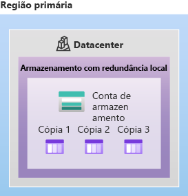

O LRS é a opção de redundância de menor custo e oferece a menor durabilidade em comparação com outras opções. O LRS protege seus dados contra falhas de unidade e rack do servidor. No entanto, caso ocorra um desastre no data center, como um incêndio ou uma inundação, todas as réplicas de uma conta de armazenamento que use o LRS poderão ser perdidas ou se tornarem irrecuperáveis. Para atenuar esse risco, a Microsoft recomenda usar o armazenamento com redundância de zona (ZRS), o armazenamento com redundância geográfica (GRS) ou o armazenamento com redundância de zona geográfica (GZRS).

Armazenamento com redundância de zona
Em regiões habilitadas como zonas de disponibilidade, o ZRS (armazenamento com redundância de zona) replica os dados do Armazenamento do Azure de maneira síncrona em três zonas de disponibilidade do Azure na região primária. O ZRS oferece durabilidade para objetos de dados do Armazenamento do Azure de, pelo menos, 12 noves (99,9999999999%) em um dado ano.

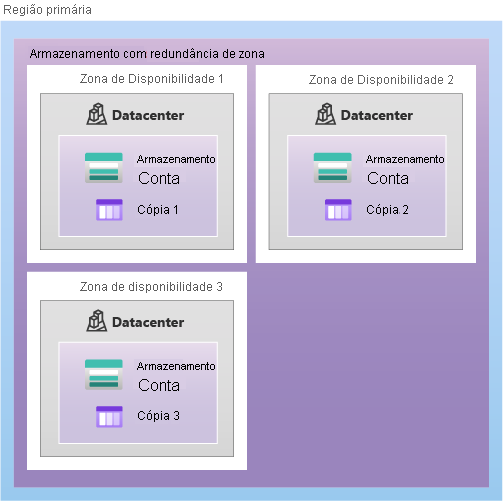

Com o ZRS, seus dados ainda podem ser acessados por operações de leitura e de gravação, mesmo em caso de não disponibilidade de uma zona. Não é necessário desmontar compartilhamentos de arquivos do Azure dos clientes conectados. Se uma zona se tornar indisponível, o Azure realizará atualizações da rede, como o redirecionamento de DNS. Essas atualizações podem afetar seu aplicativo se você estiver acessando os dados antes que as atualizações sejam concluídas.

A Microsoft recomenda usar o ZRS na região primária para cenários que exigem alta disponibilidade. O ZRS também é recomendado para restringir a replicação de dados em um país ou uma região para atender aos requisitos de governança de dados.

Redundância em uma região secundária
Para aplicativos que exigem alta durabilidade, você pode optar por também copiar os dados em sua conta de armazenamento para uma região secundária que esteja a centenas de quilômetros de distância da região primária. Se os dados em sua conta de armazenamento forem copiados para uma região secundária, seus dados serão duráveis mesmo no caso de uma falha catastrófica que impeça que os dados na região primária sejam recuperados.

Quando você cria uma conta de armazenamento, pode selecionar a região primária para a conta. A região secundária emparelhada é baseada nos Pares de Região do Azure e não pode ser alterada.

O Armazenamento do Azure oferece duas opções para copiar seus dados em uma região secundária: GRS (armazenamento com redundância geográfica) e GZRS (armazenamento com redundância de zona geográfica). O GRS é semelhante à execução do LRS em duas regiões, e o GZRS é semelhante à execução de ZRS na região primária e LRS na região secundária.

Por padrão, os dados na região secundária não ficam disponíveis para acesso de leitura ou gravação, a menos que haja um failover na região secundária. Se a região primária ficar indisponível, você poderá optar por fazer failover para a região secundária. Após a conclusão do failover, a região secundária se tornará a região primária e você poderá ler e gravar os dados novamente.

 Importante

Como os dados são replicados na região secundária de maneira assíncrona, uma falha que afete a região primária poderá resultar na perda de dados se a região primária não puder ser recuperada. O intervalo entre as gravações mais recentes na região primária e a última gravação na região secundária é conhecido como objetivo de ponto de recuperação (RPO). O RPO indica o ponto no tempo em que os dados podem ser recuperados. Normalmente, o Armazenamento do Microsoft Azure tem um RPO inferior a 15 minutos, embora atualmente não exista nenhum SLA sobre quanto tempo é preciso para replicar os dados para a região secundária.

Armazenamento com redundância geográfica
O GRS copia seus dados de maneira síncrona três vezes em um único local físico na região primária usando LRS. Em seguida, ele copia os dados de maneira assíncrona em um único local físico na região secundária (o par da região) usando LRS. O GRS oferece durabilidade para objetos de dados do Armazenamento do Azure de, pelo menos, 16 noves (99,99999999999999%) em um dado ano.

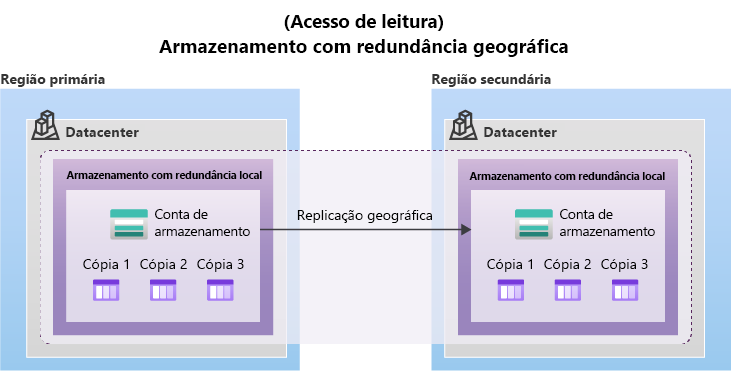

Armazenamento com redundância de zona geográfica
O GZRS combina a alta disponibilidade fornecida pela redundância entre zonas de disponibilidade com a proteção contra interrupções regionais fornecidas pela replicação geográfica. Os dados em uma conta de armazenamento GZRS são copiados entre três zonas de disponibilidade do Azure na região primária (semelhante ao ZRS) e são replicados em uma região geográfica secundária usando LRS para proteção contra desastres regionais. A Microsoft recomenda o uso do GZRS para aplicativos que exigem consistência, durabilidade e disponibilidade máximas, excelente desempenho e resiliência para recuperação de desastres.


O GZRS foi projetado para fornecer pelo menos 16 noves (99,99999999999999%) de durabilidade dos objetos durante um determinado ano.

Acesso de leitura aos dados na região secundária
O armazenamento com redundância geográfica (com GRS ou GZRS) replica seus dados para outro local físico na região secundária para proteger contra interrupções regionais. No entanto, esses dados estarão disponíveis para serem lidos somente se o cliente ou a Microsoft iniciar um failover da região primária para a secundária. No entanto, se você habilitar o acesso de leitura à região secundária, seus dados estarão sempre disponíveis, mesmo que a região primária esteja sendo executada de maneira ideal. Para obter acesso de leitura para o local secundário, habilite o armazenamento com redundância geográfica com acesso de leitura (RA-GRS) ou o armazenamento com redundância de zona com acesso de leitura (RA-GZRS).

 Importante

Lembre-se de que os dados em sua região secundária podem não estar atualizados devido ao RPO.

Descrever os serviços de armazenamento do Azure

A plataforma de Armazenamento do Microsoft Azure inclui os seguintes serviços de dados:

Blobs do Azure: um repositório de objetos altamente escalonável para texto e dados binários. Ela também inclui suporte para análise de Big Data por meio do Data Lake Storage Gen2.
Arquivos do Azure: compartilhamentos de arquivos gerenciados para implantações locais e em nuvem.
Filas do Azure: um armazenamento de mensagens para um sistema de mensagens confiável entre componentes do aplicativo.
Azure Disks: volumes de armazenamento em nível de bloco para VMs do Azure.
Benefícios do Armazenamento do Azure
Os serviços de Armazenamento do Microsoft Azure oferecem os seguintes benefícios aos desenvolvedores de aplicativos e profissionais de TI:

Durável e altamente disponível. A redundância garante a segurança dos dados no caso de falhas de hardware transitórias. Você também pode optar por replicar os dados em data centers ou regiões geográficas para obter mais proteção contra catástrofes locais ou desastres naturais. Os dados replicados dessa maneira continuam altamente disponíveis em caso de interrupção inesperada.
Seguro. Todos os dados gravados em uma conta de armazenamento do Azure são criptografados pelo serviço. O Armazenamento do Azure oferece um controle refinado sobre quem possui acesso aos seus dados.
Escalonável. O Armazenamento do Azure foi concebido para ser altamente escalonável e atender às necessidades de desempenho e armazenamento de dados dos aplicativos atuais.
Gerenciado. o Azure cuida da manutenção de hardware, das atualizações e dos problemas críticos para você.
Acessível. Os dados no Armazenamento do Azure são acessíveis de qualquer lugar no mundo por HTTP ou HTTPS. A Microsoft fornece bibliotecas de clientes para o Armazenamento do Microsoft Azure em várias linguagens, incluindo .NET, Java, Node.js, Python, PHP, Ruby, Go, entre outras, bem como uma API REST bem desenvolvida. O Armazenamento do Azure oferece suporte para scripts no Azure PowerShell ou na CLI do Azure. E o Portal do Azure e o Gerenciador de Armazenamento do Azure oferecem soluções visualmente fáceis para o trabalho com os seus dados.
Armazenamento de blob
O Armazenamento de Blobs do Azure é uma solução de armazenamento de objetos para a nuvem. Ele pode armazenar grandes quantidades de dados, como texto ou dados binários. O Armazenamento de Blobs do Azure não é estruturado, o que significa que não há nenhuma restrição quanto aos tipos de dados que ele pode armazenar. O Armazenamento de Blobs pode gerenciar milhares de carregamentos simultâneos, grandes quantidades de dados de vídeo, arquivos de log em constante crescimento e pode ser acessado de qualquer lugar com uma conexão com a Internet.

Os blobs não estão limitados a formatos de arquivo comuns. Um blob pode conter gigabytes de dados binários transmitidos de um instrumento científico, uma mensagem criptografada para outro aplicativo ou dados em um formato personalizado para um aplicativo que você está desenvolvendo. Uma vantagem do Armazenamento de Blobs em relação ao Armazenamento em Disco é que ele não exige que os desenvolvedores pensem em discos e nem os gerenciem. Os dados são carregados como blobs e o Azure cuida das necessidades de armazenamento físico.

O armazenamento de Blobs é ideal para:

Fornecimento de imagens ou de documentos diretamente a um navegador.
Armazenamento de arquivos para acesso distribuído.
Transmissão por streaming de áudio e vídeo.
Armazenamento de dados de backup e restauração, recuperação de desastres e arquivamento.
Armazenamento de dados para análise por um serviço local ou hospedado no Azure.
Acessar o Armazenamento de Blobs
Os objetos no armazenamento de Blobs podem ser acessados de qualquer lugar no mundo via HTTP ou HTTPS. Usuários ou aplicativos cliente podem acessar blobs por meio de URLs, da API REST do Armazenamento do Azure, do Azure PowerShell, da CLI do Azure ou de uma biblioteca de cliente de Armazenamento do Azure. As bibliotecas de clientes de armazenamento estão disponíveis para várias linguagens, incluindo .NET, Java, Node.js, Python, PHP e Ruby.

Camadas do Armazenamento de Blobs
Os dados armazenados na nuvem podem crescer em um ritmo exponencial. Para gerenciar os custos de suas necessidades cada vez maiores de armazenamento, é útil organizar seus dados com base em atributos como frequência de acesso e período de retenção planejado. Os dados armazenados na nuvem podem ser processados de maneira diferente considerando como eles são gerados, processados e acessados durante o tempo de vida. Alguns dados são ativamente acessados e modificados durante seu ciclo de vida. Alguns dados são acessados com frequência no início do seu tempo de vida, mas esse acesso cai drasticamente à medida que os dados envelhecem. Alguns dados permanecem ociosos na nuvem e raramente são acessos depois de armazenados, talvez nunca. Para acomodar essas diferentes necessidades de acesso, o Azure fornece várias camadas de acesso, que você pode usar para balancear os custos de armazenamento com suas necessidades de acesso.

O Armazenamento do Azure oferece diferentes camadas de acesso para seu armazenamento de blobs, ajudando você a armazenar dados de objeto da maneira mais econômica. As camadas de acesso disponíveis incluem:

Camada de acesso quente: otimizada para armazenar dados que são acessados com frequência (por exemplo, imagens de seu site).
Camada de acesso frio: otimizada para dados acessados com menos frequência e armazenados por pelo menos 30 dias (por exemplo, faturas de seus clientes).
Camada de acesso aos arquivos: adequada para dados acessados raramente e armazenados por pelo menos 180 dias, com requisitos de latência flexíveis (por exemplo, backups de longo prazo).
As seguintes considerações se aplicam às diferentes camadas de acesso:

Apenas as camadas de acesso quente e frio podem ser definidas no nível da conta. A camada de acesso aos arquivos não está disponível no nível da conta.
As camadas quente, fria e de arquivos podem ser definidas no nível do blob, durante ou após o upload.
Os dados na camada de acesso frio podem tolerar uma disponibilidade ligeiramente inferior, mas ainda requerem alta durabilidade, latência de recuperação e características de taxa de transferência semelhantes a dados de acesso frequente. Para dados de acesso esporádico, um SLA (contrato de nível de serviço) de disponibilidade ligeiramente inferior e custos de acesso mais altos comparados com os dados de acesso frequente são compensações aceitáveis para custos de armazenamento mais baixos.
O armazenamento de arquivos armazena dados offline e oferece os custos de armazenamento mais baixos, mas também os mais altos custos para reidratar e acessar dados.
Arquivos do Azure
Os Arquivos do Azure oferecem compartilhamentos de arquivo totalmente gerenciados na nuvem que são acessíveis por meio do protocolo SMB ou NFS (Network File System) padrão do setor. Os compartilhamentos de Arquivos do Azure podem ser montados de maneira simultânea por implantações locais ou na nuvem. É possível acessar os compartilhamentos de Arquivos do Azure do protocolo SMB em clientes Windows, Linux e macOS. É possível acessar os compartilhamentos de Arquivos do Azure do protocolo NFS em clientes Linux e macOS. Além disso, os compartilhamentos de Arquivos do Azure do protocolo SMB podem ser armazenados em cache nos Windows Servers com a Sincronização de Arquivos do Azure para acesso rápido perto de onde os dados estão sendo usados.

Principais benefícios dos Arquivos do Azure:
Acesso compartilhado: os compartilhamentos de arquivo do Azure são compatíveis com os protocolos SMB e NFS padrão. Isso significa que você pode substituir facilmente os compartilhamentos de arquivo locais pelos do Azure sem se preocupar com a compatibilidade do aplicativo.
Totalmente gerenciados: os compartilhamentos de arquivo do Azure podem ser criados sem a necessidade de gerenciar um sistema operacional ou um hardware. Isso significa que você não precisa lidar com a correção do sistema operacional do servidor com atualizações críticas de segurança ou com a substituição de discos rígidos com defeito.
Script e ferramentas: os cmdlets do PowerShell e a CLI do Azure podem ser usados para criar, montar e gerenciar compartilhamentos de arquivo do Azure como parte da administração de aplicativos do Azure. Você pode criar e gerenciar compartilhamentos de arquivos do Azure usando o portal do Azure e o Gerenciador de Armazenamento do Azure.
Resiliência: o serviço Arquivos do Azure foi criado do zero para estar sempre disponível. A substituição dos compartilhamentos de arquivo locais pelos Arquivos do Azure significa que você não precisa acordar no meio da noite para lidar com interrupções de energia ou problemas de rede locais.
Programação familiar: os aplicativos executados no Azure podem acessar dados no compartilhamento por meio de APIs de E/S do sistema de arquivos. Os desenvolvedores podem, portanto, utilizar seus códigos e habilidades existentes para migrar aplicativos existentes. Além das APIs de E/S do sistema, você pode usar as Bibliotecas do Cliente de Armazenamento do Azure ou a API de REST do Armazenamento do Azure.
Armazenamento de filas
O armazenamento de Filas do Azure é um serviço usado para armazenar grandes quantidades de mensagens. Após o armazenamento, você pode acessar as mensagens em qualquer lugar do mundo por meio de chamadas autenticadas usando HTTP ou HTTPS. Uma fila pode conter a quantidade de mensagens que couber na sua conta de armazenamento (possivelmente milhões). Cada mensagem individual pode ter até 64 KB de tamanho. As filas são normalmente usadas para criar uma lista de pendências de trabalho para processamento assíncrono.

O Armazenamento de Filas pode ser combinado com funções de computação, como o Azure Functions, para executar uma ação quando uma mensagem é recebida. Por exemplo, você quer que uma ação seja executada depois que um cliente carregar um formulário no site. Você pode fazer com que o botão Enviar no site dispare uma mensagem para o Armazenamento de Filas. Depois, você pode usar o Azure Functions para disparar uma ação quando a mensagem for recebida.

Armazenamento em disco
O Armazenamento em Disco ou o Azure Managed Disks são volumes de armazenamento em nível de bloco gerenciados pelo Azure para serem usados com VMs do Azure. Conceitualmente, eles são iguais a um disco físico, mas são virtualizados, oferecendo maior resiliência e disponibilidade do que um disco físico. Com discos gerenciados, você só precisa provisionar o disco e deixar que o Azure cuide do resto.

### Exercício – Criar um blob de armazenamento

Área restrita ativada! Tempo restante: 
Você usou todas as 3 de 10 áreas restritas de hoje. Mais áreas restritas estarão disponíveis amanhã.
Criar uma conta de armazenamento
Nesta tarefa, criaremos uma nova conta de armazenamento.

Entre no portal do Microsoft Azure em https://portal.azure.com

Selecione Criar um recurso.

Em Categorias, selecione Armazenamento.

Em Conta de Armazenamento, selecione Criar.

Na guia Básico da folha Criar conta de armazenamento, preencha as informações a seguir. Mantenha os padrões para todo o resto.

Configuração	Valor
Subscription	Assinatura do Concierge
Grupo de recursos	learn-d04b223a-6013-4a9a-8df1-018cb1c92153
Nome da conta de armazenamento	criar um nome de conta de armazenamento exclusivo
Location	padrão
Desempenho	Standard
Redundância	LRS (armazenamento com redundância local)
Selecione Revisar + Criar para revisar as configurações da sua conta de armazenamento e permitir que o Azure valide a configuração.

Depois de validar, selecione Criar. Aguarde a notificação de que a conta foi criada com sucesso.

Selecione Ir para o recurso.

Trabalhar com o armazenamento de blobs
Nesta seção, você criará um contêiner de Blob e carregará uma imagem

Em Armazenamento de dados, selecione Contêineres.

Captura de tela da seção Adicionar contêiner de uma conta de armazenamento.

Selecione + Contêiner e preencha as informações.

Configuração	Valor
Nome	Insira um nome para o contêiner
Nível de acesso público	Privado (sem acesso anônimo)
Selecione Criar.

 Observação

A Etapa 4 precisará de uma imagem. Se você quiser carregar uma imagem que já esteja no computador, continue na Etapa 4. Caso contrário, abra uma nova janela no navegador e use o Bing para pesquisar imagens de flor. Salve a imagem no computador.

De volta no portal do Azure, selecione o contêiner que você criou e clique em Carregar.

Procure o arquivo de imagem que você quer carregar. Selecione-a e depois carregue.

 Observação

Você poderá carregar quantos blobs quiser dessa maneira. Novos blobs serão listados no contêiner.

Selecione o Blob (arquivo) que você acabou de carregar. Você deve estar na guia propriedades.

Copie a URL do campo de URL e cole-a em uma nova guia.

Você receberá um uma mensagem de erro semelhante à mostrada a seguir.

```

<Error>
  <Code>ResourceNotFound</Code>
  <Message>The specified resource does not exist. RequestId:4a4bd3d9-101e-005a-1a3e-84bd42000000 Time:2022-06-20T00:41:31.2482656Z</Message>
</Error>

```

Altere o nível de acesso do blob
Retorne ao portal do Azure

Selecione Alterar nível de acesso

Defina o Nível de acesso público como Blob (acesso de leitura anônimo somente para blobs)

Captura de tela com a opção Alterar nível de acesso realçada.

Selecione OK

Atualize a guia em que você tentou acessar o arquivo anteriormente.

Parabéns, você concluiu este exercício. Você criou uma conta de armazenamento, adicionou um contêiner a ela e depois carregou blobs (arquivos) no contêiner. Depois, você alterou o nível de acesso para poder acessar o arquivo pela Internet.

Limpar
A área restrita limpará automaticamente seus recursos quando você concluir este módulo.

Quando já estiver trabalhando na sua assinatura, analise se você ainda precisa dos recursos criados no fim de um projeto. Os recursos que você deixa em execução podem lhe custar dinheiro. Você pode excluir os recursos individualmente ou excluir o grupo de recursos para excluir todo o conjunto de recursos.

## Identificar as opções de migração de dados do Azure

Agora que você entende as diferentes opções de armazenamento no Azure, é importante entender também como colocar seus dados e informações no Azure. O Azure dá suporte à migração em tempo real de infraestrutura, aplicativos e dados usando o serviço Migrações para Azure, bem como a migração assíncrona de dados usando o Azure Data Box.

Migrações para Azure
O Migrações para Azure é um serviço que ajuda você a migrar de um ambiente local para a nuvem. O Migrações para Azure funciona como um hub para ajudar você a gerenciar a avaliação e a migração do datacenter local para o Azure. Elas fornecem o seguinte:

Plataforma de migração unificada: Um único portal para iniciar, executar e acompanhar sua migração para o Azure.
Variedade de ferramentas: Uma variedade de ferramentas para avaliação e migração. As ferramentas das Migrações para Azure incluem itens como Migrações para Azure: descoberta e avaliação. Além de Migrações para Azure: ferramenta de Migração do Servidor. As Migrações para Azure também integram-se a outros serviços do Azure e a outras ferramentas, bem como com ofertas de ISVs (fornecedores independentes de software).
Avaliação e migração: no hub do Migrações para Azure, você pode avaliar e migrar sua infraestrutura local para o Azure.
Ferramentas integradas
Além de trabalhar com ferramentas de ISVs, o hub do Migrações para Azure também inclui as seguintes ferramentas para ajudar na migração:

Migrações para Azure: Descoberta e avaliação. Descubra e avalie servidores locais em execução em VMware, Hyper-V servidores físicos para se preparar para a migração para o Azure.
Migrações para Azure: Migração de Servidor. Migre VMs do VMware, VMs do Hyper-V, servidores físicos, outros servidores virtualizados e VMs da nuvem pública para o Azure.
Assistente de Migração de Dados. O Assistente de Migração de Dados é uma ferramenta autônoma criada para avaliar SQL Servers. Ele ajuda a identificar possíveis problemas que bloqueiam a migração. Ele identifica recursos sem suporte e novos recursos dos quais você pode se beneficiar após a migração e o caminho certo para a migração de banco de dados.
Serviço de Migração de Banco de Dados do Azure. Migre bancos de dados locais para VMs do Azure executando SQL Server, Banco de Dados SQL do Azure ou Instâncias Gerenciadas de SQL.
Assistente de migração de aplicativo Web. O Migration Assistant do Serviço de Aplicativo do Azure é uma ferramenta autônoma para avaliar sites locais para migração para o Serviço de Aplicativo do Azure. Use o Migration Assistant para migrar aplicativos Web .NET e PHP para o Azure.
Azure Data Box. Use os produtos Azure Data Box offline para mover grandes quantidades de dados offline para o Azure.
Azure Data Box
O Azure Data Box é um serviço de migração física que ajuda a transferir grandes quantidades de dados de maneira rápida, barata e confiável. A transferência de dados segura é acelerada com o envio de um dispositivo de armazenamento Data Box proprietário que tem uma capacidade máxima de armazenamento utilizável de 80 terabytes. O Data Box é transportado entre o datacenter por meio de uma empresa regional. Uma caixa robusta protege o Data Box contra danos durante o transporte.

Você pode solicitar o dispositivo Data Box pelo portal do Azure para importar dados de ou exportar dados para o Azure. Depois que o dispositivo é recebido, você pode configurá-lo rapidamente usando a IU da Web local, e conectá-lo à sua rede. Depois de terminar a transferência dos dados (para dentro ou para fora do Azure), basta devolver o Data Box. Se você estiver transferindo dados para o Azure, eles serão carregados automaticamente depois que a Microsoft receber o Data Box de volta. Todo o processo é acompanhado de ponta a ponta pelo serviço Data Box no portal do Azure.

Casos de uso

O Data Box é ideal para transferir os tamanhos de dados maiores do que 40 TB em cenários com conectividade de rede limitada a inexistente. A movimentação de dados pode ser única, periódica ou uma transferência de dados em massa inicial seguida por transferências periódicas.

Veja a seguir os vários cenários em que o Data Box pode ser usado para importar dados para o Azure.

Migração única – Quando um grande volume de dados do local é transferido para o Azure.
Movimentação de uma biblioteca de mídia de fitas offline para o Azure para a criação de uma biblioteca de mídia online.
Migração do farm de VMs, do SQL Server e de aplicativos para o Azure.
Migração de dados históricos para o Azure para análise e relatórios detalhados com o HDInsight.
Transferência em massa inicial – quando uma transferência em massa inicial é feita usando o Data Box (semente) seguida por transferências incrementais pela rede.
Carregamentos periódicos - quando grandes quantidades de dados são geradas periodicamente e precisam ser movidas para o Azure.
Veja a seguir os vários cenários em que o Data Box pode ser usado para exportar dados do Azure.

Recuperação de desastre – quando uma cópia dos dados do Azure é restaurada para uma rede local. Em um cenário típico de recuperação de desastre, um grande volume de dados do Azure é exportado para um Data Box. Em seguida, a Microsoft envia esse Data Box, e os dados são restaurados no seu local após um breve período.
Requisitos de segurança – quando você precisa ser capaz de exportar dados provenientes do Azure devido a requisitos governamentais ou de segurança.
Migre de volta para o local ou para outro provedor de serviços de nuvem: quando desejar mover todos os dados de volta para o local ou para outro provedor de serviços de nuvem, exporte os dados por meio do Data Box para migrar as cargas de trabalho.
Depois que os dados do seu pedido de importação são importados no Azure, os discos do dispositivo são apagados, de acordo com os padrões NIST 800-88r1. Para uma ordem de exportação, os discos são apagados quando o dispositivo atinge o datacenter do Azure.

## Identificar as opções de movimentação de arquivos do Azure

### Identificar as opções de movimentação de arquivos do Azure

Além da migração em larga escala usando serviços como Migrações para Azure e Azure Data Box, o Azure também tem ferramentas projetadas para ajudar você a mover ou interagir com arquivos individuais ou grupos de arquivos pequenos. Entre essas ferramentas estão AzCopy, Gerenciador de Armazenamento do Azure e Sincronização de Arquivos do Azure.

AzCopy
O AzCopy é um utilitário de linha de comando que você pode usar para copiar blobs ou arquivos de/para uma conta de armazenamento. Com o AzCopy, você pode carregar arquivos, baixar arquivos, copiar arquivos entre contas de armazenamento e até mesmo sincronizar arquivos. O AzCopy pode até mesmo ser configurado para trabalhar com outros provedores de nuvem para ajudar a mover arquivos entre nuvens.

 Importante

A sincronização de blobs ou arquivos com o AzCopy é uma sincronização de apenas uma direção. Ao sincronizar, você designa a origem e o destino e o AzCopy copiará arquivos ou blobs nessa direção. Ele não sincroniza bidirecionalmente com base em carimbos de data/hora ou outros metadados.

Gerenciador de Armazenamento do Azure
O Gerenciador de Armazenamento do Azure é um aplicativo autônomo que fornece uma interface gráfica para gerenciar arquivos e blobs em sua Conta do Armazenamento do Azure. Ele funciona em sistemas operacionais Windows, macOS e Linux e usa o AzCopy no back-end para executar todas as tarefas de gerenciamento de arquivos e blobs. Com o Gerenciador de Armazenamento, você pode carregar no Azure, baixar do Azure ou mover entre contas de armazenamento.

Sincronização de Arquivos do Azure
A Sincronização de Arquivos do Azure é uma ferramenta que permite centralizar seus compartilhamentos de arquivos no serviço Arquivos do Azure e manter a flexibilidade, o desempenho e a compatibilidade de um servidor de arquivos do Windows. É quase como transformar o servidor de arquivos do Windows em uma rede de distribuição de conteúdo em miniatura. Depois de instalar a Sincronização de Arquivos do Azure no seu servidor Windows local, ele permanecerá automaticamente sincronizado bidirecionalmente com seus arquivos no Azure.

Com a Sincronização de Arquivos do Azure, você pode:

Usar qualquer protocolo disponível no Windows Server para acessar seus dados localmente, incluindo SMB, NFS e FTPS.
Ter tantos caches quantos precisar em todo o mundo.
Substituir um servidor local com falha instalando a Sincronização de Arquivos do Azure em um novo servidor no mesmo datacenter.
Configurar a camada de nuvem para que os arquivos acessados com mais frequência sejam replicados localmente, enquanto os arquivos acessados com pouca frequência sejam mantidos na nuvem até que sejam solicitados.

## Descrever os serviços e tipos de identidade do Azure AD

Introdução

Neste módulo, você será apresentado aos serviços e ferramentas de identidade, acesso e segurança do Azure. Você aprenderá sobre serviços de diretório no Azure, métodos de autenticação e controle de acesso. Você também abordará questões como Confiança Zero e defesa em profundidade e como eles mantêm a nuvem mais segura. Você finalizará com uma introdução ao Microsoft Defender para Nuvem.

Objetivos de aprendizagem
Depois de concluir este módulo, você poderá:

Descrever serviços de diretório no Azure, incluindo o Azure AD (Active Directory) e o Azure AD DS.
Descrever métodos de autenticação no Azure, incluindo SSO (logon único), MFA (autenticação multifator) e sem senha.
Descrever identidades externas e acesso de convidado no Azure.
Descrever o acesso condicional do Azure AD.
Descrever o RBAC (controle de acesso baseado em função) do Azure.
Descrever o conceito de Confiança Zero.
Descrever a finalidade do modelo de defesa em profundidade.
Descrever a finalidade do Microsoft Defender para Nuvem.

## Descrever os serviços de diretório do Azure

O Azure AD (Azure Active Directory) é um serviço de diretório que permite que você entre e acesse aplicativos de nuvem da Microsoft e aplicativos de nuvem que você desenvolve. O Azure AD também pode ajudar você a manter sua implantação do Active Directory local.

Em ambientes locais, o Active Directory em execução no Windows Server fornece um serviço de gerenciamento de identidade e acesso gerenciado pela sua organização. O Azure AD é o serviço de gerenciamento de acesso e identidade baseado em nuvem da Microsoft. Com o Azure AD, você controla as contas de identidade, mas a Microsoft garante que o serviço esteja disponível globalmente. Se você já trabalhou com o Active Directory, o Azure AD lhe será familiar.

Quando você protege identidades locais com o Active Directory, a Microsoft não monitora tentativas de conexão. Quando você conecta o Active Directory ao Azure AD, a Microsoft pode ajudar a protegê-lo detectando tentativas de conexão suspeitas sem custo adicional. Por exemplo, o Azure AD pode detectar tentativas de conexão de locais inesperados ou dispositivos desconhecidos.

Quem usa o Azure AD?
O Azure AD é para:

Administradores de TI. Os administradores podem usar o Azure AD para controlar o acesso a aplicativos e recursos com base em seus requisitos de negócios.
Desenvolvedores de aplicativos. Os desenvolvedores podem usar o Azure AD para fornecer uma abordagem baseada em padrões para adicionar funcionalidade a aplicativos que eles criam, como adicionar a funcionalidade de SSO a um aplicativo ou habilitar um aplicativo para trabalhar com as credenciais existentes de um usuário.
Usuários. Os usuários podem gerenciar as respectivas identidades e executar ações de manutenção, como redefinição de senha por autoatendimento.
Assinantes do serviço online. Os assinantes do Microsoft 365, do Microsoft Office 365, do Azure e do Microsoft Dynamics CRM Online já estão usando o Azure AD para autenticação em suas contas.
O que o Azure AD faz?
O Azure AD fornece serviços como:

Autenticação: inclui verificar a identidade para acessar aplicativos e recursos. Também inclui fornecer funcionalidades como redefinição de senha por autoatendimento, autenticação multifator, uma lista personalizada de senhas banidas e serviços de bloqueio inteligente.
Logon único: o SSO (logon único) permite que você se lembre apenas de um nome de usuário e uma senha para acessar vários aplicativos. Uma única identidade é vinculada a um usuário, o que simplifica o modelo de segurança. À medida que os usuários trocam de funções ou saem de uma organização, as modificações de acesso são vinculadas àquela identidade, o que reduz consideravelmente o esforço necessário para alterar ou desabilitar contas.
Gerenciamento de aplicativo: você pode gerenciar seus aplicativos de nuvem e locais usando o Azure AD. Recursos como Proxy de Aplicativo, aplicativos SaaS, o portal Meus Aplicativos e o logon único proporcionam uma experiência do usuário aprimorada.
Gerenciamento de dispositivo: além das contas de pessoas individuais, o Azure AD dá suporte ao registro de dispositivos. O registro permite que os dispositivos sejam gerenciados por meio de ferramentas como o Microsoft Intune. Também permite que políticas de Acesso Condicional baseadas no dispositivo restrinjam tentativas de acesso somente às provenientes de dispositivos conhecidos, independentemente da conta de usuário solicitante.
Posso conectar meu AD local com Azure AD?
Se você tivesse um ambiente local executando o Active Directory e uma implantação de nuvem usando o Azure AD, precisaria manter dois conjuntos de identidade. No entanto, você pode conectar o Active Directory com o Azure AD, possibilitando uma experiência de identidade consistente entre a nuvem e o local.

Um método de conexão do Azure AD com o AD local é usar o Azure AD Connect. O Azure AD Connect sincroniza identidades de usuário entre o Active Directory local e o Azure AD. O Azure AD Connect sincroniza alterações entre os dois sistemas de identidade, o que permite que você use recursos como SSO, autenticação multifator e redefinição de senha por autoatendimento em ambos.

O que é o Azure Active Directory Domain Services?
O Azure AD DS (Azure Active Directory Domain Services) é um serviço que fornece serviços de domínio gerenciado, como ingresso no domínio, política de grupo, protocolo LDAP e autenticação Kerberos/NTLM. Assim como o Azure AD permite que você use serviços de diretório sem precisar manter uma infraestrutura de suporte, com Azure AD DS você obtém o benefício dos serviços de domínio sem a necessidade de implantar, gerenciar e corrigir DCs (controladores de domínio) na nuvem.

Um domínio gerenciado do Azure AD DS permite que você execute aplicativos herdados na nuvem que não podem usar métodos de autenticação modernos ou nos quais você não deseja que as pesquisas de diretório sempre voltem para um ambiente de AD DS local. Você pode realizar lift-and-shift desses aplicativos herdados do seu ambiente local para um domínio gerenciado, sem a necessidade de gerenciar o ambiente de AD DS na nuvem.

O Azure AD DS integra-se com o seu locatário existente do Azure AD. Essa integração permite que os usuários entrem em serviços e aplicativos conectados ao domínio gerenciado usando as credenciais que eles já têm. Você também pode usar grupos e contas de usuário para proteger o acesso aos recursos. Esses recursos fornecem um lift-and-shift mais suave de recursos locais para o Azure.

Como funciona o Azure AD DS?

Ao criar um domínio gerenciado do Azure AD DS, você define um namespace exclusivo. Esse namespace é o nome de domínio. Dois controladores de domínio do Windows Server são então implantados na região do Azure que você selecionou. Essa implantação de DCs é conhecida como conjunto de réplicas.

Você não precisa gerenciar, configurar nem atualizar esses DCs. A plataforma do Azure manipula os DCs como parte do domínio gerenciado, incluindo backups e a criptografia em repouso usando o Azure Disk Encryption.

As informações são sincronizadas?
Um domínio gerenciado é configurado para executar uma sincronização unidirecional do Azure AD com o Azure AD DS. É possível criar recursos diretamente no domínio gerenciado, mas eles não são sincronizados com o Azure AD. Em um ambiente híbrido com um ambiente local do AD DS, o Azure AD Connect sincroniza as informações de identidade com o Azure AD, que, por sua vez, é sincronizado com o domínio gerenciado.

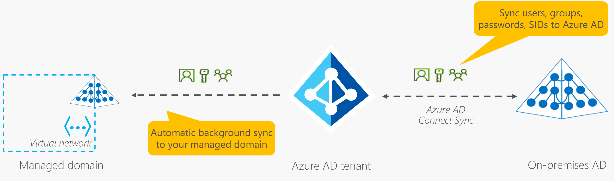

Então, aplicativos, serviços e VMs no Azure que se conectam a esse domínio gerenciado poderão usar recursos comuns do Azure AD DS, como o ingresso no domínio, a política de grupo, o LDAP e a autenticação Kerberos/NTLM.

Descrever os métodos de autenticação do Azure

Autenticação é o processo de estabelecer a identidade de uma pessoa, um serviço ou um dispositivo. Ela requer que a pessoa, o serviço ou o dispositivo forneça algum tipo de credencial para provar quem são. A autenticação é como apresentar a identidade quando você está viajando. Ela não confirma que você tem a passagem, só prova que você é quem diz ser. O Azure dá suporte a vários métodos de autenticação, incluindo senhas padrão, SSO (logon único), MFA (autenticação multifator) e métodos sem senha.

Por muito tempo, a segurança e a conveniência pareciam estar em desacordo entre si. Atualmente, novas soluções de autenticação fornecem segurança e conveniência.

O diagrama a seguir mostra o nível de segurança em comparação com a conveniência. Observe que a Autenticação sem senha é de alta segurança e alta conveniência, enquanto o uso somente das senhas é de baixa segurança, mas de alta conveniência.

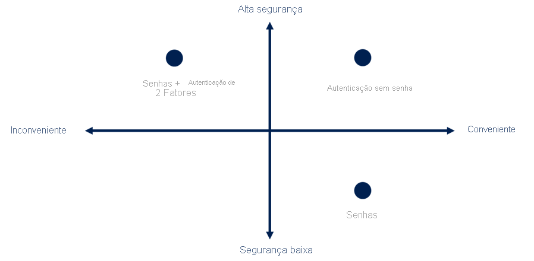

## O que é o logon único?

O SSO (logon único) permite que um usuário entre uma vez e use essa credencial para acessar vários recursos e aplicativos de provedores diferentes. Para que o SSO funcione, os diferentes aplicativos e provedores devem confiar no autenticador inicial.

Um número maior de identidades significa mais senhas para se lembrar e alterar. As políticas de senha podem variar entre aplicativos. À medida que os requisitos de complexidade aumentam, fica cada vez mais difícil para os usuários se lembrarem delas. Quanto mais senhas um usuário precisa gerenciar, maior o risco de um incidente de segurança relacionado às credenciais.

Considere o processo de gerenciamento de todas essas identidades. Mais restrições são colocadas no suporte técnico, pois eles lidam com bloqueios de contas e solicitações de redefinição de senha. Se um usuário sai de uma organização, o rastreamento de todas essas identidades e a garantia de que elas sejam desabilitadas podem ser um desafio. Quando uma identidade é negligenciada, isso pode permitir o acesso quando ele deveria ter sido eliminado.

Com o SSO, você precisa se lembrar apenas de uma ID e uma senha. O acesso entre aplicativos é concedido a uma única identidade vinculada ao usuário, o que simplifica o modelo de segurança. À medida que os usuários mudam de função ou deixam a organização, o acesso fica vinculado a uma só identidade. Essa alteração reduz consideravelmente o esforço necessário para alterar ou desabilitar contas. Usar SSO nas contas facilita para os usuários gerenciarem suas identidades e para a TI gerenciar os usuários.

 Importante

O logon único será tão seguro quanto o autenticador inicial, pois as conexões subsequentes serão todas baseadas na segurança do autenticador inicial.

O que é a Autenticação multifator?
A autenticação multifator é o processo de solicitar a um usuário uma forma (ou um fator) adicional de identificação durante o processo de entrada. A MFA ajuda a proteger contra uma exposição de senha em situações em que a senha tenha sido comprometida, mas o segundo fator não.

Pense em como você entra em sites, email ou serviços online. Depois de inserir seu nome de usuário e senha, você alguma vez precisou inserir um código enviado para seu telefone? Se sim, você usou a autenticação multifator para entrar.

A autenticação multifator fornece segurança adicional para as identidades, exigindo dois ou mais elementos para a autenticação completa. Esses elementos se enquadram em três categorias:

Algo que o usuário saiba– essa pode ser uma pergunta de desafio.
Algo que o usuário tenha – pode ser um código enviado para o telefone celular do usuário.
Algo que o usuário seja – normalmente é algum tipo de propriedade biométrica, como a leitura de impressão digital ou reconhecimento facial.
A autenticação multifator aumenta a segurança de identidade, limitando o impacto da exposição da credencial (por exemplo, nomes de acesso e senhas roubados). Com a autenticação multifator habilitada, um invasor que tenha uma senha de usuário também precisará ter em mãos o telefone ou a impressão digital desse usuário para se autenticar por completo.

Comparação da autenticação multifator com a autenticação de fator único. Na autenticação de fator único, um invasor precisaria apenas de um nome de usuário e senha para se autenticar. A autenticação multifator deve ser habilitada sempre que possível, pois traz enormes benefícios à segurança.

O que é a Autenticação Multifator do Azure AD?
A Autenticação Multifator do Azure AD é um serviço da Microsoft que fornece funcionalidades de autenticação multifator. A Autenticação Multifator do Azure AD permite que os usuários escolham uma forma adicional de autenticação durante a conexão, como uma chamada telefônica ou uma notificação no aplicativo móvel.

O que é a autenticação sem senha?
Recursos como a MFA são ótimas maneiras de proteger sua organização, mas os usuários geralmente ficam frustrados ao precisar memorizar senhas com a camada de segurança adicional. As pessoas são mais propensas a cumprir quando é fácil e conveniente fazê-lo. Os métodos de autenticação sem senha são mais convenientes porque a senha é removida e substituída por algo que você tenha, além de algo que você seja ou saiba.

A autenticação sem senha precisa ser configurada em um dispositivo para poder funcionar. Por exemplo, seu computador é algo que você tem. Depois de registrado ou inscrito, o Azure agora sabe que ele está associado a você. Agora que o computador é conhecido, uma vez que você forneça algo que você saiba ou seja (como um PIN ou uma impressão digital), você poderá ser autenticado sem usar uma senha.

Cada organização tem necessidades diferentes de autenticação. O Azure e Azure Governamental da Microsoft global oferece estas três opções de autenticação sem senha que se integram ao Azure Active Directory (Azure AD):

Windows Hello para Empresas
Aplicativo Microsoft Authenticator
Chaves de segurança FIDO2
Windows Hello para Empresas
O Windows Hello para Empresas é ideal para operadores de informação que têm seu próprio PC Windows. Credenciais biométricas e de PIN estão diretamente ligadas ao computador do usuário, o que impede o acesso de quem não seja o proprietário. Com a integração de infraestrutura de chave pública (PKI) e suporte interno para logon único (SSO), o Windows Hello para Empresas oferece um método conveniente para acessar diretamente os recursos corporativos locais e na nuvem.

Aplicativo Microsoft Authenticator
Você também pode permitir que o telefone do funcionário se torne um método de autenticação sem senha. Talvez você já esteja usando o aplicativo Microsoft Authenticator como opção de autenticação multifator conveniente, além de uma senha. Você também pode usar o aplicativo Authenticator como uma opção sem senha.

O aplicativo Authenticator transforma qualquer telefone iOS ou Android em uma credencial forte e sem senha. Para entrar em qualquer plataforma ou navegador, os usuários recebem uma notificação no telefone, fazem a correspondência de um número na tela com um no telefone e depois usam um gesto biométrico (toque ou rosto) ou PIN para confirmar. Veja Baixar e instalar o aplicativo Microsoft Authenticator para obter detalhes de instalação.

Chaves de segurança FIDO2
A FIDO (Fast Identity online) Alliance ajuda a promover padrões de autenticação aberta e a reduzir o uso de senhas como forma de autenticação. FIDO2 é o padrão mais recente que incorpora o padrão de autenticação na Web (WebAuthn).

As chaves de segurança FIDO2 são um método de autenticação de senha baseado em padrões à prova de phishing, que podem usar qualquer fator forma. A FIDO (Fast Identity Online) é um padrão aberto para autenticação sem senha. A FIDO permite que usuários e organizações aproveitem o padrão para entrar nos recursos sem usar nome de usuário nem senha, usando uma chave de segurança externa ou uma chave de plataforma incorporada a um dispositivo.

Os usuários podem registrar e, em seguida, selecionar uma chave de segurança FIDO2 na interface de entrada como o principal meio de autenticação. Essas chaves de segurança FIDO2 normalmente são dispositivos USB, mas também podem usar Bluetooth ou NFC. Com um dispositivo de hardware que manipula a autenticação, a segurança de uma conta é aumentada, pois não há senha que possa ser exposta ou adivinhada.

## Descrever as identidades externas do Azure

Uma identidade externa é uma pessoa, um dispositivo, um serviço etc. que está fora da sua organização. O recurso Identidades Externas do Azure AD refere-se a todas as maneiras pelas quais você pode interagir com usuários fora da organização com segurança. Se você quiser colaborar com parceiros, distribuidores ou fornecedores, compartilhe seus recursos e defina como os usuários internos poderão acessar organizações externas. Se você é um desenvolvedor que cria aplicativos voltados para o consumidor, pode gerenciar as experiências de identidade dos clientes.

As identidades externas podem soar semelhantes ao logon único. Com identidades externas, os usuários externos podem "trazer suas próprias identidades". Se eles tiverem uma identidade digital emitida pela empresa ou pelo governo ou uma identidade social não gerenciada, como o Google ou o Facebook, eles poderão usar as próprias credenciais para entrar. O provedor de identidade do usuário externo gerencia a identidade dele e você gerencia o acesso aos seus aplicativos com o Azure AD ou o Azure AD B2C para manter seus recursos protegidos.

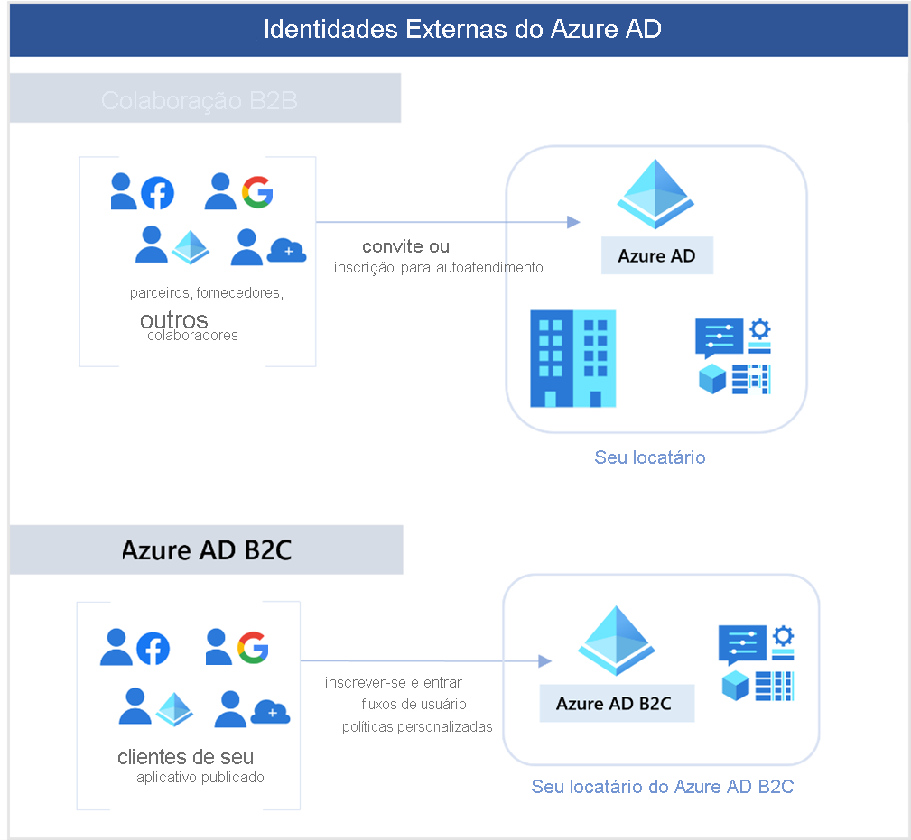

As seguintes funcionalidades compõem identidades externas:

Colaboração B2B (Business to business) – Colabore com usuários externos deixando que eles usem a identidade preferida para entrar nos aplicativos Microsoft ou em outros aplicativos empresariais (aplicativos SaaS, aplicativos personalizados etc.). Os usuários de colaboração B2B são representados em seu diretório, normalmente como usuários convidados.
Conexão direta B2B – estabeleça uma relação de confiança mútua e de duas vias com outra organização do Azure AD para colaboração contínua. Atualmente, o B2B Direct Connect dá suporte Teams canais compartilhados, permitindo que usuários externos acessem seus recursos de dentro de suas instâncias de Teams. Os usuários do B2B Direct Connect não são representados em seu diretório, mas são visíveis de dentro do canal compartilhado Teams e podem ser monitorados em relatórios Teams centro de administração.
Azure AD B2C (business to customer) – Publique aplicativos SaaS modernos ou aplicativos personalizados (exceto aplicativos Microsoft) para consumidores e clientes, usando o Azure AD B2C para gerenciamento de identidades e acesso.
Dependendo de como deseja interagir com organizações externas e os tipos de recursos que você precisa compartilhar, você pode usar uma combinação dessas funcionalidades.

Com o Azure AD (Azure Active Directory), você pode habilitar com facilidade a colaboração em limites organizacionais usando o recurso B2B do Azure AD. Usuários convidados de outros locatários podem ser convidados por administradores ou por outros usuários. Isso também se aplica às identidades sociais, como contas da Microsoft.

Você também pode assegurar com facilidade que os usuários convidados tenham o acesso apropriado. Você pode pedir que os próprios convidados ou que um tomador de decisão participem de uma revisão de acesso e reconfirmem (ou atestem) o acesso de convidado. Revisores podem fornecer a sua entrada na necessidade de cada usuário de acesso contínuo, com base nas sugestões do Azure AD. Quando uma revisão de acesso for finalizada, você poderá alterar e remover o acesso de convidados que não precisam mais dela.

Descrever o acesso condicional do Azure

O Acesso Condicional é uma ferramenta que o Azure Active Directory usa para permitir (ou negar) o acesso a recursos com base em sinais de identidade. Esses sinais incluem quem é o usuário, onde ele está e de qual dispositivo está solicitando acesso.

O acesso condicional ajuda os administradores de TI a:

Capacitar os usuários a serem produtivos em qualquer lugar e sempre.
Proteger os ativos da organização.
O Acesso Condicional também proporciona uma experiência de autenticação multifator mais granular para os usuários. Por exemplo, um segundo fator de autenticação poderá não ser solicitado se o usuário estiver em uma localização conhecida. No entanto, ele poderá ser solicitado se os sinais de conexão do usuário forem incomuns ou se o usuário estiver em uma localização inesperada.

Durante a conexão, o acesso condicional coleta sinais do usuário, toma decisões com base nesses sinais e impõe essa decisão, permitindo ou negando a solicitação de acesso ou solicitando uma resposta de autenticação multifator.

O seguinte diagrama ilustra esse fluxo:

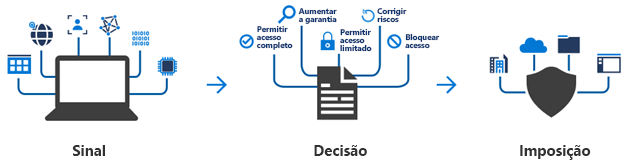

Aqui, o sinal pode ser a localização do usuário, o dispositivo do usuário ou o aplicativo que o usuário está tentando acessar.

Com base nesses sinais, a decisão poderá ser permitir acesso completo se o usuário estiver entrando de seu local usual. Se o usuário estiver entrando de uma localização incomum ou que esteja marcada como de alto risco, o acesso poderá ser totalmente bloqueado ou possivelmente concedido depois que o usuário fornecer uma segunda forma de autenticação.

A imposição é a ação que executa a decisão. Por exemplo, permitir o acesso ou exigir que o usuário forneça uma segunda forma de autenticação.

Quando posso usar o acesso condicional?
O acesso condicional é útil quando você precisa:

Exija a MFA (autenticação multifator) para acessar um aplicativo, dependendo da função, da localização ou da rede do solicitante. Por exemplo, você pode exigir a MFA para administradores, mas não para usuários regulares ou pessoas que se conectam de fora da rede corporativa.
Exigir acesso a serviços somente por meio de aplicativos cliente aprovados. Por exemplo, você pode limitar quais aplicativos de email podem se conectar ao serviço de email.
Exigir que os usuários acessem seu aplicativo somente de dispositivos gerenciados. Um dispositivo gerenciado é um dispositivo que atende os padrões de segurança e conformidade.
Bloquear o acesso de fontes não confiáveis, como o acesso de locais desconhecidos ou inesperados.

## Descrever o controle de acesso baseado em função do Azure

Quando você tem várias equipes de TI e engenharia, como é possível controlar o acesso que eles têm aos recursos no seu ambiente de nuvem? O princípio de privilégios mínimos diz que você só deve conceder acesso até o nível necessário para concluir uma tarefa. Se você precisar apenas de acesso de leitura a um blob de armazenamento, só será concedido acesso de leitura a esse blob de armazenamento. O acesso de gravação a esse blob não deve ser concedido, nem o acesso de leitura a outros blobs de armazenamento. Essa é uma boa prática de segurança para seguir.

No entanto, o gerenciamento desse nível de permissões para uma equipe inteira se tornaria tedioso. Em vez de definir os requisitos de acesso detalhados para cada indivíduo e atualizar os requisitos de acesso quando outros recursos forem criados ou novas pessoas entrarem na equipe, o Azure permite controlar o acesso por meio do RBAC do Azure (controle de acesso baseado em função do Azure).

O Azure fornece funções internas que descrevem regras de acesso comuns para os recursos de nuvem. Você também pode definir suas funções. Cada função tem um conjunto associado de permissões de acesso relacionadas a essa função. Quando você atribui indivíduos ou grupos a uma ou mais funções, eles recebem todas as permissões de acesso relacionadas.

Portanto, se você contratar um novo engenheiro e adicioná-lo ao grupo do RBAC do Azure para engenheiros, ele obterá automaticamente o mesmo acesso que os outros engenheiros do mesmo grupo do RBAC do Azure. Da mesma forma, se você adicionar outros recursos e apontar o RBAC do Azure para eles, todos nesse grupo do RBAC do Azure vão ter as permissões nos novos recursos, bem como nos recursos existentes.

Como o controle de acesso baseado em função é aplicado aos recursos?
O controle de acesso baseado em função é aplicado a um escopo, que é um recurso ou um conjunto de recursos ao qual esse acesso se aplica.

O diagrama a seguir mostra a relação entre funções e escopos. Um grupo de gerenciamento, uma assinatura ou um administrador de recursos pode receber a função de proprietário, passando a ter maior controle e autoridade. Um observador, que não deve fazer atualizações, pode receber uma função de Leitor para o mesmo escopo, permitindo que ele examine ou observe o grupo de gerenciamento, a assinatura ou o grupo de recursos.

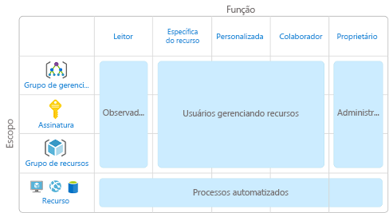

Os escopos incluem:

Um grupo de gerenciamento (uma coleção de várias assinaturas).
Uma assinatura única.
Um grupo de recursos.
Um recurso individual.
Observadores, usuários que gerenciam recursos, administradores e processos automatizados ilustram os tipos de usuários ou contas que normalmente são atribuídos a cada uma das várias funções.

O RBAC do Azure é hierárquico, porque quando você permite acesso a um escopo pai, essas permissões são herdadas por todos os escopos filho. Por exemplo:

Quando você atribui a função Proprietário a um usuário no escopo do grupo de gerenciamento, esse usuário pode gerenciar tudo em todas as assinaturas dentro do grupo de gerenciamento.
Quando você atribui a função Leitor a um grupo no escopo da assinatura, os membros desse grupo podem ver todos os grupos de recursos e os recursos na assinatura.
Como o RBAC do Azure é imposto?
O RBAC do Azure é imposto em qualquer ação iniciada em um recurso do Azure que passa pelo Azure Resource Manager. O Resource Manager é um serviço de gerenciamento que fornece um modo de organizar e proteger seus recursos de nuvem.

Normalmente, você acessa o Resource Manager no portal do Azure, no Azure Cloud Shell, no Azure PowerShell e na CLI do Azure. O RBAC do Azure não impõe permissões de acesso no nível do aplicativo nem dos dados. A segurança do aplicativo precisa ser realizada pelo aplicativo.

O RBAC do Azure usa um modelo de permissão. Quando você recebe uma função, o RBAC do Azure permite que você execute ações dentro do escopo dessa função. Se uma atribuição de função conceder a você permissões de leitura em um grupo de recursos e outra atribuição de função conceder a você permissões de gravação no mesmo grupo de recursos, você terá permissões de gravação e leitura nesse grupo de recursos.

## Descrever o modelo de Confiança Zero

A Confiança Zero é um modelo de segurança que pressupõe o pior cenário e protege os recursos com essa expectativa. A Confiança Zero pressupõe uma violação desde o início e verifica cada solicitação como se ela tivesse sido originada em uma rede não controlada.

Atualmente, as organizações precisam de um novo modelo de segurança que se adapte efetivamente à complexidade dos ambientes modernos, adote a força de trabalho móvel e proteja pessoas, dispositivos, aplicativos e dados onde quer que eles estejam.

Para abordar esse novo mundo da computação, a Microsoft recomenda altamente o modelo de segurança de Confiança Zero, que se baseia nestes princípios orientadores:

Verificar de modo explícito – sempre autentique e autorize com base em todos os pontos de dados disponíveis.
Usar o acesso com o mínimo de privilégios – limite o acesso do usuário com JIT/JEA (Just-In-Time e Just-Enough-Access), políticas adaptáveis baseadas em risco e proteção de dados.
Pressupor a violação – minimize o raio de alcance e segmente o acesso. Verifique a criptografia de ponta a ponta. Use a análise para obter visibilidade, promover a detecção de ameaças e aprimorar as defesas.
Ajustando-se à Confiança Zero
Tradicionalmente, as redes corporativas eram restritas, protegidas e, em geral, supostamente seguras. Somente computadores gerenciados podiam ingressar na rede, o acesso de VPN era fortemente controlado e os dispositivos pessoais eram frequentemente restritos ou bloqueados.

O modelo de Confiança Zero muda completamente esse cenário. Em vez de supor que um dispositivo é seguro porque está dentro da rede corporativa, ele requer que todos se autentiquem. Em seguida, concede acesso com base na autenticação e não na localização.

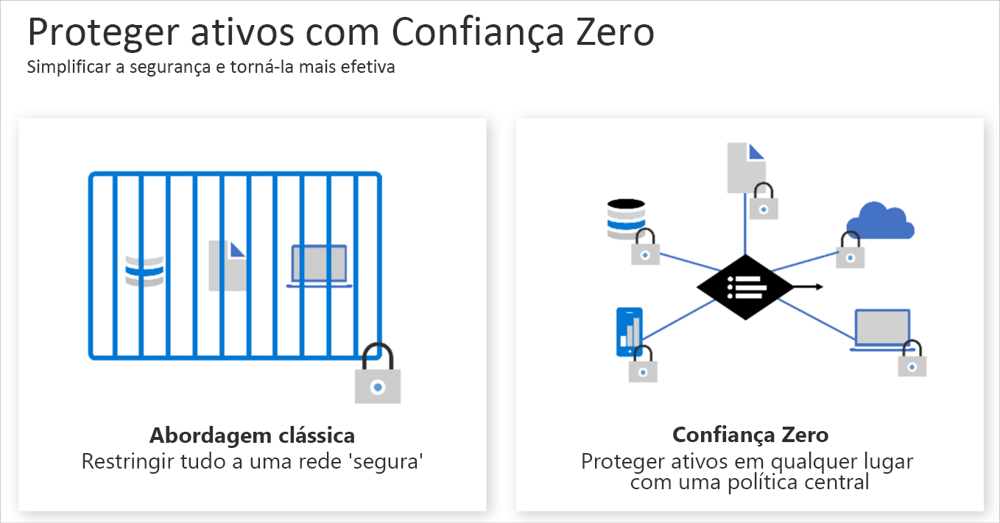

## Descrever a defesa em profundidade
Concluído
100 XP
4 minutos
O objetivo da defesa em profundidade é proteger as informações e impedir que elas sejam roubadas por pessoas que não estejam autorizadas a acessá-las.

Uma estratégia de defesa em profundidade usa uma série de mecanismos para reduzir o avanço de um ataque que busca obter acesso não autorizado aos dados.

Camadas da defesa em profundidade
Você pode visualizar a defesa em profundidade como um conjunto de camadas, com os dados a serem protegidos no centro e todas as outras camadas funcionando para proteger essa camada de dados central.

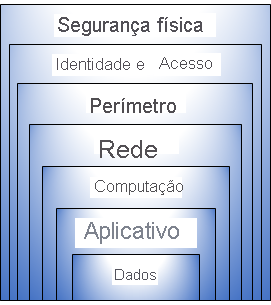

Cada camada fornece proteção, de modo que se uma camada for violada, uma camada seguinte já estará em vigor para impedir a exposição adicional. Essa abordagem elimina a dependência de qualquer camada única de proteção. Ela desacelera um ataque e fornece informações de alerta sobre as quais as equipes de segurança podem agir, automática ou manualmente.

Aqui está uma breve visão geral da função de cada camada:

A camada de segurança física é a primeira linha de defesa para proteger o hardware de computação no datacenter.
A camada de identidade e acesso controla o acesso à infraestrutura e ao controle de alterações.
A camada de perímetro usa a proteção contra DDoS (ataque de negação de serviço distribuído) para filtrar ataques em grande escala antes que eles possam causar uma negação de serviço para os usuários.
A camada de rede limita a comunicação entre recursos por meio de controles de acesso e segmentação.
A camada de computação protege o acesso a máquinas virtuais.
A camada de aplicativo ajuda a garantir que os aplicativos estejam seguros e livres de vulnerabilidades de segurança.
A camada de dados controla o acesso aos dados corporativos e do cliente que você precisa proteger.
Essas camadas fornecem diretrizes para ajudar você a tomar decisões de configuração de segurança em todas as camadas de seus aplicativos.

O Azure fornece ferramentas e recursos de segurança em todos os níveis do conceito de defesa em profundidade. Vamos examinar cada camada em mais detalhes:

Segurança física
Proteger fisicamente o acesso a edifícios e controlar o acesso ao hardware de computação no datacenter é a primeira linha de defesa.

Com a segurança física, a intenção é fornecer garantias físicas contra o acesso aos ativos. Essas garantias asseguram que outras camadas não possam ser ignoradas e que a perda ou o roubo seja tratado de maneira adequada. A Microsoft usa vários mecanismos de segurança físicos em seus datacenters de nuvem.

Identidade e acesso
A camada de identidade e acesso refere-se a garantir que as identidades estejam seguras, que o acesso seja concedido apenas ao que é necessário e que os eventos de entrada e as alterações sejam registradas.

Nessa camada, é importante:

Controle o acesso à infraestrutura e o controle de alterações.
Usar o SSO (logon único) e a autenticação multifator.
Faça a auditoria de eventos e alterações.
Perímetro
O perímetro da rede protege seus recursos contra ataques baseados na rede. Identificar esses ataques, eliminar o impacto e alertar quando eles ocorrem são maneiras importantes de manter a rede segura.

Nessa camada, é importante:

Usar a Proteção contra DDoS para filtrar ataques em grande escala antes que eles possam afetar a disponibilidade de um sistema para os usuários.
Use firewalls de perímetro para identificar e alertar sobre ataques maliciosos contra a rede.
Rede
Essa camada concentra-se em limitar a conectividade de rede entre todos os recursos para permitir apenas o necessário. Ao limitar essa comunicação, você reduz o risco de uma disseminação de ataques para outros sistemas na rede.

Nessa camada, é importante:

Limite a comunicação entre os recursos.
Negue por padrão.
Restringir o acesso à Internet de entrada e limitar o acesso de saída quando apropriado.
Implemente a conectividade segura com as redes locais.
Computação
Malware, sistemas sem patches e sistemas sem proteção adequada abrem o ambiente para ataques. Essa camada tem como foco garantir que os recursos de computação estejam seguros e que haja controles adequados em vigor para minimizar os problemas de segurança.

Nessa camada, é importante:

Proteger o acesso às máquinas virtuais.
Implementar o Endpoint Protection em dispositivos e manter os sistemas atualizados e com patches.
Aplicativo
A integração da segurança no ciclo de vida de desenvolvimento do aplicativo ajuda a reduzir o número de vulnerabilidades introduzidas no código. Toda equipe de desenvolvimento deve garantir que seus aplicativos sejam seguros por padrão.

Nessa camada, é importante:

Verificar se os aplicativos estão seguros e livres de vulnerabilidades.
Armazene os segredos de aplicativos confidenciais em uma mídia de armazenamento seguro.
Faça com que a segurança seja um requisito de design em todo o desenvolvimento do aplicativo.
Dados
Quem armazena dados e controla o acesso a eles é responsável por garantir que estejam protegidos adequadamente. É comum que requisitos regulatórios determinem os controles e os processos que precisam estar em vigor para garantir a confidencialidade, a integridade e a disponibilidade dos dados.

Em quase todos os casos, os invasores estão em busca de dados:

Armazenados em um banco de dados.
Armazenados em disco em máquinas virtuais.
Armazenados em aplicativos SaaS (software como serviço), como o Office 365.
Gerenciados por meio do armazenamento em nuvem.

### Descrever o Microsoft Defender para Nuvem

O Defender para Nuvem é uma ferramenta de monitoramento para gerenciamento da postura de segurança e proteção contra ameaças. Ele monitora ambientes de nuvem, locais, híbridos e de multinuvem para fornecer diretrizes e notificações com o objetivo de fortalecer sua postura de segurança.

O Defender para Nuvem fornece as ferramentas necessárias para proteger seus recursos, acompanhar sua postura de segurança, proteger contra ataques cibernéticos e simplificar o gerenciamento de segurança. A implantação do Defender para Nuvem é fácil e já está integrada nativamente ao Azure.

Proteção em todos os lugares em que você está implantado
Como o Defender para Nuvem é um serviço nativo do Azure, muitos serviços do Azure são monitorados e protegidos sem a necessidade de qualquer implantação. No entanto, se você também tiver um datacenter local ou estiver operando em outro ambiente de nuvem, o monitoramento dos serviços do Azure poderá não fornecer uma visão completa da sua situação de segurança.

Quando necessário, o Defender para Nuvem pode implantar automaticamente um agente do Log Analytics para coletar dados relacionados à segurança. Para computadores do Azure, a implantação é tratada diretamente. Em ambientes híbridos e multinuvem, os planos do Microsoft Defender são estendidos para computadores que não são do Azure com a ajuda do Azure Arc. Além disso, os recursos de GPSN (gerenciamento da postura de segurança na nuvem) são estendidos para computadores multinuvem sem a necessidade de agentes.

Proteções nativas do Azure
O Defender para Nuvem ajuda a detectar ameaças em:

Serviços PaaS do Azure – detecte ameaças que tenham como alvo serviços do Azure, incluindo o Serviço de Aplicativo do Azure, SQL do Azure, Conta de Armazenamento do Azure e outros serviços de dados. Você também pode executar a detecção de anomalias nos logs de atividades do Azure usando a integração nativa com o Microsoft Defender para Aplicativos de Nuvem (anteriormente conhecido como Microsoft Cloud App Security).
Serviços de dados do Azure – o Defender para Nuvem inclui recursos que ajudam a classificar automaticamente os dados no SQL do Azure. Você também pode obter avaliações de possíveis vulnerabilidades nos serviços de Armazenamento e SQL do Azure e recomendações de como mitigá-las.
Redes – o Defender para Nuvem ajuda a limitar a exposição a ataques de força bruta. Ao reduzir o acesso às portas de máquina virtual, usando o acesso de VM Just-In-Time, você pode proteger sua rede, impedindo acesso desnecessário. Você pode definir políticas de acesso seguro em portas selecionadas somente para usuários autorizados, endereços IP ou intervalos de endereços IP de origem permitida por um tempo limitado.
Proteja seus recursos híbridos
Além de defender seu ambiente do Azure, você pode adicionar os recursos do Defender para Nuvem em seu ambiente de nuvem híbrido para proteger seus servidores que não sejam Azure. Para ajudá-lo a se concentrar no que é mais importante, você obterá inteligência contra ameaças personalizada e alertas priorizados de acordo com seu ambiente específico.

Para estender a proteção para computadores locais, implante o Azure Arc e habilite os recursos de segurança aprimorados do Defender para Nuvem.

Recursos do Defender em execução em outras nuvens
O Defender para Nuvem também pode proteger recursos em outras nuvens (como AWS e GCP).

Por exemplo, se você conectou uma conta do Amazon Web Services a uma assinatura do Azure, você pode habilitar qualquer uma dessas proteções:

Os recursos do CSPM do Defender para Nuvem se estendem aos seus recursos da AWS. Esse plano sem agente avalia os recursos da AWS de acordo com as recomendações de segurança específicas da AWS e inclui os resultados na classificação de segurança. Os recursos também serão avaliados quanto à conformidade com padrões internos específicos da AWS (AWS CIS, AWS PCI DSS e AWS Foundational Security Best Practices). A página de inventário de ativos do Defender para Nuvem é um recurso habilitado para várias nuvens que ajuda você a gerenciar seus recursos da AWS e do Azure juntos.
O Microsoft Defender para Contêineres estende a detecção de ameaças de contêiner e as defesas avançadas para os clusters do Amazon EKS no Linux.
O Microsoft Defender para Servidores adiciona proteções avançadas e detecção de ameaças às instâncias do EC2 no Windows e no Linux.
Avaliar, proteger e defender
O Defender para Nuvem preenche três necessidades vitais à medida que você gerencia a segurança de seus recursos e cargas de trabalho locais e na nuvem:

Avaliação contínua – Conheça sua postura de segurança. Identifique e rastreie vulnerabilidades.
Proteger – Proteja recursos e serviços com o Azure Security Benchmark.
Defender – Detecte e resolva ameaças a recursos, cargas de trabalho e serviços.


Avaliar continuamente
O Defender para nuvem ajuda você a avaliar continuamente o ambiente. O Defender para Nuvem inclui soluções de avaliação de vulnerabilidade para suas máquinas virtuais, registros de contêiner e servidores SQL.

O Microsoft Defender para servidores inclui a integração automática e nativa com o Microsoft Defender para Ponto de Extremidade. Com essa integração habilitada, você terá acesso às descobertas de vulnerabilidade do gerenciamento de ameaças e vulnerabilidades da Microsoft.

Entre essas ferramentas de avaliação, você terá verificações de vulnerabilidade regulares e detalhadas que abrangem computação, dados e infraestrutura. Você pode examinar e responder aos resultados dessas verificações dentro do Defender para Nuvem.

Seguro
Dos métodos de autenticação para controle de acesso ao conceito de Confiança Zero, a segurança na nuvem é um fundamento essencial que deve ser feito corretamente. Para ser seguro na nuvem, você precisa garantir que suas cargas de trabalho estejam seguras. Para proteger suas cargas de trabalho, você precisa de políticas de segurança em vigor sob medida para seu ambiente e sua situação. Como as políticas do Defender para Nuvem são criadas sobre controles do Azure Policy, você está obtendo toda a gama e a flexibilidade de uma solução de política de alto nível. No Defender para Nuvem, você pode definir suas políticas a serem executadas nos grupos de gerenciamento, entre assinaturas e até mesmo para um locatário inteiro.

Um dos benefícios da migração para a nuvem é a capacidade de crescer e escalar de acordo com as exigências, adicionando novos serviços e recursos conforme necessário. O Defender para Nuvem está constantemente monitorando novos recursos que estão sendo implantados em suas cargas de trabalho. O Defender para Nuvem avalia se novos recursos estão configurados de acordo com as práticas recomendadas de segurança. Caso contrário, eles serão sinalizados e você obterá uma lista priorizada de recomendações para o que precisa corrigir. As recomendações ajudam a reduzir a superfície de ataque em cada um de seus recursos.

A lista de recomendações está habilitada e tem suporte do Azure Security Benchmark. Esse parâmetro de comparação específico do Azure e criado pela Microsoft fornece um conjunto de diretrizes de melhores práticas de segurança e conformidade baseadas em estruturas de conformidade comuns.

Dessa forma, o Defender para Nuvem permite que você não apenas defina políticas de segurança, como aplique padrões de configuração segura em todos os seus recursos.

Para ajudar você a entender a importância de cada recomendação para sua postura de segurança geral, o Defender para Nuvem agrupa as recomendações em controles de segurança e adiciona um valor de classificação de segurança a cada controle. A classificação de segurança fornece um indicador simples e rápido sobre a integridade de sua postura de segurança, e os controles fornecem uma lista de trabalho com as coisas a serem consideradas para aprimorar a classificação de segurança e a postura geral de segurança.


## Defender

As duas primeiras áreas se concentraram em avaliar, monitorar e dar manutenção ao ambiente. O Defender para Nuvem também ajuda você a defender seu ambiente fornecendo alertas de segurança e recursos avançados de proteção contra ameaças.

Alertas de segurança
Quando o Defender para Nuvem detecta uma ameaça em qualquer área do ambiente, ele gera um alerta de segurança. Alertas de segurança:

Descrever detalhes dos recursos afetados
Sugerir etapas de correção
Fornecer, em alguns casos, uma opção para disparar um aplicativo lógico em resposta
Se um alerta for gerado pelo Defender para Nuvem ou recebido pelo Defender para Nuvem de um produto de segurança integrado, você poderá exportá-lo. A proteção contra ameaças do Defender para Nuvem inclui a análise da cadeia de encerramento de fusão, que correlaciona automaticamente alertas no seu ambiente com base na análise cibernética da cadeia de encerramento, para ajudar você a entender melhor todos os detalhes de um ataque, como ele começou e que tipo de impacto causou nos seus recursos.

Proteção avançada contra ameaças

O Defender para nuvem fornece recursos avançados de proteção contra ameaças para muitos de seus recursos implantados, incluindo máquinas virtuais, bancos de dados SQL, contêineres, aplicativos Web e sua rede. As proteções incluem proteger as portas de gerenciamento de suas VMs com acesso just-in-time e controles de aplicativos adaptáveis para criar listas de permissões de quais aplicativos devem ou não ser executados nos computadores.


## Capítulo 3 : DESCREVA NÚCLEO SOLUÇÕES E GERENCIAMENTO FERRAMENTAS EM AZURE


## Resumo Geral

Este capítulo cobriu muito terreno! 

Não somente você aprendeu alguns dos fundamentos relacionados ao Azure para regiões e grupos de recursos, mas você aprendeu
sobre muitos dos principais serviços de carga de trabalho do Azure fornece.

Uma região do Azure é uma área dentro de uma área geográfica específica limite, e cada região é tipicamente centenas de milhas
separado.

Uma geografia é geralmente um país, e cada geografia contém pelo menos duas regiões.

Um datacenter é um edifício físico dentro de uma região, e cada datacenter tem sua própria energia, fornecimento de refrigeração, água alimentação, geradores e rede.

A latência de ida e volta entre duas regiões não deve ser superior a 2ms, e é por isso que as regiões às vezes são definido como um "limite de latência". Os clientes devem implantar recursos do Azure em vários regiões para garantir a disponibilidade.

As zonas de disponibilidade garantem que seus recursos sejam implantados em datacenters separados em uma região. Lá há pelo menos três zonas de disponibilidade em cada região.

Os grupos de recursos permitem que você separe os recursos do Azure de maneira lógica e você pode marcar recursos para facilitar
gerenciamento.

Todos os seus recursos do Azure são criados em um Azure assinatura, e você pode criar assinaturas adicionais se você precisar agrupar ou relatar recursos com mais facilidade.

As assinaturas do Azure têm limites associados a elas. 

Os grupos de gerenciamento permitem que você atribua políticas e controle de acesso aos recursos do Azure.

Somente assinaturas ou outros grupos de gerenciamento podem ser adicionado a um grupo de gerenciamento.

Azure Resource Manager (ARM) é como o Azure ferramentas de gerenciamento criam e gerenciam recursos do Azure.

ARM usa provedores de recursos para criar e gerenciar recursos.

Um modelo ARM permite garantir a consistência de grandes implantações do Azure. 

As máquinas virtuais do Azure são uma oferta de IaaS em que você gerenciar o sistema operacional e a configuração.

Os conjuntos de disponibilidade protegem suas VMs com domínios de falha e atualizar domínios. Os domínios de falha protegem sua VM de um falha de hardware em um rack de hardware. Você está protegido de reinicializações de VM por domínios de atualização.

Os conjuntos de dimensionamento permitem que você configure regras de dimensionamento automático para dimensionar
horizontalmente quando necessário.

O Serviço de Aplicativo do Azure facilita a hospedagem de aplicativos Web no cloud porque é um serviço PaaS que remove o
carga de gerenciamento do usuário.

Os aplicativos do Serviço de Aplicativo são executados dentro de um plano do Serviço de Aplicativo que especifica o número de VMs e a configuração de essas VMs.

Os contêineres permitem que você crie uma imagem de um aplicativo e tudo o que é necessário para executá-lo.

As instâncias de contêiner do Azure (ACI) permitem que você execute contêineres por um custo muito baixo.

Azure Kubernetes Service (AKS) é um serviço gerenciado que facilita a hospedagem de clusters Kubernetes no nuvem.

A área de trabalho virtual do Windows cria aplicativos e sistemas operacionais facilmente disponível para vários usuários de quase qualquer dispositivo. 

Uma rede virtual do Azure (VNet) permite que os serviços do Azure comunicar uns com os outros e com a Internet.

Você pode adicionar um endereço IP público a uma VNet para entrada Conectividade com a Internet. Isso é útil se um site for executando em seu VNET e você deseja permitir que as pessoas Acesse isso.

O Azure Load Balancer pode distribuir o tráfego do Internet em várias VMs em sua VNet.

ExpressRoute permite que você tenha uma alta largura de banda conexão ao Azure de até 10 Gbps conectando-se a um
Roteador Microsoft Enterprise Edge (MSEE).

O tráfego no ExpressRoute não passa pelo Internet.

O Armazenamento de Blobs do Azure é uma boa opção de armazenamento para dados não estruturados, como arquivos binários.

Se você precisar mover uma grande quantidade de dados para o Blob Armazenamento, Azure Data Box é uma boa opção. Você pode ter
discos rígidos de vários tamanhos enviados para você. 

Adicione o seu dados para eles e enviá-los de volta para a Microsoft, onde eles serão adicionados à sua conta de armazenamento.

O armazenamento em disco do Azure é um armazenamento em disco virtual para VMs do Azure.

Os discos gerenciados permitem que você remova o gerenciamento carga de discos.

Azure Files permite que você tenha espaço em disco na nuvem que você pode mapear para uma unidade local.

O Azure Blob Storage oferece armazenamento Hot, Cool e Archive níveis que são baseados em quanto tempo você pretende armazenar o
dados, com que frequência os dados são acessados e assim por diante.

Azure Cosmos DB é um banco de dados NoSQL na nuvem para dados não estruturados.

O Banco de Dados SQL do Azure é um sistema de banco de dados relacional em a nuvem totalmente gerenciada pela Microsoft.

O Banco de Dados do Azure para MySQL é baseado na Comunidade Edição do sistema de banco de dados MySQL de código aberto. Isso é
um serviço gerenciado que remove o fardo de gerenciamento do usuário.

O Banco de Dados do Azure para PostgreSQL é um serviço gerenciado para hospedagem de bancos de dados PostgreSQL.

O Azure Marketplace é uma fonte de modelos para criando recursos do Azure. Alguns são fornecidos por A Microsoft e alguns são fornecidos por terceiros.

## DESCREVA NÚCLEO SOLUÇÕES E GERENCIAMENTO FERRAMENTAS EM AZURE


- Azure IoT Hub
- IoT Central
- Azure Sphere
- Azure Synapse Analytics
- HDInsight
- Azure Databricks
- Azure Machine Learning
- Cognitive Services
- Azure Bot Service
- Serverless computing
- Azure Functions
- Logic Apps
- Event Grid
- Azure DevOps
- Azure DevTest Labs

## Descrever fatores que podem afetar os custos no Azure

O Azure desloca os custos de desenvolvimento de CapEx (despesa de capital) de criar e manter a infraestrutura e instalações para OpEx (despesa operacional) de alugar a infraestrutura conforme necessário, seja computação, armazenamento, rede etc.

Esse custo OpEx pode ser afetado por muitos fatores. Alguns deles são:

- Tipo de recurso
- Consumo
- Manutenção
- Painel Geografia do app's selecionado
- Tipo de assinatura
- Azure Marketplace
- Tipo de recurso

Vários fatores influenciam o custo dos recursos do Azure. O tipo de recursos, as configurações do recurso e a região do Azure afetarão o custo de um recurso. Quando você provisiona um recurso do Azure, a plataforma cria instâncias limitadas para esse recurso. Os medidores rastreiam o uso dos recursos e geram um registro de uso para o cálculo da sua fatura.

### Exemplos

Com uma conta de armazenamento, você especifica um tipo como blob, um nível de desempenho, uma camada de acesso, configurações de redundância e uma região. Criar a mesma conta de armazenamento em regiões diferentes pode mostrar custos diferentes, e alterar qualquer uma das configurações também pode afetar o preço.

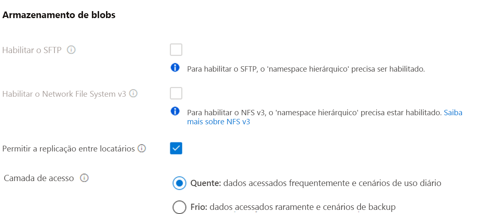

Com uma VM (máquina virtual), talvez seja necessário considerar o licenciamento para o sistema operacional ou outro software, o processador e o número de núcleos para a VM, o armazenamento anexado e o adaptador de rede. Assim como acontece com o armazenamento, o provisionamento da mesma máquina virtual em regiões diferentes pode resultar em custos diferentes.

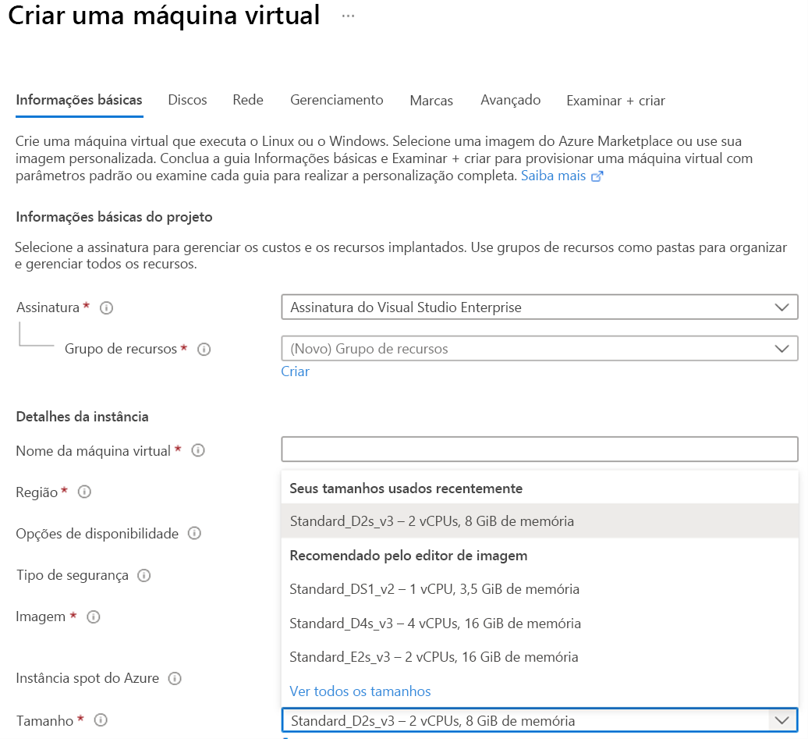

### Consumo

O pagamento conforme o uso é um tema consistente em todo o processo, e esse é o modelo de pagamento em nuvem em que você paga pelos recursos usados durante um ciclo de cobrança. Se você usar mais computação neste ciclo, pagará mais. Se você usar menos no ciclo atual, pagará menos. É um mecanismo de preços direto que permite a flexibilidade máxima.

No entanto, o Azure também permite que o usuário se comprometa a usar uma quantidade definida de recursos de nuvem com antecedência e receber descontos nesses recursos "reservados". Muitos serviços, incluindo bancos de dados, computação e armazenamento, permitem fazer commit um nível de uso e receber um desconto, em alguns casos, até 72%.

Quando você reserva capacidade, você está se comprometendo a usar e pagar por uma determinada quantidade de recursos do Azure durante um determinado período (normalmente um ou três anos). Com o backup do pagamento conforme o uso, se você vir um aumento repentino na demanda que consome o que você pré-reservou, bastará pagar pelos recursos adicionais que excedem sua reserva. Esse modelo permite reconhecer economias significativas em cargas de trabalho confiáveis e consistentes, ao mesmo tempo proporcionando a flexibilidade de aumentar rapidamente seu volume de nuvem à medida que a necessidade surge.

### Manutenção

A flexibilidade da nuvem possibilita ajustar rapidamente os recursos com base na demanda. O uso de grupos de recursos pode ajudar a manter todos os seus recursos organizados. Para controlar os custos, é importante manter o ambiente de nuvem. Por exemplo, sempre que você provisiona uma VM, recursos adicionais, como armazenamento e rede, também são provisionados. Se você desprovisionar a VM, esses recursos adicionais poderão não ser desprovisionados ao mesmo tempo, seja intencionalmente ou não. Ficar atento aos seus recursos e não manter recursos desnecessários ajuda a controlar os custos de nuvem.

###  Painel Geografia do app's selecionado

Ao provisionar a maioria dos recursos no Azure, você precisa definir uma região em que o recurso é implantado. A infraestrutura do Azure é distribuída no mundo inteiro, o que permite que você implante seus serviços centralmente, mais perto dos clientes ou adote uma solução intermediária. Com essa implantação global, há diferenças de preços globais. Os custos de energia, mão de obra, impostos e taxas variam dependendo do local. Devido a essas variações, os custos de implantar recursos do Azure podem diferir dependendo da região.

O tráfego de rede também é afetado conforme a área geográfica. Por exemplo, é mais barato mover informações dentro da Europa do que mover informações da Europa para a Ásia ou a América do Sul.

### Tráfego de rede

As zonas de cobrança são um fator para determinar o custo de alguns serviços do Azure.

A largura de banda refere-se aos dados que entram e saem dos datacenters do Azure. Algumas transferências de dados de entrada (dados que entram em datacenters do Azure) são gratuitas. Para transferências de dados de saída (dados que saem de data centers do Azure), o preço de transferência de dados é baseado em zonas.

Uma zona é um agrupamento geográfico de regiões do Azure para fins de cobrança. A página de preços de largura de banda tem informações adicionais sobre preços de entrada, saída e transferência de dados.

### Tipo de assinatura

Alguns tipos de assinatura do Azure também incluem as concessões de uso, que afetam os custos.

Por exemplo, uma assinatura de avaliação gratuita do Azure fornece acesso a vários produtos do Azure gratuitos por 12 meses. Ele também inclui crédito a ser gasto em seus primeiros 30 dias de inscrição. Você obterá acesso a mais de 25 produtos que são sempre gratuitos (com base na disponibilidade de recursos e regiões).

### Azure Marketplace

O Azure Marketplace permite comprar soluções e serviços baseados no Azure de fornecedores de terceiros. Isso pode ser um servidor com software pré-instalado e configurado, ou dispositivos de firewall de rede gerenciados ou conectores para serviços de backup de terceiros. Ao comprar produtos por meio do Azure Marketplace, você pode pagar não apenas pelos serviços do Azure que está usando, mas também pelos serviços ou pela experiência do fornecedor de terceiros. As estruturas de cobrança são definidas pelo fornecedor.

Todas as soluções disponíveis no Azure Marketplace são certificadas e em conformidade com as políticas e padrões do Azure. As políticas de certificação podem variar com base no tipo de serviço ou solução e no serviço do Azure envolvido. As políticas de certificação do marketplace comercial têm informações adicionais sobre certificações do Azure Marketplace.

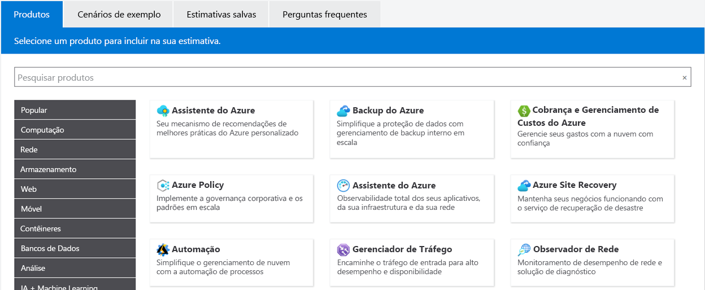

### Calculadora de TCO

A calculadora de TCO foi projetada para ajudá-lo a comparar os custos para executar uma infraestrutura local versus uma infraestrutura de nuvem do Azure. Com a calculadora de TCO, você insere sua configuração de infraestrutura atual, incluindo servidores, bancos de dados, armazenamento e tráfego de rede de saída. Então a calculadora de TCO compara os custos previstos para seu ambiente atual com um ambiente do Azure que dá suporte aos mesmos requisitos de infraestrutura.

Com a calculadora de TCO, você insere sua configuração, adiciona suposições como custos com energia e mão de obra de TI e recebe uma estimativa da diferença de custo para executar o mesmo ambiente no datacenter atual ou no Azure.

## Exercício – Estimar os custos da carga de trabalho usando a calculadora de preços

Neste exercício, você usará a calculadora de preços para estimar o custo da execução de um aplicativo Web básico no Azure.

Comece definindo de quais serviços do Azure você precisa.

### Observação

A calculadora de preços é apenas para fins informativos. Os preços são apenas uma estimativa e você não será cobrado pelos serviços que selecionar.

Definir seus requisitos

Antes de executar a calculadora de preços, você precisa ter uma noção dos serviços do Azure necessários.

Para um aplicativo Web básico hospedado em seu datacenter, você pode executar uma configuração semelhante à seguinte.

Um aplicativo Web ASP.NET executado no Windows. O aplicativo Web fornece informações sobre o inventário e o preço do produto. Há duas máquinas virtuais conectadas por um balanceador de carga central. O aplicativo Web conecta-se a um banco de dados do SQL Server que contém informações de inventário e preço.

### Para migrar para o Azure, você pode:

Use instâncias de Máquinas Virtuais do Azure, semelhante às máquinas virtuais usadas no datacenter.
Usar o Gateway de Aplicativo do Azure para balanceamento de carga.
Usar o Banco de Dados SQL do Azure para manter informações de inventário e preço.
Aqui está um diagrama que mostra a configuração básica:

Um diagrama mostrando uma possível solução do Azure para hospedar um aplicativo.

Na prática, você definiria seus requisitos com mais detalhes. Porém, aqui estão alguns fatos básicos e requisitos para começar:

O aplicativo é usado internamente. Ele não está acessível aos clientes.
Esse aplicativo não exige uma grande quantidade de potência de computação.
As máquinas virtuais e o banco de dados são executados o tempo todo (730 horas/mês).
A rede processa cerca de 1 TB de dados por mês.
O banco de dados não precisa ser configurado para cargas de trabalho de alto desempenho e não requer mais de 32 GB de armazenamento.
Explore a calculadora de preços
Vamos começar com um tour rápido pela calculadora de preços.

Acesse a Calculadora de preços.

Observe as seguintes guias:

Uma captura de tela da barra de menus da calculadora de preços com a guia Produtos selecionada.

Produtos É aí que você escolhe os serviços do Azure que deseja incluir na estimativa. Você provavelmente gastará a maior parte do tempo aqui.
Exemplos de cenários Aqui, você encontrará várias arquiteturas de referência ou soluções comuns baseadas em nuvem que podem ser usadas como ponto de partida.
Estimativas salvas Aqui você encontrará suas estimativas salvas anteriormente.
Perguntas frequentes Aqui você descobrirá respostas para perguntas frequentes sobre a calculadora de preços.
Estimar sua solução
Aqui você adiciona cada serviço do Azure necessário à calculadora. Em seguida, configure cada serviço para atender às suas necessidades.

 Dica

Verifique se a calculadora está zerada, sem nada listado na estimativa. Você pode redefinir a estimativa selecionando o ícone Lixeira ao lado de cada item.

Adicionar serviços à estimativa
Na guia Produtos, selecione o serviço de cada uma dessas categorias:

Categoria	Serviço
Computação	Máquinas virtuais
Bancos de dados	Banco de Dados SQL do Azure
Rede	Gateway de Aplicativo
Role até o final do painel à direita. Cada serviço está listado com a configuração padrão.

Configurar serviços para atender às suas necessidades
Em Banco de Dados SQL do Azure, defina estes valores:

Configuração	Valor
Região	Oeste dos EUA
Tipo	Banco de Dados Individual
Camada de armazenamento de backup	RA-GRS
Modelo de compra	vCore
Camada de serviço	Uso Geral
Camada de computação	Provisionado
Generation	Gen 5
Instância	8 vCore
Deixe as configurações restantes com os valores atuais.

Em Gateway de Aplicativo, defina estes valores:

Configuração	Valor
Região	Oeste dos EUA
Camada	Firewall do Aplicativo Web
Tamanho	Média
Horas de gateway	2 x 730 horas
Dados processados	1 TB
Transferência de dados de saída	5 GB
Deixe as configurações restantes com os valores atuais.

Examinar, compartilhar e salvar a estimativa
Na parte inferior da página, você verá o custo estimado total de executar a solução. Você poderá alterar o tipo de moeda se quiser.

Neste ponto, você tem algumas opções:

Selecionar Exportar para salvar a estimativa como um documento do Excel.
Selecionar Salvar ou Salvar como para salvar a estimativa na guia Estimativas Salvas para depois.
Selecionar Compartilhar para gerar uma URL para compartilhar a estimativa com a equipe.
Agora você tem uma estimativa de custo que pode compartilhar com sua equipe. Você pode fazer ajustes conforme descobre alterações em seus requisitos.

Experimente algumas das opções com as quais você trabalhou aqui ou crie um plano de compra para uma carga de trabalho que você deseja executar no Azure.

## Descrever a ferramenta Gerenciamento de Custos do Azure

O Microsoft Azure é um provedor de nuvem global, o que significa que você pode provisionar recursos em qualquer lugar do mundo. Você pode provisionar recursos rapidamente para atender a uma demanda repentina ou testar um novo recurso ou em caso de acidente. Se você provisionar acidentalmente novos recursos, talvez não esteja ciente deles até a hora da fatura. O Gerenciamento de Custos é um serviço do Azure que ajuda a evitar essas situações.

### O que é o Gerenciamento de Custo?

O Gerenciamento de Custos permite verificar rapidamente os custos de recursos do Azure, criar alertas com base nos gastos com recursos e criar orçamentos que podem ser usados para automatizar o gerenciamento de recursos.

A análise de custo é um subconjunto de Gerenciamento de Custos que apresenta um visual rápido para os custos do Azure. Usando a análise de custo, você pode visualizar rapidamente o custo total de várias maneiras, inclusive por ciclo de cobrança, região, recurso etc.

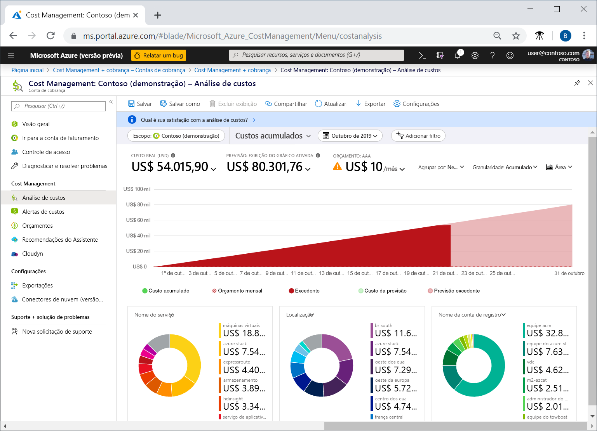

## Você usa a análise de custos para explorar e analisar seus custos organizacionais. Você pode visualizar os custos agregados por organização para entender onde os custos são acumulados e para identificar tendências de gastos. E você pode ver os custos acumulados ao longo do tempo para estimar tendências de custo mensais, trimestrais ou mesmo anuais em comparação a um orçamento.

Alertas de custo
Os alertas de custo fornecem um só local para verificar rapidamente todos os diferentes tipos de alerta que podem aparecer no serviço de Gerenciamento de Custos. Os três tipos de alertas que podem aparecer são:

Alertas de orçamento
Alertas de crédito
Alertas de cota de gastos do departamento.
Alertas de orçamento
Os alertas de orçamento notificam você quando os gastos, com base em uso ou custos, atingem ou excedem o valor definido na condição de alerta do orçamento. Os orçamentos do Gerenciamento de Custos são criados usando o portal do Azure ou a API de Consumo do Azure.

No portal do Azure, os orçamentos são definidos pelo custo. Os orçamentos são definidos pelo custo ou pelo uso de consumo ao usar a API de Consumo do Azure. Alertas de orçamento dão suporte a orçamentos com base em custo e em uso. Alertas de orçamento são gerados automaticamente sempre que as condições de alerta de orçamento são atendidas. Você pode exibir todos os alertas de custo no portal do Azure. Sempre que um alerta é gerado, ele é mostrado nos alertas de custo. Um email de alerta também é enviado para as pessoas na lista de destinatários de alertas do orçamento.

Alertas de crédito
Os alertas de crédito notificam você quando seus compromissos monetários de crédito do Azure são consumidos. Os compromissos monetários se destinam a organizações que têm EAs (Contratos Enterprise). Os alertas de crédito são gerados automaticamente a 90% e a 100% do saldo de crédito do Azure. Sempre que um alerta é gerado, ele se reflete nos alertas de custo e no email enviado aos proprietários da conta.

Alertas de cota de gasto do departamento
Os alertas de cota de gasto do departamento notificam você quando os gastos do departamento atingem um limite fixo da cota. As cotas de gasto são configuradas no Portal do EA. Sempre que um limite é atingido, ele gera um email para os proprietários do departamento no qual os alertas de custo são exibidos. Por exemplo, 50% ou 75% da cota.

Orçamentos
É em um orçamento que você define um limite de gastos para o Azure. Você pode definir orçamentos com base em uma assinatura, grupo de recursos, tipo de serviço ou outros critérios. Ao definir um orçamento, você também define um alerta de orçamento. Quando o orçamento atinge o nível de alerta do orçamento, ele dispara um alerta de orçamento que aparece na área de alertas de custo. Se configurados, os alertas de orçamento também enviarão uma notificação por email de que um limite de alerta de orçamento foi disparado.

Um uso mais avançado de orçamentos permite que as condições orçamentárias disparem a automação que suspende ou modifica recursos depois que a condição de gatilho ocorre.

## Descrever a finalidade das marcas


À medida que o seu uso de nuvem aumenta, passa a ser cada vez mais importante manter-se organizado. Uma boa estratégia de organização ajuda você a entender o seu uso da nuvem e pode ajudar a gerenciar os custos.

Uma forma de organizar os recursos relacionados é colocá-los nas próprias assinaturas. Use também grupos de recursos para gerenciar os recursos relacionados. As marcas de recursos são outra maneira de organizar os recursos. As marcas fornecem informações extras ou metadados sobre os recursos. Esses metadados são úteis para:

Gerenciamento de recursos As marcas permitem que você localize em recursos associados a cargas de trabalho, ambientes, unidades de negócios e proprietários específicos e realize ações nesses recursos.
Gerenciamento e otimização de recursos As marcas permitem agrupar os recursos para que você possa relatar custos, alocar centros de custos internos, acompanhar orçamentos e prever o custo estimado.
Gerenciamento de operações As marcas permitem que você agrupe os recursos de acordo com o grau de importância da disponibilidade deles para os seus negócios. Esse agrupamento ajuda você a formular SLAs (Contratos de Nível de Serviço). Um SLA é uma garantia de tempo de atividade ou desempenho acordada entre você e seus usuários.
Segurança As marcas permitem que você classifique os dados pelo nível de segurança, como público ou confidencial.
Governança e conformidade regulatória As marcas permitem que você identifique recursos que se alinham com os requisitos de conformidade regulatória ou de governança, como a ISO 27001. Elas também podem fazer parte dos seus esforços de imposição de padrões. Por exemplo, você pode exigir que todos os recursos sejam marcados com um proprietário ou um nome de departamento.
Automação e otimização de carga de trabalho As marcas podem ajudar você a visualizar todos os recursos que participam de implantações complexas. Por exemplo, você pode marcar um recurso com o nome da carga de trabalho ou do aplicativo associado e usar um software como o Azure DevOps para executar tarefas automatizadas nesses recursos.
Como fazer para gerenciar marcas de recursos?
Você pode adicionar, modificar ou excluir marcas de recursos por meio do Windows PowerShell, da CLI do Azure, dos modelos do Azure Resource Manager, da API REST ou do portal do Azure.

Você pode usar o Azure Policy para impor a marcação de regras e convenções. Por exemplo, exija que determinadas marcas sejam adicionadas aos novos recursos à medida que eles forem provisionados. Defina também regras que reaplicam as marcas removidas. As marcas não são herdadas, o que significa que você pode aplicar marcas de um nível sem que elas apareçam automaticamente em um nível diferente, permitindo que você crie esquemas de marcação personalizados que mudam conforme o nível (recurso, grupo de recursos, assinatura etc.).

Um exemplo de estrutura de marcação
Uma marca de recurso consiste em um nome e um valor. Você pode atribuir uma ou mais marcas a cada recurso do Azure.

Nome

Valor

AppName

O nome do aplicativo do qual o recurso faz parte.

CostCenter

O código do centro de custo interno.

Proprietário

O nome do proprietário de negócios responsável pelo recurso.

Ambiente

Um nome de ambiente, como "Prod", "Dev" ou "Test".

Impacto

O grau de importância do recurso para as operações de negócios, como "Crítico", "De alto impacto" ou "De baixo impacto".

Tenha em mente que não é necessário impor a presença de uma marca específica em todos os recursos. Por exemplo, você pode decidir que apenas os recursos críticos tenham a marca Impact. Em seguida, todos os recursos não marcados não serão considerados críticos.

## Descrever a finalidade do Azure Blueprints

O que acontece quando a nuvem começa a ter mais do que apenas uma assinatura ou um ambiente? Como você pode dimensionar a configuração dos recursos? Como você pode impor configurações e políticas nas novas assinaturas?

O Azure Blueprints permite padronizar as implantações de ambiente ou de assinatura de nuvem. Em vez de precisar configurar recursos como o Azure Policy para cada nova assinatura, com o Azure Blueprints você pode definir configurações e políticas repetíveis que são aplicadas à medida que as assinaturas são criadas. Você precisa de um novo ambiente de teste/desenvolvimento? O Azure Blueprints permite implantar um novo ambiente de Teste/Desenvolvimento com configurações de segurança e conformidade já definidas. Dessa forma, as equipes de desenvolvimento podem criar e implantar rapidamente novos ambientes com a certeza de que estão cumprindo os requisitos organizacionais.

O que são artefatos?
Cada componente na definição de blueprint é conhecido como um artefato.

É possível que os artefatos não tenham parâmetros adicionais (configurações). Um exemplo é a política Implantar detecção de ameaças nos servidores SQL, que não requer nenhuma configuração adicional.

Os artefatos também podem conter um ou mais parâmetros que você pode configurar. A captura de tela a seguir mostra a política Localizações permitidas. Essa política inclui um parâmetro que especifica as localizações permitidas.

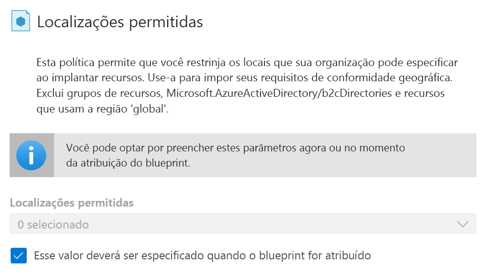

Você pode especificar o valor de um parâmetro ao criar a definição de blueprint ou atribuí-la a um escopo. Com isso, você pode manter um blueprint padrão, mas ter a flexibilidade de especificar os parâmetros de configuração relevantes em cada escopo no qual a definição é atribuída.

O Azure Blueprints implanta um novo ambiente com base em todos os requisitos, as configurações e as definições dos artefatos associados. Os artefatos podem incluir itens como:

Atribuições de função
Atribuições de política
Modelos do Azure Resource Manager
Grupos de recursos
Como o Azure Blueprints ajuda a monitorar as implantações?
O Azure Blueprints inclui o controle de versão, o que permite que você crie uma configuração inicial e depois faça atualizações, atribuindo uma nova versão à atualização. Com o controle de versão, você pode fazer pequenas atualizações e acompanhar quais implantações usaram qual conjunto de configuração.

Com o Azure Blueprints, a relação entre a definição do blueprint (o que deve ser implantado) e a atribuição do blueprint (o que foi implantado) é preservada. Em outras palavras, o Azure cria um registro que associa um recurso ao blueprint que o define. Essa conexão ajuda você a acompanhar e auditar suas implantações.

## Descrever a finalidade do Azure Policy

Como garantir que seus recursos permaneçam em conformidade? Você poderá receber um alerta se a configuração de um recurso for alterada?

O Azure Policy é um serviço do Azure que permite criar, atribuir e gerenciar políticas que controlam ou auditam os recursos. Essas políticas impõem regras diferentes sobre as configurações dos recursos, de modo que essas configurações permaneçam em conformidade com os padrões corporativos.

Como o Azure Policy define as políticas?
O Azure Policy permite que você defina políticas individuais e grupos de políticas relacionadas, conhecidas como iniciativas. O Azure Policy avalia seus recursos e realça os que não estão em conformidade com as políticas criadas por você. Ele também pode impedir a criação de recursos sem conformidade.

As Políticas do Azure podem ser definidas em cada nível, permitindo que você defina políticas em um recurso específico, um grupo de recursos, uma assinatura e assim por diante. Além disso, as Políticas do Azure são herdadas, portanto, se você definir uma política em um nível superior, ela será aplicada automaticamente a todos os agrupamentos que se enquadram no pai. Por exemplo, se você definir um Azure Policy em um grupo de recursos, todos os recursos criados nesse grupo de recursos receberão automaticamente a mesma política.

O Azure Policy vem com definições de iniciativa e política internas para Armazenamento, Rede, Computação, Central de Segurança e Monitoramento. Por exemplo, se você definir uma política que permita o uso de apenas um tamanho de VM (máquina virtual) em seu ambiente, essa política será invocada quando você criar uma VM e sempre que você redimensionar as VMs existentes. O Azure Policy também avalia e monitora todas as VMs atuais em seu ambiente, incluindo VMs que foram criadas antes da criação da política.

Em alguns casos, ele pode corrigir automaticamente os recursos e as configurações sem conformidade para garantir a integridade do estado dos recursos. Por exemplo, se todos os recursos de determinado grupo de recursos precisarem ser marcados com AppName e um valor igual a "SpecialOrders", o Azure Policy aplicará automaticamente essa marca se ela estiver ausente. No entanto, você ainda manterá o controle total do seu ambiente. Se houver um recurso específico que você não deseja que o Azure Policy corrija automaticamente, poderá sinalizar esse recurso como uma exceção e a política não o corrigirá automaticamente.

Além disso, o Azure Policy se integra ao Azure DevOps aplicando as políticas de pipeline de entrega e integração contínua que se pertencem às fases pré e pós-implantação dos seus aplicativos.

O que são iniciativas do Azure Policy?
Uma iniciativa do Azure Policy é uma forma de agrupar políticas relacionadas. A definição de iniciativa contém todas as definições de política para ajudar a acompanhar seu estado de conformidade para atingir uma meta maior.

Por exemplo, o Azure Policy inclui uma iniciativa chamada Habilitar o Monitoramento na Central de Segurança do Azure. A meta dele é monitorar todas as recomendações de segurança disponíveis para todos os tipos de recursos do Azure na Central de Segurança do Azure.

Com essa iniciativa, as seguintes definições de política são incluídas:

Monitorar um banco de dados SQL não criptografado na Central de Segurança Essa política monitora servidores e bancos de dados SQL não criptografados.
Monitorar vulnerabilidades de SO na Central de Segurança Esta política monitora servidores que não atendem à linha de base de vulnerabilidade do sistema operacional configurado.
Monitorar o Endpoint Protection ausente na Central de Segurança Essa política monitora servidores que não têm um agente de proteção de ponto de extremidade instalado.
Na verdade, a iniciativa Habilitar o Monitoramento na Central de Segurança do Azure contém mais de 100 definições de política separadas.

## Descrever a finalidade dos bloqueios de recursos

Um bloqueio de recurso impede que os recursos sejam excluídos ou alterados acidentalmente.

Mesmo com as políticas do controle de acesso baseado em função do Azure (RBAC do Azure) em vigor, ainda há um risco de que as pessoas com o nível correto de acesso possam excluir recursos de nuvem críticos. Os bloqueios de recursos impedem que recursos sejam excluídos ou atualizados, dependendo do tipo de bloqueio. Os bloqueios de recursos podem ser aplicados a recursos individuais, grupos de recursos ou até mesmo a toda uma assinatura. Os bloqueios de recursos são herdados, o que significa que, se você colocar um bloqueio de recurso em um grupo de recursos, todos os recursos do grupo de recursos também terão o bloqueio de recurso aplicado.

Tipos de Bloqueios de Recursos
Há dois tipos de bloqueios de recursos, um que impede que os usuários excluam e outro que impede que os usuários alterem ou excluam um recurso.

A exclusão significa que os usuários autorizados ainda poderão ler e modificar um recurso, mas não poderão excluir o recurso.
ReadOnly significa que os usuários autorizados poderão ler um recurso, mas não poderão excluir ou atualizar o recurso. Aplicar esse bloqueio é semelhante ao restringir todos os usuários autorizados para as permissões concedidas pela função Leitor.
Como fazer para gerenciar os bloqueios de recursos?
Gerencie os bloqueios de recursos no portal do Azure, no PowerShell, na CLI do Azure ou em um modelo do Azure Resource Manager.

Para ver, adicionar ou excluir bloqueios no portal do Azure, acesse a seção Configurações do painel Configurações de um recurso no portal do Azure.

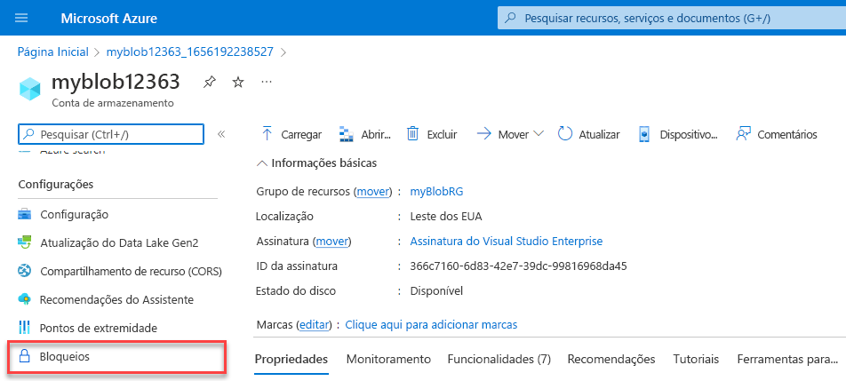

## Como fazer para excluir ou alterar um recurso bloqueado?
Embora o bloqueio ajude a evitar alterações acidentais, você ainda poderá fazer alterações seguindo um processo de duas etapas.

Para modificar um recurso bloqueado, primeiro, você precisará remover o bloqueio. Depois de remover o bloqueio, aplique qualquer ação que você tenha permissões para executar. Os bloqueios de recursos se aplicam independentemente das permissões de RBAC. Mesmo que você seja o proprietário do recurso, ainda precisará remover o bloqueio para realizar a atividade bloqueada.

## Exercício – Configurar um bloqueio de recurso
Concluído
100 XP
15 minutos
Neste exercício, você criará um recurso e configurará um bloqueio de recurso. As contas de armazenamento são um dos tipos mais fáceis de bloqueio de recurso em que é possível ver rapidamente o impacto, portanto, você usará uma conta de armazenamento neste exercício.

Este é um exercício Traga sua própria assinatura, portanto você precisará fornecer a sua assinatura do Azure para realizá-lo. Mas não se preocupe, pois todo o exercício pode ser concluído gratuitamente com os serviços gratuitos de 12 meses que você recebe quando se inscreve em uma conta do Azure.

Para obter ajuda para se inscrever em uma conta do Azure, confira o módulo de aprendizado Criar uma conta do Azure.

Depois de criar a conta gratuita, siga as etapas abaixo. Se você não tiver uma conta do Azure, poderá examinar as etapas para ver o processo de adição de um bloqueio de recurso simples a um recurso.

Tarefa 1: Criar um recurso
Para aplicar um bloqueio de recurso, você precisa ter um recurso criado no Azure. A primeira tarefa se concentra na criação de um recurso que você possa bloquear nas tarefas subsequentes.

Entre no portal do Microsoft Azure em https://portal.azure.com

Selecione Criar um recurso.

Em Categorias, selecione Armazenamento.

Em Conta de Armazenamento, selecione Criar.

Na guia Básico da folha Criar conta de armazenamento, preencha as informações a seguir. Mantenha os padrões para todo o resto.

Configuração	Valor
Resource group	Criar
Nome da conta de armazenamento	insira um nome de conta de armazenamento exclusivo
Location	padrão
Desempenho	Standard
Redundância	LRS (armazenamento com redundância local)
Selecione Revisar + Criar para revisar as configurações da sua conta de armazenamento e permitir que o Azure valide a configuração.

Depois de validar, selecione Criar. Aguarde a notificação de que a conta foi criada com sucesso.

Selecione Ir para o recurso.

Tarefa 2: Aplicar um bloqueio de recurso somente leitura
Nesta tarefa, você aplica um bloqueio de recurso somente leitura à conta de armazenamento. Qual será o impacto que isso terá na conta de armazenamento?

Role para baixo até encontrar a seção Configurações da folha, à esquerda da tela.

Selecione Bloqueios.

Selecione + Adicionar.

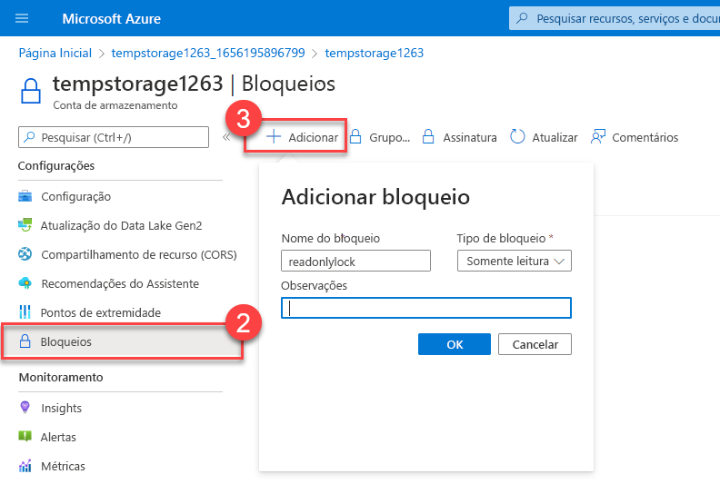

Insira um nome para o Bloqueio.

Verifique se o Tipo de bloqueio está definido como Somente leitura.

Selecione OK.

Tarefa 3: Adicionar um contêiner à conta de armazenamento
Nesta tarefa, você adiciona um contêiner à conta de armazenamento; esse é o contêiner em que você pode armazenar seus blobs.

Role para cima até encontrar a seção Armazenamento de dados da folha, à esquerda da tela.

Selecione Contêineres.

Selecionar + Contêiner.

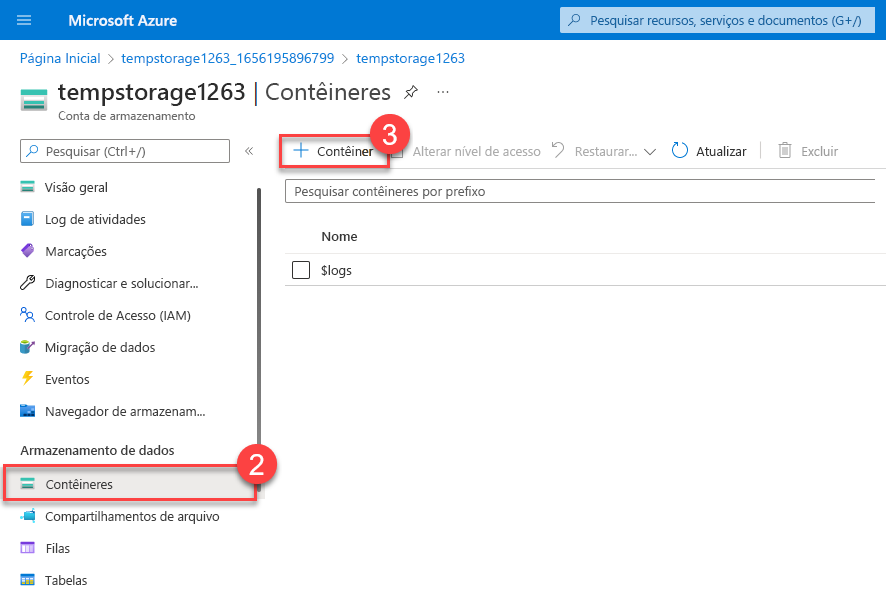

Insira um nome de contêiner e selecione Criar.

Você deverá ver uma mensagem de erro: Falha ao criar contêiner de armazenamento.

Captura de tela da mensagem de erro Falha ao criar o contêiner de armazenamento.

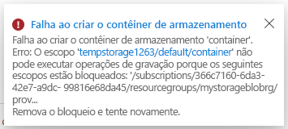

 Observação

A mensagem de erro permite que você saiba que não foi possível criar um contêiner de armazenamento porque um bloqueio está em vigor. O bloqueio somente leitura impede qualquer operação de criação ou atualização na conta de armazenamento, portanto, você não consegue criar um contêiner de armazenamento.

Tarefa 4: Modificar o bloqueio de recursos e criar um contêiner de armazenamento
Role para baixo até encontrar a seção Configurações da folha, à esquerda da tela.

Selecione Bloqueios.

Selecione o bloqueio de recurso somente leitura que você criou.

Altere o Tipo de bloqueio para Excluir e selecione OK.

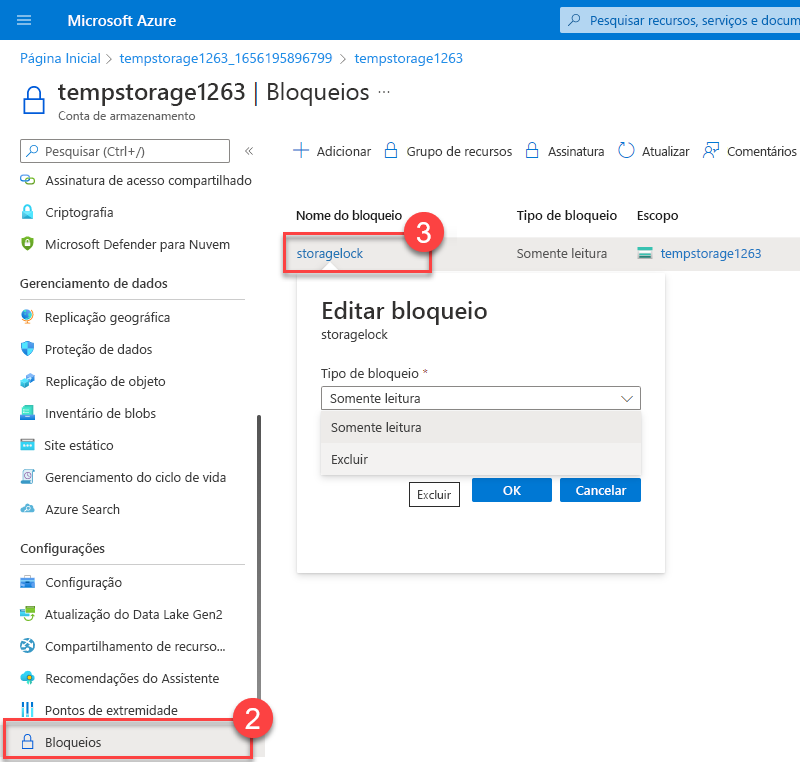

Role para cima até encontrar a seção Armazenamento de dados da folha, à esquerda da tela.

Selecione Contêineres.

Selecionar + Contêiner.

Insira um nome de contêiner e selecione Criar.

O seu contêiner de armazenamento deve aparecer na sua lista de contêineres.

Agora você sabe como o bloqueio somente leitura impediu que você adicionasse um contêiner à sua conta de armazenamento. Uma vez que o tipo de bloqueio foi alterado (você poderia tê-lo removido), você conseguiu adicionar um contêiner.

Tarefa 5: Excluir a conta de armazenamento
Na verdade, você fará essa última tarefa duas vezes. Lembre-se de que há um bloqueio de exclusão na conta de armazenamento, portanto, você ainda não conseguirá realmente excluir a conta de armazenamento.

Role para cima até encontrar Visão geral na parte superior da folha, à esquerda da tela.

Selecione Visão geral.

Selecione Excluir.

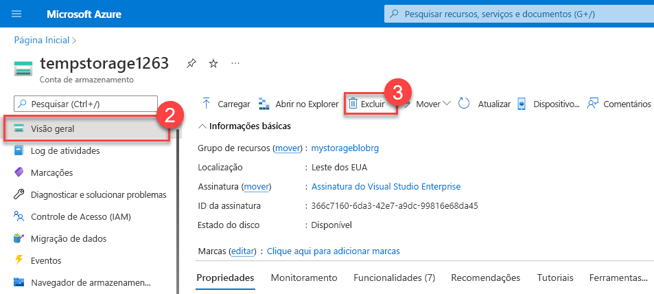

Você deve receber uma notificação informando que não pode excluir o recurso porque ele tem um bloqueio de exclusão. Para excluir a conta de armazenamento, você precisará remover o bloqueio de exclusão.

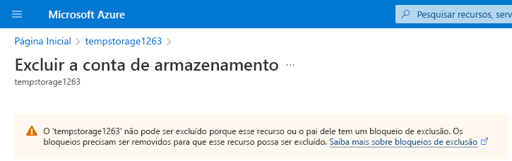

Tarefa 6: Remover o bloqueio de exclusão e excluir a conta de armazenamento
Na tarefa final, você remove o bloqueio de recurso e exclui a conta de armazenamento da sua conta do Azure. Essa etapa é importante. Você quer ter a certeza de que não haja nenhum recurso à toa em sua conta.

Selecione o nome da conta de armazenamento na trilha na parte superior da tela.

Role para baixo até encontrar a seção Configurações da folha, à esquerda da tela.

Selecione Bloqueios.

Selecione Excluir.

Selecione Página Inicial na trilha na parte superior da tela.

Selecionar Contas de armazenamento

Selecione a conta de armazenamento usada para este exercício.

Selecione Excluir.

Para evitar a exclusão acidental, o Azure solicita que você insira o nome da conta de armazenamento que deseja excluir. Insira o nome da conta de armazenamento e selecione Excluir.

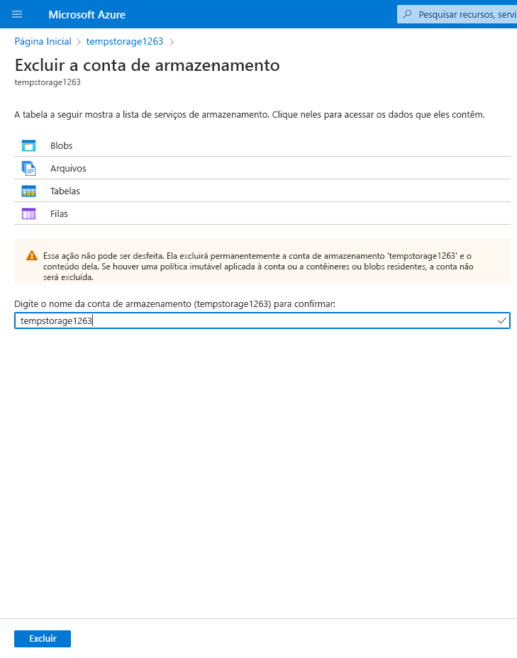

Você deve receber uma mensagem informando que a conta de armazenamento foi excluída. Se você acessar Página Inicial > Contas de armazenamento, verá que a conta de armazenamento que você criou para este exercício desapareceu.

Parabéns! Você concluiu a configuração, a atualização e a remoção de um bloqueio de recurso em um recurso do Azure.

 Importante

Não se esqueça de realizar a Tarefa 6, a remoção da conta de armazenamento. Você é o único responsável pelos recursos em sua conta do Azure. Limpe sua conta depois de concluir este exercício.

## Descrever a finalidade do portal de Confiança do Serviço


O Portal de Confiança do Serviço da Microsoft é um local que oferece acesso a vários conteúdos, ferramentas e outros recursos sobre práticas de segurança, privacidade e conformidade da Microsoft.

O Portal de Confiança do Serviço contém detalhes sobre a implementação de controles e processos da Microsoft que protegem nossos serviços na nuvem e os dados do cliente encontrados neles. Para acessar alguns dos recursos do Portal de Confiança do Serviço, é preciso entrar como usuário autenticado com sua conta de serviços em nuvem da Microsoft (conta da organização do Azure Active Directory). Você precisará examinar e aceitar o contrato de confidencialidade da Microsoft dos materiais de conformidade.

Acessar o Portal de Confiança do Serviço
Você pode acessar o Portal de Confiança do Serviço em https://servicetrust.microsoft.com/.

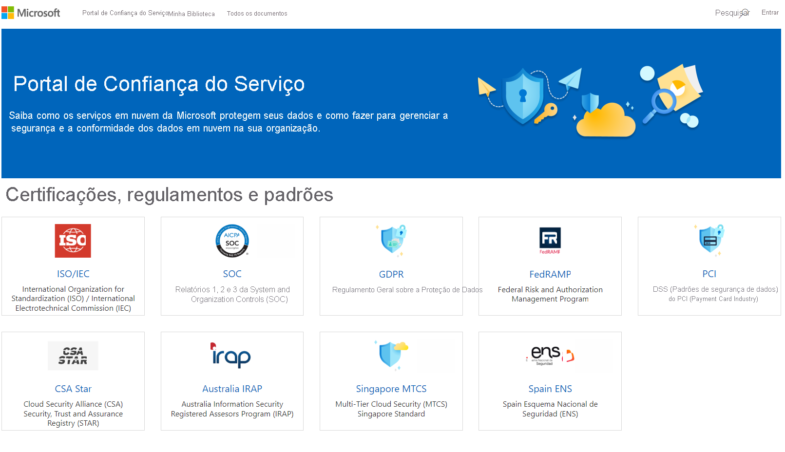


Captura de tela do portal de confiança do serviço com os itens do menu principal visíveis.

Os recursos e o conteúdo do Portal de Confiança do Serviço podem ser acessados no menu principal. As categorias do menu principal são:

O Portal de Confiança do Serviço fornece um hiperlink de acesso rápido para retornar à página inicial do Portal.
Documentos Confiáveis fornecem uma grande quantidade de informações de design e implementação de segurança. A meta das informações é facilitar o cumprimento dos objetivos de conformidade regulatória entendendo como os serviços do Microsoft Cloud mantêm seus dados seguros. Os Documentos Confiáveis têm subitens, incluindo: Relatórios de Auditoria, Proteção de Dados e Azure Stack.
Setores & Regiões fornecem informações de conformidade específicas do setor e da região sobre os serviços do Microsoft Cloud.
Links da Central de Confiabilidade para a Central de Confiabilidade da Microsoft. A Central de Confiabilidade fornece mais informações sobre segurança, conformidade e privacidade no Microsoft Cloud. Essas incluem: informações sobre os recursos dos serviços do Microsoft Cloud que você pode usar para atender a requisitos específicos do Regulamento Geral sobre a Proteção de Dados; documentação útil para sua prestação de contas do GDPR; e documentação útil para entender as medidas técnicas e organizacionais que a Microsoft vem tomando para dar suporte ao GDPR.
Os recursos fornecem acesso a mais recursos, como o Centro de Segurança e Conformidade, informações sobre Datacenters Globais da Microsoft e perguntas frequentes.
A Minha Biblioteca permite salvar (ou fixar) documentos para serem acessados rapidamente na página Minha Biblioteca. Você também pode configurar para receber notificações quando os documentos em Minha Biblioteca forem atualizados.
 Observação

Os relatórios e documentos do Portal de Confiança do Serviço estão disponíveis para download por pelo menos 12 meses após a publicação ou até que uma nova versão do documento esteja disponível.

## Descrever ferramentas para interagir com o Azure
Concluído
100 XP
5 minutos
Para aproveitar ao máximo o Azure, você precisa de um modo de interagir com o ambiente, os grupos de gerenciamento, as assinaturas, os grupos de recursos, os recursos etc. do Azure. O Azure fornece várias ferramentas para gerenciar seu ambiente, incluindo:

Portal do Azure
Azure PowerShell
CLI (Interface de Linha de Comando) do Azure.
O que é o portal do Azure?
O portal do Azure é um console unificado baseado na Web que fornece uma alternativa para as ferramentas de linha de comando. Com o portal do Azure, você pode gerenciar a assinatura do Azure usando uma interface gráfica do usuário. Você pode:

Compile, gerencie e monitore tudo, desde aplicativos Web simples a implantações em nuvem complexas
Crie painéis personalizados para ter uma exibição organizada dos recursos
Configure opções de acessibilidade para ter a experiência ideal
O seguinte vídeo apresenta o portal do Azure:


O portal do Azure foi projetado para ter resiliência e disponibilidade contínua. Ele mantém uma presença em todos os datacenters do Azure. Essa configuração torna o portal do Azure resiliente a falhas de datacenters individuais e evita a lentidão da rede ao se manter perto dos usuários. O portal do Azure é atualizado continuamente e não requer nenhum tempo de inatividade para atividades de manutenção.

Azure Cloud Shell
O Azure Cloud Shell é uma ferramenta de shell baseada em navegador que permite criar, configurar e gerenciar recursos do Azure usando um shell. O Azure Cloud Shell dá suporte ao Azure PowerShell e à CLI (Interface de Linha de Comando) do Azure, que é um shell bash.

É possível acessar o Azure Cloud Shell por meio do portal do Azure selecionando o ícone do Cloud Shell:

Captura de tela do portal do Azure com o ícone do Cloud Shell destacado.

O Azure Cloud Shell tem vários recursos que o tornam uma oferta exclusiva para dar suporte ao gerenciamento do Azure. Alguns desses recursos são:

É uma experiência de shell baseada em navegador sem a necessidade de instalação ou configuração local.
Ele é autenticado em suas credenciais do Azure, portanto, quando você faz logon, ele sabe inerentemente quem você é e quais permissões você tem.
Você escolhe o shell com o qual está mais familiarizado; o Azure Cloud Shell dá suporte ao Azure PowerShell e à CLI do Azure (que usa o Bash).
O que é o Azure PowerShell?
O Azure PowerShell é um shell com o qual desenvolvedores, DevOps e profissionais de TI podem executar comandos chamados de command-lets (cmdlets). Esses comandos chamam a API REST do Azure para realizar tarefas de gerenciamento no Azure. Os cmdlets podem ser executados de modo independente para lidar com alterações pontuais ou ser combinados para ajudar a orquestrar ações complexas como:

A configuração, desinstalação e manutenção de rotina de um único recurso ou de vários recursos conectados.
A implantação de uma infraestrutura inteira, que pode conter dezenas ou centenas de recursos, de um código imperativo.
A captura dos comandos em um script torna o processo repetível e automatizado.

Além de estar disponível por meio do Azure Cloud Shell, você pode instalar e configurar o Azure PowerShell em plataformas Windows, Linux e Mac.

O que é a CLI do Azure?
A CLI do Azure é funcionalmente equivalente ao Azure PowerShell, sendo a principal diferença a sintaxe dos comandos. Enquanto o Azure PowerShell usa comandos do PowerShell, a CLI do Azure usa comandos Bash.

A CLI do Azure fornece os mesmos benefícios de lidar com tarefas separadas ou orquestrar operações complexas por meio do código. Ele também pode ser instalado nas plataformas Windows, Linux e Mac, bem como por meio do Azure Cloud Shell.

Devido às semelhanças em termos de funcionalidade e acesso entre o Azure PowerShell e a CLI do Azure baseada em Bash, a questão se resume basicamente à linguagem com a qual você está mais familiarizado.

## Descrever a finalidade do Azure Arc
Concluído
100 XP
3 minutos
O gerenciamento de ambientes híbridos e de várias nuvens pode se complicar rapidamente. O Azure oferece uma série de ferramentas para provisionar, configurar e monitorar recursos do Azure. E quanto aos recursos locais em uma configuração híbrida ou aos recursos de nuvem em uma configuração de várias nuvens?

Ao utilizar o ARM (Azure Resource Manager), o Arc permite estender a conformidade e o monitoramento do Azure para suas configurações híbridas e multinuvem. O Azure Arc simplifica a governança e o gerenciamento ao fornecer uma plataforma de gerenciamento local e de várias nuvens consistente.

O Azure Arc fornece uma forma centralizada e unificada para:

Gerenciar todo o seu ambiente projetando os recursos que não são do Azure no ARM.
Gerencie máquinas virtuais híbridas e de várias nuvens, clusters do Kubernetes e bancos de dados como se eles estivessem em execução no Azure.
Use as funcionalidades familiares de gerenciamento e serviços do Azure, independentemente de onde eles estejam hospedados.
Continuar usando a ITOps tradicional, introduzindo práticas de DevOps para dar suporte a novos padrões nativos de nuvem no seu ambiente.
Configurar localizações personalizadas como uma camada de abstração no cluster de Kubernetes habilitado para Azure Arc e nas extensões de cluster.
O que o Azure Arc pode fazer fora do Azure?
Atualmente, o Azure Arc permite que você gerencie os seguintes tipos de recursos hospedados fora do Azure:

Servidores
Clusters do Kubernetes
Serviços de Dados do Azure
SQL Server
Máquinas virtuais (versão prévia)
Unidade seguinte: Descrever modelos do Azure Resource Manager e do ARM do Azure

## Descrever modelos do Azure Resource Manager e do ARM do Azure
Concluído
100 XP
6 minutos
O ARM (Azure Resource Manager) é o serviço de implantação e gerenciamento do Azure. Ele fornece uma camada de gerenciamento que lhe permite criar, atualizar e excluir recursos em sua conta do Azure. Sempre que você faz qualquer coisa com seus recursos do Azure, o ARM está envolvido.

Quando um usuário envia uma solicitação de ferramentas, APIs ou SDKs do Azure, o ARM recebe a solicitação. O ARM se autentica e autoriza a solicitação. Então, o ARM envia a solicitação para o serviço do Azure, que executa a ação solicitada. Você vê resultados e recursos consistentes em todas as diferentes ferramentas porque todas as solicitações são tratadas por meio da mesma API.

Benefícios do Azure Resource Manager
Com o Azure Resource Manager, você pode:

Gerenciar sua infraestrutura por meio de modelos declarativos em vez de scripts. Um modelo do Resource Manager é um arquivo JSON que define o que você deseja implantar no Azure.
Implantar, gerenciar e monitorar todos os recursos da sua solução como um grupo em vez de tratá-los individualmente.
Reimplantar a solução durante o ciclo de vida de desenvolvimento e ter confiança de que os recursos serão implantados em um estado consistente.
Definir as dependências entre os recursos para que eles sejam implantados na ordem correta.
Aplicar o controle de acesso a todos os serviços porque o RBAC é integrado nativamente à plataforma de gerenciamento.
Aplicar marcas aos recursos para organizar de modo lógico todos os recursos em sua assinatura.
Esclarecer a cobrança da organização exibindo os custos de um grupo de recursos que compartilham a mesma marca.
O vídeo a seguir apresenta uma visão geral de como você pode usar diferentes ferramentas do Azure com o ARM para gerenciar seu ambiente:


Modelos de ARM
A infraestrutura como código é um conceito em que você gerencia sua infraestrutura como linhas de código. Usar o Azure Cloud Shell, o Azure PowerShell ou a CLI do Azure são alguns exemplos de uso de código para implantar a infraestrutura de nuvem. Modelos do ARM são outro exemplo de infraestrutura como código em ação.

Ao usar os modelos do ARM, você pode descrever os recursos que deseja usar em um formato JSON declarativo. Com um modelo do ARM, o código de implantação é verificado antes da execução de qualquer código. Isso garante que os recursos serão criados e conectados corretamente. Em seguida, o modelo orquestra a criação desses recursos em paralelo. Ou seja, se você precisar de 50 instâncias do mesmo recurso, todas as 50 instâncias serão criadas ao mesmo tempo.

No fim das contas, o desenvolvedor, o DevOps profissional ou o profissional de TI precisa apenas definir o estado desejado e a configuração de cada recurso no modelo do ARM e o modelo fará o resto. Os modelos podem até mesmo executar scripts do PowerShell e Bash antes ou depois da configuração de um recurso.

Benefícios de usar modelos do ARM
Os modelos do ARM proporcionam muitos benefícios ao planejar a implantação de recursos do Azure. Alguns desses benefícios incluem:

Sintaxe declarativa: Os modelos ARM permitem criar e implantar uma infraestrutura inteira do Azure de forma declarativa. A sintaxe declarativa significa que você declara o que deseja implantar, mas não precisa escrever os comandos de programação e a sequência de fato para implantar os recursos.
Resultados repetidos: Implante repetidamente sua infraestrutura em todo seu ciclo de vida de desenvolvimento e com a confiança de que seus recursos são implantados em um estado consistente. Você pode usar o mesmo modelo do ARM para implantar vários ambientes de desenvolvimento/teste, sabendo que todos os ambientes são iguais.
Orquestração: Você não precisa se preocupar com as complexidades das operações de ordenação. O Azure Resource Manager orquestra a implantação dos recursos interdependentes para que eles sejam criados na ordem correta. Quando possível, o Azure Resource Manager implanta recursos em paralelo para que suas implantações sejam concluídas mais rapidamente do que as implantações seriais. Você implanta o modelo por meio de um comando, em vez de vários comandos imperativos.
Arquivos modulares: Você pode dividir seus modelos em componentes menores e reutilizáveis e vinculá-los no momento da implantação. Também é possível aninhar um modelo em outro modelo. Por exemplo, você pode criar um modelo para uma pilha de VM e então aninhar esse modelo dentro de modelos que implantam ambientes inteiros, e essa pilha de VM será consistentemente implantada em cada um dos modelos de ambiente.
Extensibilidade: com scripts de implantação, você pode adicionar scripts do PowerShell ou Bash aos seus modelos. Os scripts de implantação estendem sua capacidade de configurar recursos durante a implantação. Um script pode ser incluído no modelo ou armazenado em uma fonte externa e referenciado no modelo. Os scripts de implantação oferecem a capacidade de concluir a configuração de seu ambiente de ponta a ponta em um único modelo ARM.

## Descrever a finalidade do Assistente do Azure

O Assistente do Azure avalia seus recursos do Azure e faz recomendações para ajudar a melhorar a confiabilidade, a segurança e o desempenho, alcançar a excelência operacional e reduzir os custos. O Assistente do Azure foi projetado para ajudar você a poupar tempo na otimização da nuvem. O serviço de recomendação inclui ações sugeridas que você pode adotar imediatamente, adiar ou ignorar.

As recomendações estão disponíveis por meio do portal do Azure e da API, e é possível configurar notificações para alertar você sobre novas recomendações.

Quando você está no portal do Azure, o painel do Assistente exibe recomendações personalizadas para todas as suas assinaturas. Você pode usar filtros para selecionar recomendações para assinaturas, grupos de recursos ou serviços específicos. As recomendações são divididas em cinco categorias:

A confiabilidade é usada para garantir e aprimorar a continuidade dos seus aplicativos comercialmente críticos.
A segurança é usada para detectar ameaças e vulnerabilidades que podem levar a violações de segurança.
O desempenho é usado para melhorar a velocidade de seus aplicativos.
A excelência operacional é usada para ajudar você a obter eficiência de processo e fluxo de trabalho, capacidade de gerenciamento de recursos e melhores práticas de implantação.
O custo é usado para otimizar e reduzir os gastos gerais do Azure.
A imagem a seguir mostra o painel do Assistente do Azure.

Captura de tela do painel do Assistente do Azure com caixas das principais áreas de recomendações.

## Descrever a Integridade do Serviço do Azure
Concluído
100 XP
2 minutos
O Microsoft Azure fornece uma solução de nuvem global para ajudar você a gerenciar suas necessidades de infraestrutura, alcançar seus clientes, inovar e se adaptar rapidamente. Conhecer o status da infraestrutura global do Azure e de cada um de seus recursos pode parecer uma tarefa assustadora. A Integridade do Serviço do Azure ajuda você manter o controle do recurso do Azure, tanto os recursos especificamente implantados quando o status geral do Azure. A integridade do serviço do Azure faz isso combinando três serviços diferentes do Azure:

O Status do Azure é uma visão geral do status do Azure em todo o globo. O status do Azure informa sobre interrupções de serviço no Azure na página Status do Azure . A página é uma exibição global da integridade de todos os serviços do Azure em todas as regiões do Azure. É uma boa rápida para incidentes com impacto generalizado.
A Integridade do Serviço fornece uma visão mais restrita dos serviços e das regiões do Azure. Ela se concentra nos serviços e regiões do Azure que você está usando. Esse é o melhor lugar onde procurar serviços que afetam as comunicações sobre interrupções, atividades de manutenção planejada e outros avisos de integridade, porque a experiência autenticada da Integridade do Serviço sabe quais serviços e recursos você usa atualmente. Você até pode configurar alertas da Integridade do Serviço para ser notificado quando problemas de serviço, manutenção planejada ou outras alterações puderem afetar os serviços e as regiões do Azure que você usa.
O Resource Health é uma exibição personalizada dos recursos reais do Azure. Ele fornece informações sobre a integridade de cada um de seus recursos de nuvem, como uma instância de máquina virtual específica. Usando o Azure Monitor, você também pode configurar alertas para notificá-lo de alterações de disponibilidade para seus recursos de nuvem.
Usando o Status do Azure, a Integridade do serviço e a Integridade do recurso, a Integridade do Serviço do Azure fornece uma visão completa do ambiente do Azure desde o status global dos serviços e regiões do Azure até recursos específicos. Além disso, os alertas históricos são armazenados e ficam acessíveis para revisão posterior. Algo que você inicialmente pensou ser uma anomalia simples e se transformou em uma tendência, pode ser prontamente revisado e investigado graças aos alertas históricos.

Por fim, caso uma carga de trabalho que você está executando seja afetada por um evento, a Integridade do Serviço do Azure fornecerá links para suporte.

## Descrever o Azure Monitor
Concluído
100 XP
3 minutos
O Azure Monitor é uma plataforma para coletar dados sobre seus recursos, analisar esses dados, visualizar as informações e até mesmo agir com base nos resultados. O Azure Monitor pode monitorar recursos do Azure, seus recursos locais e até mesmo recursos de várias nuvens, como máquinas virtuais hospedadas com um provedor de nuvem diferente.

O diagrama a seguir ilustra o nível de abrangência do Azure Monitor:

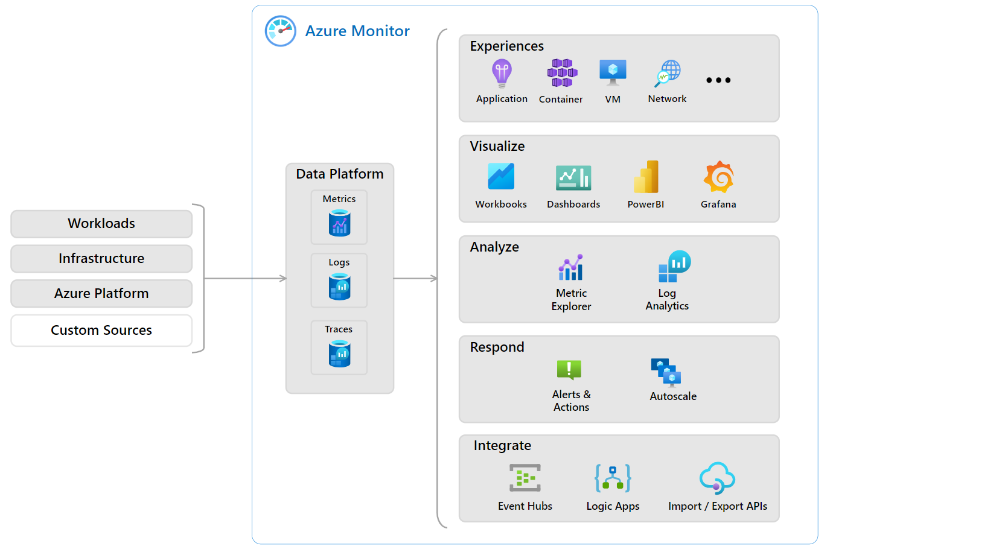


Uma ilustração mostrando o fluxo de informações que o Azure Monitor usa para fornecer monitoramento e visualização de dados.

À esquerda fica uma lista das fontes dos dados de registro em log e de métrica que podem ser coletados em cada camada na arquitetura do aplicativo, indo do aplicativo ao sistema operacional e à rede.

No centro, os dados de registro em log e de métricas são armazenados em repositórios centrais.

À direita, os dados são usados de várias maneiras. Você pode exibir o desempenho histórico e em tempo real em cada camada da arquitetura ou ver informações agregadas e detalhadas. Os dados são exibidos em diferentes níveis para públicos-alvo diferentes. É possível exibir relatórios de alto nível no painel do Azure Monitor ou criar modos de exibição personalizados usando consultas do Power BI e do Kusto.

Além disso, os dados podem ser usados para ajudar você a reagir a eventos críticos em tempo real, por meio de alertas entregues às equipes por SMS, email etc. Outra opção é usar limites a fim de disparar a funcionalidade de dimensionamento automático para escalar conforme a demanda.

Azure Log Analytics
O Log Analytics do Azure é a ferramenta do portal do Azure em que você escreverá e executará consultas de log nos dados coletados pelo Azure Monitor. O Log Analytics é uma ferramenta robusta que dá suporte a consultas simples e complexas e à análise de dados. Você pode escrever uma consulta simples que retorna um conjunto de registros e usar os recursos do Log Analytics para classificá-los, filtrá-los e analisá-los. Você pode escrever uma consulta avançada para executar a análise estatística e visualizar os resultados em um gráfico a fim de identificar uma tendência específica. Independentemente de você trabalhar com os resultados das suas consultas de maneira interativa ou usá-las com outros recursos do Azure Monitor, como alertas de consulta de log ou pastas de trabalho, o Log Analytics é a ferramenta que você usará para escrever e testar essas consultas.

Alertas do Azure Monitor
Os Alertas do Azure Monitor são formas automatizadas de se manter informado caso o Azure Monitor detecte um limite sendo ultrapassado. Você define as condições de alerta, as ações de notificação e, em seguida, os Alertas do Azure Monitor notificam quando um alerta é disparado. Dependendo da sua configuração, os Alertas do Azure Monitor também podem tentar uma ação corretiva.

Captura de tela dos Alertas do Azure Monitor mostrando o total de alertas e os alertas agrupados por gravidade.

Os alertas podem ser configurados para monitorar os logs e disparar sob determinados eventos de log ou podem ser definidos para monitorar métricas e disparar caso determinadas métricas sejam ultrapassadas. Por exemplo, você poderia definir um alerta baseado em métrica para notificá-lo quando o uso da CPU em uma máquina virtual excedesse 80%. As regras de alerta baseadas em métricas fornecem alertas quase em tempo real baseados em valores numéricos. As regras baseadas em logs permitem uma lógica complexa entre os dados de várias fontes.

Os Alertas do Azure Monitor usam grupos de ações para configurar a quem notificar e quais ações tomar. Um grupo de ações é simplesmente uma coleção de preferências de notificação e ação que você associa a um ou vários alertas. O Azure Monitor, a Integridade do Serviço e o Assistente do Azure usam grupos de ações para notificar você sobre um alerta que foi disparado.

Application Insights
O Application Insights, um recurso do Azure Monitor, monitora seus aplicativos Web. O Application Insights consegue monitorar aplicativos que esteja em execução no Azure, localmente ou em outro ambiente de nuvem.

Há duas maneiras de configurar o Application Insights para ajudar a monitorar seu aplicativo. Você pode instalar um SDK em seu aplicativo ou usar o agente do Application Insights. O agente do Application Insights é compatível com C#.NET, VB.NET, Java, JavaScript, Node.js e Python.

Depois que o Application Insights estiver em execução, você poderá usá-lo para monitorar uma ampla variedade de informações, como:

As taxas, tempos de resposta e taxas de falha de solicitação
Taxas de dependência, tempos de resposta e taxas de falha: para mostrar se os serviços externos estão desacelerando o desempenho
Exibições de página e o desempenho de carregamento relatados por navegadores dos usuários
Chamadas AJAX de páginas da web, incluindo taxas, tempos de resposta e taxas de falha
Contagens de sessão e usuários
Contadores de desempenho de máquinas de servidor Linux ou Windows server, como CPU, memória e uso da rede
O Application Insights não só ajuda a monitorar o desempenho do seu aplicativo, mas você também pode configurá-lo para enviar periodicamente solicitações sintéticas para seu aplicativo, permitindo que você verifique o status e monitore o aplicativo mesmo durante períodos de baixa atividade.

### Internet das Coisas do Azure

### Azure IOT Central

È uma solução SAAS, com console centralizado.

### Hub IOT do Azure

È um serviço gerenciado e hospedado na nuvem que atua como um Hub central de mensagens bidirecional.

### Azure Sphere

È uma plataforma de aplicativo segura e de alto nivelcom recursos internos de comunicação e segurança.


### Azure Synapse Analytics

Um Enterprise Data Warehouse baseado em nuvem.

### Azure HDInsight

Um serviço de análise open-source e totalmente gerenciado para empresas.

### Azure Databricks

Serviço de análise baseado no Apache Spark.


## Inteligencia Artifical e Machine learning Azure


### Azure Machine learning

Baseado em nuvem para desenvolver, treinar e implantar modelos de machine learning.


### Serviços Cognitivos

Habilitar rapidamente os aplicativos para ver, ouvir, falar, entender e interpretar as necessidades de um usuário.


### Serviços de Bot do Azure

Desenvolver Bots inteligentes de nivel empresarial.


### Computação Sem Servidor


### Azure functions

código baseado em evento executando o serviço e não a infra estrutura subjacentes.

### Aplicativos Lógicos do Azure

Automatizar e orquestrar tarefas, processos empresariais e fluxo de trabalho para integrar aplicativos.


### Azure DevOps

Ferramenta de colaboração e desenvolvimento, incluindo pipelines, cartões kanban e testes de cargas automatizados baseados em nuvem.

### Github 

Hosting de desenvolvimento de software com controle de versão e gerenciamento de codigo fonte.

### GitHub Actions Azure

Automatizar fluxo de trabalho de software para criar , testar e implementar dentro do GitHub.

### Azure DevTest Labs

Criar rapidamente ambientes no Azure enquanto minimiza gastos e controla custos.

# Dicas Para Estudar Antes do Exame e Perguntas

###  1. Qual tipo de expansão envolve adicionar ou remover recursos (como máquinas virtuais ou contêineres) para atender à demanda?

( ) Dimensionamento vertical

(x) Dimensionamento horizontal

( ) Escala direta

R: A escala horizontal é adição ou subtração do número de recursos.

###  2. O que é caracterizado como a capacidade de um sistema de se recuperar de falhas e continuar funcionando?

(x) Confiabilidade

( ) Previsibilidade

( ) Escalabilidade

R: A confiabilidade é a capacidade de um sistema de se recuperar de falhas e continuar funcionando, além de ser um dos pilares da Microsoft Azure Well-Architected Framework.

###  3. Qual tipo de serviço de nuvem é mais adequado para uma migração lift-and-shift de um datacenter local para uma implantação de nuvem?

(x) IaaS (infraestrutura como serviço)

( ) PaaS (plataforma como serviço)

( ) SaaS (software como serviço)


###  4. Em que tipo de serviço de nuvem geralmente estaria uma solução de controle de finanças e despesas?

( ) IaaS (infraestrutura como serviço)

( ) PaaS (plataforma como serviço)

(x) SaaS (software como serviço)

###  5 - Sua empresa possui datacenters em Los Angeles e Nova York. A empresa tem uma assinatura do Microsoft Azure.

Você está configurando os dois datacenters como sites com cluster geográfico para resiliência do site.
Você precisa recomendar uma opção de redundância de armazenamento do Azure.
Você tem os seguintes requisitos de armazenamento de dados:

✑ Os dados devem ser armazenados em vários nós.
✑ Os dados devem ser armazenados em nós em localizações geográficas separadas.
✑ Os dados podem ser lidos do local secundário, bem como do local principal

Qual das seguintes opções de redundância armazenada do Azure você deve recomendar?

A. Armazenamento com redundância geográfica
B. Armazenamento com redundância geográfica somente leitura
C. Armazenamento com redundância de zona
D. Armazenamento com redundância local

Resposta correta: B 🗳️

O RA-GRS permite que você tenha maior disponibilidade de leitura para sua conta de armazenamento, fornecendo acesso "somente leitura" aos dados replicados para o local secundário. Depois de habilitar esse recurso, o local secundário pode ser usado para obter maior disponibilidade caso os dados não estejam disponíveis na região primária. Isto é um
Recurso de aceitação que exige que a conta de armazenamento seja replicada geograficamente.
Referências:
https://docs.microsoft.com/en-us/azure/storage/common/storage-redundancy https://docs.microsoft.com/en-us/azure/storage/common/storage-redundancy-grs#read -access-geo-redundant-storage

###  6 - Para ajudá-lo a aplicar a marcação de recursos para que você possa gerenciar o faturamento?

R: Política Azure. 

Política Azure pode ser usado para impor a marcação valores e regras sobre os recursos.

###  7 -  Qual das seguintes pode ser utilizado para gerir a governação através de múltiplas assinaturas Azure?

R: Resource Groups

###  8 - Qual das seguintes podem ser usados ??para estimar redução de custos ao migrar para o Azure?

R: Total Cost of Ownership Calculator 

Custo Total de Propriedade calculadora (TCO). A calculadora de TCO é uma ferramenta que você usa para estimar redução de custos que você pode realizar com a migração para o Azure.

###  9 - Qual dos seguintes serviços em nuvem fornece ferramentas de colaboração de desenvolvimento incluindo gasodutos de alta performance. repositórios Git privado gratuito. e placas Kanban configuráveis?

R: Azure Devops Services

Azure DevOps Services inclui ferramentas de desenvolvimento de colaboração. incluindo gasodutos de alta performance. repositórios Git privado gratuito. e placas Kanban configuráveis.

###  10 - Qual das seguintes opções de serviços é uma rede distribuída de servidores que podem eficientemente entregar conteúdos Web a usuários?

R: Azure Content delivery Network

A Content Delivery Network é uma rede distribuída de servidores que podem eficientemente entregar conteúdos Web a usuários.

###  11 - Qual dos seguintes serviços você usaria para o tráfego de internet filtro na sua rede virtual Azure?

R: Network Security Group

 Grupo de Segurança de Rede (NSG). NSGs permitem tráfego de rede filtro de e para recursos Azure em uma rede virtual Azure. Um NSG pode conter múltiplas de entrada e regras de segurança de saída que lhe permitem filtrar o tráfego de e para recursos de origem e de destino IP endereço. porta e protocolo.

###  12 -  Qual das seguintes opções você deve usar para baixar publicado relatórios de auditoria e como a Microsoft constrói e opera seus serviços de nuvem?

R: Service Trust Portal

Service Trust Portal é o site público da Microsoft para a publicação de relatórios de auditoria e outras informações relacionadas com o cumprimento relevantes para os serviços em nuvem da Microsoft. usuários STP pode baixar relatórios de auditoria produzidos por auditores externos e discernimento ganho de relatórios Microsoft-autoria que fornecem detalhes sobre como Microsoft constrói e opera seus serviços de nuvem.

###  13 - Qual das seguintes você deve usar quando você está preocupado apenas com o código de execução de seu serviço e não a plataforma ou infra-estrutura subjacente?

R: Azure Functions

 Funções Azure. Funções Azure são ideais quando você está preocupado apenas com o código de execução de seu serviço e não a plataforma subjacente ou infra-estrutura.

###  14 - Qual das seguintes é verdadeiro quando se trata de SaaS (Software como serviço)?

R: Você é responsavel por configurar a solução

Você é responsável por configurar a solução. porque SaaS fornece uma solução completa de software que você compra em um pay-as-you-go base de um provedor de serviço de nuvem. Você alugar o uso de um aplicativo para a sua organização. e seus usuários se conectar a ele através da Internet. geralmente com um navegador web. Toda a infra-estrutura subjacente. middleware. software aplicativo e dados de aplicativos estão localizados no centro de dados do prestador de serviços. O prestador de serviços gerencia o hardware e software. e com o acordo de serviço adequado. irá garantir a disponibilidade e a segurança do aplicativo e seus dados também. SaaS permite que sua organização para obter rapidamente instalado e funcionando com um aplicativo no custo inicial mínima

###  15 - Qual das seguintes categorias se enquadra o Azure Kubernetes?

R: PAAS - Plataforma como um serviço”.

###  16 -  Qual das seguintes dar a todos os clientes Azure a chance de beta teste e outros recursos de pré-lançamento?

R: Public Preview

 Public Preview. Preview público significa que um recurso Azure está disponível para todos os clientes Azure para fins de avaliação.

###  17 - Qual dos seguintes descreve um benefício de serviços em nuvem?

R: Economia e escalabilidade

18 - Qual dos seguintes descreve uma nuvem pública?

R:  A nuvem pública oferece recursos e serviços a várias organizações e usuários. que se conectam através de uma conexão de rede segura.

###  18 - Sua empresa planeja implantar vários aplicativos personalizados no Azure. Os aplicativos fornecerão serviços de faturamento aos clientes da empresa. Cada aplicativo terá vários aplicativos e serviços pré-requisitos instalados.

Você precisa recomendar uma solução de implantação em nuvem para todos os aplicativos.

O que você deve recomendar?
A. Software como serviço (SaaS)
B. Plataforma como serviço (PaaS)
C. Infraestrutura como serviço (laaS)


Resposta: C

###  19 - Qual das seguintes opções fornece informações sobre a manutenção planejada e mudanças que possam afetar a disponibilidade de seus recursos?

R: Azure Service Health

Azure Serviço de Saúde é um conjunto de experiências que fornecem orientação e apoio personalizado quando problemas com serviços Azure afetá-lo. Ele pode notificá-lo. ajudá-lo a compreender o impacto de questões. e mantê-lo atualizado como o problema foi resolvido. Azure Serviço de Saúde também pode ajudá-lo a se preparar para a manutenção planejada e mudanças que possam afetar a disponibilidade de seus recursos.

###  20 - Qual das seguintes poderia conceder ou negar acesso com base no endereço IP de origem?

R: Azure Firewall

###  21 - Quais são os dois tipos de clientes são elegíveis para utilizar o Governo Azure para desenvolver uma solução em nuvem?

R: a United States Goverment Entity
   a United States Goverment Contractor

O documento do governo Azure afirma claramente "as agências do governo dos EUA ou seus parceiros" são elegíveis para utilizar Governo Azure para desenvolver uma solução de nuvem.

###  22 - Qual modelo de nuvem fornece o maior grau de flexibilidade?

R: Hibrido. 

###  23 -  Qual modelo de nuvem fornece o maior grau de propriedade e controle?

R: Privado.

###  24 - Qual recurso Azure de computação que você pode usar para implantar a gerir um conjunto de máquinas virtuais idênticas?

R: Virtual Machine Scale Sets

Conjuntos escala de máquinas virtuais permitem que você implantar e gerenciar um conjunto de máquinas virtuais idênticos.

###  25 - Que serviço Azure você deve usar para armazenar certificados?

R: Azure Key Vault

Azure Key Vault podem ser usados ??para armazenar de forma segura e firmemente controlar o acesso aos tokens. senhas. certificados. chaves de API. e outros segredos.

###  26 -  Que solução de implantação de nuvem é usado para bancos de dados SQL Azure?

R: PAAS


Azure SQL Database falls under “Platform as a Service (Paas)”. - Banco de dados SQL Azure cai sob “Plataforma como Serviço (PaaS)”.

###  27 - Quem entre asseguintes opções podem utilizar os serviços oferecidos como parte da “Azure Alemanha”?

R: Todos os clientes que pretendem fazer negócios na Europa.

Microsoft Azure Alemanha é construído sobre a Microsoft "confiável nuvem" princípios de segurança. privacidade. conformidade e transparência. Traz residência de dados. em trânsito e em repouso. na Alemanha. e replicação de dados em datacenters alemães para a continuidade dos negócios.

###  28 - O que pode Azure Information Protection criptografar?

R: Documentos, e-mail e mensagens


###  29 - Os datacenters Microsoft Azure estão organizados e disponibilizados por?

R: Regiões


Datacenters Microsoft Azure estão organizados e disponibilizados pela região

###  30 -  Onde você pode obter detalhes sobre os dados pessoais processos da Microsoft. como Microsoft processa-lo. e para que fins?

R: Microsoft Privacy Statement

A Microsoft Declaração de Privacidade explica quais processos Microsoft de dados pessoais. como a Microsoft processa-lo. e para que fins.

###  31 - Você tem uma máquina virtual chamada VM1 que executa o Windows Server 2016. VM1 é na região do Oriente US Azure.

Que serviço Azure você deve usar a partir do portal Azure para notificações de falha de serviços de visualizações que podem afetar a disponibilidade de VM1?

R:  Azure Monitor
    Azure Advisor

 Dado que a questão está pedindo a disponibilidade de uma única VM, as notificações de falha de serviços pode ser visto a partir do Monitor de Azure e do Azure Virtual Machines.

###  32 - Você precisa identificar o tipo de falha para o qual uma zona de disponibilidade Azure pode ser usado para acesso de proteção para serviços Azure. O que você deve identificar?

R: Azure Datacenter Falhas

Uma Zona de disponibilidade é uma oferta de alta disponibilidade que protege seus aplicativos e dados de datacenter falhas. Zonas de disponibilidade são locais físicos exclusivos dentro de uma região Azure. Cada zona é composta de um ou mais centros de dados. equipados com potência independente. de arrefecimento. e a rede. Para garantir a resiliência. há um mínimo de três zonas separadas em todas as regiões ativado. A separação física da disponibilidade de zonas dentro de uma região protege aplicações e dados a partir de centros de dados falhas. serviços Zona redundantes replicar seus aplicativos e dados através de Zonas de disponibilidade para proteger da únicos pontos de falha. Com Zonas de disponibilidade. Azure oferece à indústria melhor 99.99% VM uptime SLA. A plena Azure SLA explica a disponibilidade garantida de Azure como um todo.


###  33 - Você tem dois serviços com diferentes SLAs. A SLA compósito é determinada por?

R:  Multiplicar os SLAs juntos.

Para determinar um SLA composto que se multiplicam os SLAs individuais juntos.

###  34 -  Seus planos da empresa para migrar todos os dados no local para Azure. Você precisa identificar se Azure está em conformidade com os requisitos regionais da empresa. O que você deve usar?

R: The Trust Center / Centro de Confiança

###  35 - A empresa quer garantir que os recursos dentro do Grupo Resource (RG) não sejam apagados acidentalmente. Qual das seguintes você usaria para este fim?

R: Locks 

Como administrador. você pode precisar para bloquear uma assinatura. grupo de recursos ou recurso para impedir que outros usuários em sua organização acidentalmente excluir ou modificar recursos críticos. Você pode definir o nível de bloqueio para Cannotdelete ou ReadOnly. No portal. os bloqueios são chamados Excluir e Read-only. respectivamente. usuários meios Cannotdelete autorizados ainda podem ler e modificar um recurso. mas eles não podem excluir o recurso. usuários ReadOnly meios autorizados pode ler um recurso. mas eles não podem excluir ou atualizar o recurso. Aplicando esse bloqueio é semelhante a restringir todos os usuários autorizados para as permissões concedidas pela função Reader.

###  36 - Sua empresa precisa de implantar e gerenciar vários Microsoft Azure Web Apps usando o recurso de serviço Azure App. Qual das seguintes URL você usa para gerenciar o Web Apps Azure?

R: https://portal.azure.com


###  37 -  Sua empresa planeja implantar vários servidores web e vários servidores de banco de dados para o Azure. Você precisa recomendar uma solução Azure para limitar os tipos de conexões dos servidores web para os servidores de banco de dados. O que você deveria incluir na recomendação?

R: Network Security Groups (NSGs) 

###  38 - A política da empresa afirma que os administradores só devem ser autorizados a criar recursos adicionais Azure em uma região do país onde seu escritório está localizado. Você precisa criar recursos Azure que devem ser usados ??para cumprir a exigência política. O que você deve criar?

R: Azure Policy


 Política Azure é um serviço no Azure que você usa para criar. atribuir e gerenciar políticas. Estas políticas impor regras diferentes e efeitos sobre os seus recursos. para que esses recursos manter a conformidade com os seus padrões corporativos e acordos de nível de serviço.

###  39 - Sua empresa quer disposição um conjunto de máquinas virtuais Azure. Um aplicativo será instalado nessas máquinas virtuais. A empresa quer garantir que o tráfego de usuários é distribuído entre as máquinas virtuais. Você decide usar o serviço Azure VPN gateway para distribuição do tráfego. Será que isso cumprir a exigência?

R: Não

Este serviço de VPN é usado para ajudar a conectar um centro de dados on-premise para uma rede virtual Azure

###  40 - Se você criar 2 máquinas virtuais que tamanho utilização BS2. cada máquina virtual sempre gerará o mesmo custo mensal

R: Não

Se você criar duas máquinas virtuais Azure que usam o tamanho B2S. cada máquina virtual nem sempre gerar os mesmos custos mensais. Isso é porque ele também depende da região em que as máquinas virtuais estão localizados e os custos diferem região-wise

###  41 - Qual o modelo de formato Azure Resource Manager usam ?

R: JSON


###  42 -  Você está planejando configurar uma conta gratuita Azure. Através da criação de uma conta gratuita Azure. você só tem acesso a um subconjunto de serviços?

R: Não 

O Azure conta gratuita dá acesso a todos os serviços em Azure.

###  43 - Você está planejando configurar uma conta Microsoft Azure gratuito. Qual das seguintes não é verdadeiro quando se trata do que é oferecido com uma conta Azure gratuito?

R: Livre acesso a todos os produtos Azure após o período de validade 12 meses.


###  44 -  Para onde uma aplicação deve conectar-se para recuperar tokens de segurança?

R: Azure Active Directory (Azure AD)

###  45 - Como melhor prática. todos os recursos que são parte de um aplicativo devem compartilhar o mesmo ciclo de vida devem existir no mesmo?

R: Resource Group

Para facilitar a gestão. recursos que são parte de um aplicativo e compartilhar seu ciclo de vida devem ser colocados no mesmo grupo de recursos.

###  46 -  Qual das necessidades seguintes garante que os dados-residência e conformidade sejam cumpridos para os clientes que precisam manter seus dados e aplicativos perto?

R: Geografias 


Geografias permitir que os clientes com necessidades específicas de dados de residência e de conformidade para manter seus dados e aplicativos perto. Geografias garantir que a residência dados. soberania. conformidade e requisitos de resiliência são honrados dentro de fronteiras geográficas.

###  47 - Sua empresa está pensando em hospedar recursos dentro Microsoft Azure. É possível que os usuários de fora tenham acesso aos recursos dentro Azure. ou os utilizadores têm de ser especificados e definidos no Azure AD?

R: Não

Não. os usuários de fora também pode obter acesso aos recursos Azure por causa do controle Azure com base na função de acesso (RBAC). que permite uma melhor gestão de segurança para grandes organizações e para as pequenas e médias empresas que trabalham com externos colaboradores. fornecedores ou freelancers que necessitem de acesso a recursos específicos em seu ambiente. mas não necessariamente a toda a infra-estrutura ou quaisquer âmbitos relacionados com o faturamento. Você pode usar os recursos em Azure B2B Active Directory para colaborar com os usuários convidados externos e você pode usar o RBAC para conceder apenas as permissões que os usuários hóspedes precisam em seu ambiente.

###  48 - Sua empresa quer disposição um conjunto de máquinas virtuais Azure. Um aplicativo será instalado nessas máquinas virtuais. A empresa quer garantir que o tráfego de usuários é distribuído entre as máquinas virtuais. Você decide usar o serviço Azure HDInsight para distribuição do tráfego. Será que isso cumprir a exigência?

R: Não

 O serviço Azure HDInsight é usado para implementação de quadros relacionados open source de Big Data.

###  49 - Qual das seguintes permite que você conceder aos usuários apenas os direitos que eles precisam para executar seus trabalhos?

R: Role Based Access Control - RBAC

###  50 - Qual das seguintes é otimizado para armazenar grandes quantidades de dados não estruturados. como vídeos e imagens?

R: Blobs

Armazenamento Azure Blob é a solução de armazenamento de objetos da Microsoft para a nuvem. armazenamento de blob é optimizado para armazenar grandes quantidades de dados não estruturados. tais como texto ou dados binários.

###  51 - Qual das seguintes é uma unidade lógica de serviços Azure que links para uma conta Azure?

R: Azure Subscription

Assinatura Azure é uma unidade lógica de serviços Azure que links para uma conta Azure.

###  52 - Qual das seguintes podem ser usados ??para ajudá-lo a aplicar a marcação de recursos para que você possa gerenciar o faturamento?

R: Azure Policy

Política Azure. Política Azure pode ser usado para impor a marcação valores e regras sobre os recursos.

### #  53 - Qual das seguintes pode ser usado para definir um conjunto repetitivo de recursos Azure que implementar requisitos organizacionais?

R: Azure Blueprint

Azure Blueprints permitem aos arquitetos de nuvem para definir um conjunto repetitivo de recursos Azure que implementam e aderir às normas. padrões e exigências de uma organização. Blueprint Azure permite que as equipes de desenvolvimento para rapidamente criar e implantar novos ambientes com o conhecimento que eles estão construindo dentro de conformidade organizacional com um conjunto de built-in componentes que aceleram o desenvolvimento e entrega.
